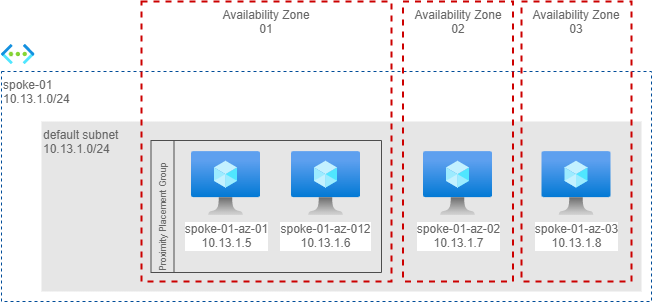

latency is an expression of how much time it takes for a data packet to travel from one designated point to another. Ideally, latency will be as close to zero as possible.

High network latency can dramatically increase webpage load times, interrupt video and audio streams, and render an application unusable. Depending on the application, even a relatively small increase in latency can ruin UX.

Azure availability zones are physically separate locations within each Azure region that are tolerant to local failures. **Azure availability zones are connected by a high-performance network with a round-trip latency of less than 2ms**. 

Each data center is assigned to a physical zone. Physical zones are mapped to logical zones in your Azure subscription. You can design resilient solutions by using Azure services that use availability zones. Co-locate your compute, storage, networking, and data resources across an availability zone, and replicate this arrangement in other availability zones.

So understanding the latency implications of different network configurations when designing an architecture is **essential**.

In this blob post I measure the latency present between deplyed machines in Azure in the following configurations:

**In this blob post I measure the latency between Virtual machine in various network configurations**:

* same vNet, same availability zone
* same vNet, across availability zones
* multiple vNets (connesse in peering), stessa availability zone
* multiple vNets (connesse in peering), across availability zones
* multiple vNets connected in a Hub & Spoke topology, Routing via Azure Virtual Network Gateway
* multiple vNets connected in a Hub & Spoke topology, Routing via Azure Firewall

to measure latency, I used [MTR](https://en.wikipedia.org/wiki/MTR_(software)), which combines the functions of the traceroute and ping programs in one network diagnostic tool.

> please note that MTR are the round-trip times for an ICMP packet to reach the hop at which its TTL expires, for the device processing that expiration to generate an ICMP Time Exceeded packet, and for that packet to return to the originating device. For many routers, performing the ICMP response for dropped packets is a low priority–and on some devices, it’s disabled entirely.

# Scenario 1 - one Virtual Network

from spoke01-az-01 (availability zone 1) to machines in same virtual network

| commamd | Av Zone |  Snt |  Last |  Avg | Best | Wrst | StDev
|---|--------|------|-------|------|------|------|------|
`mtr 10.13.1.6`| 1  |  89  |  1.1 |  1.4 |  0.8 |  8.4 |  1.1
`mtr 10.13.1.7`| 2  |  32  |  2.4 |  2.1 |  1.8 |  2.6 |  0.2
`mtr 10.13.1.8` | 3  |  32  |  2.0 |  2.1 |  1.8 |  2.5 |  0.2

# Scenario 2 - two Virtual Networks in peering

from spoke01-az-01 (availability zone 1) to machines in another virtual network in peering

| Command | Av Zone |  Snt |  Last |  Avg | Best | Wrst | StDev
|---|--------|------|-------|------|------|------|------|
| `mtr 10.13.2.5` | 1 |  13 |  15.5 |  2.3 |  0.9 | 15.5 |  4.0 |
| `mtr 10.13.2.6` | 2  |  32 |   3.1 |  2.3 |  2.0 |  3.5 |  0.3|
| `mtr 10.13.2.7` | 3  |  39 |   2.3 |  2.4 |  1.8 |  3.3 |  0.3|

# Scenario 3 - two Virtual Networks in H&S configuration with Virtual Network Gateway

from spoke01-az-01 (availability zone 1) to machines in another virtual network via virtual network gateway in the Hub Network

| Command | Av Zone |  Snt |  Last |  Avg | Best | Wrst | StDev
|---|--------|------|-------|------|------|------|------|
| `mtr 10.13.2.5` | 1  |  47 |   4.2 |  3.4 |  1.6 | 24.4 |  4.2 |
| `mtr 10.13.2.6` | 2  |  35 |   2.9 |  4.3 |  2.8 | 12.3 |  2.6 |
| `mtr 10.13.2.7` | 3  |  36 |   3.4 |  4.5 |  2.8 | 15.7 |  3.1 |

# Scenario 4 - two Virtual Networks in H&S configuration with Azure Firewall

from spoke01-az-01 (availability zone 1) to machines in another virtual network via Azure Firewall in the Hub Network

| Command | Av Zone |  Snt |  Last |  Avg | Best | Wrst | StDev |
|---|--------|------|-------|------|------|------|------|
| `mtr 10.13.2.5` | 1  |  58   | 2.4  | 2.3  | 1.8  | 5.7  | 0.6 |
| `mtr 10.13.2.6` | 2  |  34   | 3.4  | 3.1  | 2.6  | 4.3  | 0.3 |
| `mtr 10.13.2.7` | 3  |  30   | 3.7  | 3.4  | 2.9  | 3.9  | 0.3 |

> The [**Azure hub and spoke playground**](https://github.com/nicolgit/hub-and-spoke-playground) is a repo where you find a reference architectire I use as common baseline to implement configurations and test connectivity scenarios. I have used it also here as starting point to build the lab used in this post.

* <https://www.techtarget.com/whatis/definition/latency>
* <https://docs.microsoft.com/en-us/azure/availability-zones/az-overview>

