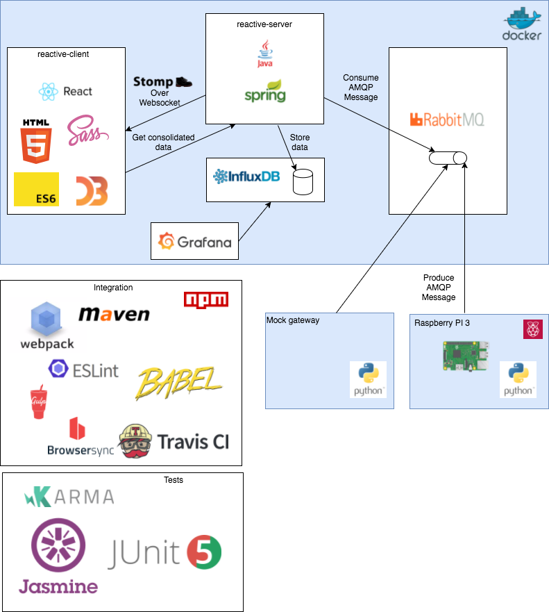

### Create a reactive meteo-station

The objective of this tutorial is to design a full reactive architecture in order to interact with a Raspberry PI 3 as
μService which produce temperature and humidity data.

- [Prerequisites](#prerequisites)
- [Overview](#overview)

###  Prerequisites

- Set up a Raspberry PI 3 [here](2017-01-14-setup_raspberry.md)
- Interacting with DHT22 Sensor [here](2017-02-28-dht22_raspberry.md)
- A server or your own computer with Docker [here](2017-02-28-install_docker.md)
- Install Git (optional) [here](https://git-scm.com/download/linux)

### Overview



| Component        |    Role       | Description  |
| ------------- |:-------------:| -----:|
| Raspberry PI 3   | μService | The Raspberry PI get data sensor and push them over RabbitMQ |
| RabbitMQ  | MOM(message-oriented middleware) | RabbitMQ is message broker that implements the Advanced Message Queuing Protocol (AMQP)  see more [here](https://www.rabbitmq.com/features.html)|
| Reactive-server  | Proxy | The server has 2 functions: consumes data from the RabbitMQ and push data directly on the socket |
| InfluxDB  | Metric database | InfluxDB is a time series database.|
| Reactive-client  | GUI | The GUI consumes data via WebSocket with Reactive-Server |


#### Step 1: Push temperature and humidity to RabbitMQ

a) Run rabbitmq image
```bash
docker run -d --hostname my-rabbit --name some-rabbit -p 5672:5672 -p 8080:15672 rabbitmq:3-management
```
see more [here](https://hub.docker.com/_/rabbitmq/)

You can see RabbitMQ management interface on port 8080.

b) Create a publisher

Show source: https://github.com/jluccisano/raspberry-scripts/blob/master/scripts/publisher.py

c) Create a consumer

Consume temperature and humidity from Queue
tail -f /var/log/dht22/send.log
see this post [here](https://github.com/jluccisano/raspberry-scripts/blob/master/scripts/consume.py)

#### Step 2: Reactive-Server

- InfluxDB

```bash
docker run -d -p 8083:8083 -p 8086:8086 \
      --name=influxdb \
      -v /usr/lib/influxdb:/var/lib/influxdb \
      influxdb
```
see more [here](https://hub.docker.com/_/influxdb/)

- Consume/Aggregate data into database

#### Step 3: Reactive-Client

Create reactive client to consume data from Browser
  - Install ReactJS
  - Create RxJs consume socket
  - Create Temperature Widget with D3Js
  - Push data to browser client vi Websockets (STOMP)


#### Step X: Start the full stack with docker-compose

a) Stop all running your docker containers

b) Adpat the docker-compose file according your environment

```yaml
version: '2'
services:
  reactive-client:
    image: "reactive-client"
    ports:
     - "8089:80"
    links:
     - "reactive-server:reactive-server"
  reactive-server:
    image: "jluccisano/reactive-app:latest"
    links:
      - "rabbitmq:rabbitmq"
  rabbitmq:
    image:  "rabbitmq:3-management"
    hostname: "rabbitmq"
    ports:
     - "5672:5672"
     - "8080:15672"
  influxdb:
    image: "influxdb"
    ports:
     - "8083:8083"
     - "8086:8086"
    environment:
     - INFLUXDB_ADMIN_ENABLED=true  
    volume: "/usr/lib/influxdb:/var/lib/influxdb"
   
```
[See code here](https://raw.githubusercontent.com/jluccisano/portfolio/master/docker-compose.yml)

c) run
```bash
docker-compose up -d
```
d) Go to http://YOUR_HOST:8089

#### Final Result

ScreenShots