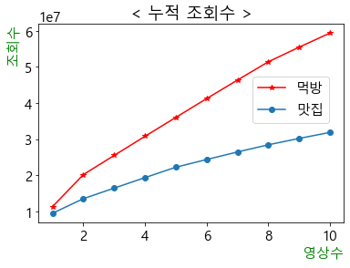

# 주피터 노트북의 기초 사용법 공부

## 유튜버 '나도코딩'님의 영상을 보고 학습했으며
## 영상에 나온 문법 외에는 구글링을 통해 학습하면 되겠다.
** 혹은 위의 Help에서 Keyboard Shortcuts를 참고 **

# Jupyter Notebook


주피터 노트북은 웹 브라우저 상에서 개발을 할 수 있는 도구이며, 코드를 Cell 단위로 묶어서 실행하고 그래프나 표, 그리고 이미지나 영상 등을 쉽게 볼 수 있어서 특히 데이터 관련 작업을 할 때 많이 활용됩니다.

> 교육을 위한 강의 노트로도 아주 훌륭해요!

### 이미지에 우클릭 후 복사해서 붙여넣으면 이미지를 불러올 수 있다.


### 또한, 파일도 불러올 수 있다.


## 특징

1. 코드를 Cell 단위로 작성 및 실행
1. 마크다운을 통한 문서화
1. 그래프나 표 등을 실시간으로 확인
1. html, pdf 등 파일로 저장

## 사전 학습 자료

다음 링크에서 파이썬 기본편에 대한 학습을 하실 수 있습니다.  
[나도코딩 블로그](https://nadocoding.tistory.com)  
동영상 소스코드를 따와서 붙일 수 있다!


```python
%%HTML
<iframe width="640" height="360" src="https://www.youtube.com/embed/kWiCuklohdY" title="YouTube video player" frameborder="0" allow="accelerometer; autoplay; clipboard-write; encrypted-media; gyroscope; picture-in-picture" allowfullscreen></iframe>
```


<iframe width="640" height="360" src="https://www.youtube.com/embed/kWiCuklohdY" title="YouTube video player" frameborder="0" allow="accelerometer; autoplay; clipboard-write; encrypted-media; gyroscope; picture-in-picture" allowfullscreen></iframe>


## 파이선 기본 문법


```python
name = "연탄이"
print(name)
```

    연탄이
    


```python
print("Ctrl + Enter : 현재 Cell 실행")
```

    Ctrl + Enter : 현재 Cell 실행
    


```python
print("Shift + Enter : 현재 Cell 실행 후 다음 Cell 선택")
```

    Shift + Enter : 현재 Cell 실행 후 다음 Cell 선택
    


```python
print("Alt + Enter : 현재 Cell 실행 후 다음 위치에 Cell 삽입")
```

    Alt + Enter : 현재 Cell 실행 후 다음 위치에 Cell 삽입
    


```python
print(1)
print(2)
print(3)
```

    1
    2
    3
    

## 모듈 사용


```python
import random
print(random.randint(1, 45))
```

    25
    


```python
# random.randint??
```


```python
num = 3
```


```python
num *= 2
```


```python
num += 4
```


```python
print(num)
```

    10
    


```python
import time
for i in range(100):
    print(i)
    time.sleep(1)
    
# time.sleep으로 1초마다 print(i)가 되도록 지정
# 중단하고 싶다면 단축키 i를 두 번 누르면 된다.
```

    0
    1
    


    ---------------------------------------------------------------------------

    KeyboardInterrupt                         Traceback (most recent call last)

    <ipython-input-31-1c770928a4ef> in <module>
          2 for i in range(100):
          3     print(i)
    ----> 4     time.sleep(1)
          5 
          6 # time.sleep으로 1초마다 print(i)가 되도록 지정
    

    KeyboardInterrupt: 


---

## 시각화 예제 1 : 그래프

- matplotlib 를 이용하면 다양한 그래프를 그릴 수 있으며 수행 결과를 바로 확인할 수 있습니다.


```python
import matplotlib as mpl
import matplotlib.pyplot as plt
import numpy as np

fig, ax = plt.subplots()  # Create a figure containing a single axes.
ax.plot([1, 2, 3, 4], [1, 4, 2, 3]);  # Plot some data on the axes.
```


    

    


## 시각화 예제 2 : 테이블

- pandas는 복잡한 데이터를 분석할 때 아주 유용합니다.


```python
import pandas as pd
import numpy as np

df = pd.DataFrame([[38.0, 2.0, 18.0, 22.0, 21, np.nan],[19, 439, 6, 452, 226,232]],
                  index=pd.Index(['Tumour (Positive)', 'Non-Tumour (Negative)'], name='Actual Label:'),
                  columns=pd.MultiIndex.from_product([['Decision Tree', 'Regression', 'Random'],['Tumour', 'Non-Tumour']], names=['Model:', 'Predicted:']))
df.style
```


<style  type="text/css" >
</style><table id="T_14063b9f_5ce9_11ec_ba16_505bc29ca842" ><thead>    <tr>        <th class="index_name level0" >Model:</th>        <th class="col_heading level0 col0" colspan=2>Decision Tree</th>        <th class="col_heading level0 col2" colspan=2>Regression</th>        <th class="col_heading level0 col4" colspan=2>Random</th>    </tr>    <tr>        <th class="index_name level1" >Predicted:</th>        <th class="col_heading level1 col0" >Tumour</th>        <th class="col_heading level1 col1" >Non-Tumour</th>        <th class="col_heading level1 col2" >Tumour</th>        <th class="col_heading level1 col3" >Non-Tumour</th>        <th class="col_heading level1 col4" >Tumour</th>        <th class="col_heading level1 col5" >Non-Tumour</th>    </tr>    <tr>        <th class="index_name level0" >Actual Label:</th>        <th class="blank" ></th>        <th class="blank" ></th>        <th class="blank" ></th>        <th class="blank" ></th>        <th class="blank" ></th>        <th class="blank" ></th>    </tr></thead><tbody>
                <tr>
                        <th id="T_14063b9f_5ce9_11ec_ba16_505bc29ca842level0_row0" class="row_heading level0 row0" >Tumour (Positive)</th>
                        <td id="T_14063b9f_5ce9_11ec_ba16_505bc29ca842row0_col0" class="data row0 col0" >38.000000</td>
                        <td id="T_14063b9f_5ce9_11ec_ba16_505bc29ca842row0_col1" class="data row0 col1" >2.000000</td>
                        <td id="T_14063b9f_5ce9_11ec_ba16_505bc29ca842row0_col2" class="data row0 col2" >18.000000</td>
                        <td id="T_14063b9f_5ce9_11ec_ba16_505bc29ca842row0_col3" class="data row0 col3" >22.000000</td>
                        <td id="T_14063b9f_5ce9_11ec_ba16_505bc29ca842row0_col4" class="data row0 col4" >21</td>
                        <td id="T_14063b9f_5ce9_11ec_ba16_505bc29ca842row0_col5" class="data row0 col5" >nan</td>
            </tr>
            <tr>
                        <th id="T_14063b9f_5ce9_11ec_ba16_505bc29ca842level0_row1" class="row_heading level0 row1" >Non-Tumour (Negative)</th>
                        <td id="T_14063b9f_5ce9_11ec_ba16_505bc29ca842row1_col0" class="data row1 col0" >19.000000</td>
                        <td id="T_14063b9f_5ce9_11ec_ba16_505bc29ca842row1_col1" class="data row1 col1" >439.000000</td>
                        <td id="T_14063b9f_5ce9_11ec_ba16_505bc29ca842row1_col2" class="data row1 col2" >6.000000</td>
                        <td id="T_14063b9f_5ce9_11ec_ba16_505bc29ca842row1_col3" class="data row1 col3" >452.000000</td>
                        <td id="T_14063b9f_5ce9_11ec_ba16_505bc29ca842row1_col4" class="data row1 col4" >226</td>
                        <td id="T_14063b9f_5ce9_11ec_ba16_505bc29ca842row1_col5" class="data row1 col5" >232.000000</td>
            </tr>
    </tbody></table>


# 주피터 노트북을 종료할 시에는 Ctrl+s로 저장 후
# Close and Halt 클릭
# 그리고 명령프롬프트 창에서 Ctrl+c, c를 누르면 종료 완료
