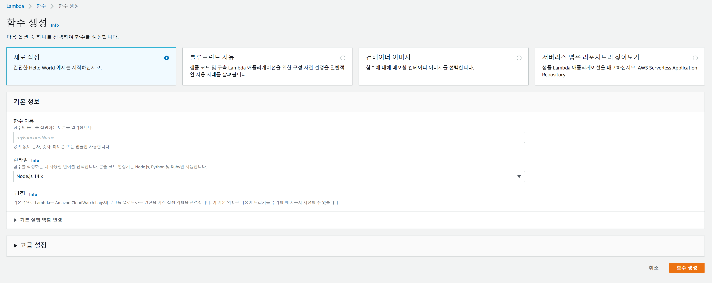

## 📐 Architecture


### Upload System


AWS의 소프트웨어로 [Candidate Idea](#candidate-idea)를 구체화한 upload system이다. 

> 1. 사용자가 컨텐츠와 정보를 AWS의 API Gateway를 통해 sever에 전달한다. 
> 2. 전달된 데이터 중, 컨텐츠는 S3저장소에 저장시키고 metadata는 database인 DynamoDB에 저장한다.
> 3. DynamoDB의 Stream 을 통해 정보가 저장되었다는 notification을 받은 후, metadata를 영어로 번역한다.
> 4. 번역된 키워드들을 ElasticSearch/OpenSearch로 Indexing 시킨다.
> 5. Indexing이 실패한다면, AWS SQS에 해당 작업이 성공할 때까지 Loop 코드를 실행한다. DB와 Search Engine간 data 동기화가 될 수 있도록 한다.


#### Upload System 구성하기


##### API Gateway


|           Path           |  Type  |                            Lambda                            |
| :----------------------: | :----: | :----------------------------------------------------------: |
| `/upload-batch-projects` | `POST` | [upload-batch-projects](https://github.com/KineMasterCorp/MultilingualSearch-sample/tree/main/lambda/upload-projects/upload-batch-projects) with `NodeJS` |

API Gateway에서의 목적은 upload 에 해당하는 API call이 호출되면 AWS lambda를 이용하여 컨텐츠는 저장소에, title과 tags와 같은 메타데이터는 database에 저장하는 것이다.

우선 적절한 이름으로 AWS의 API Gateway를 생성해보자. 생성이 되었다면, 위의 테이블 항목과 같이 API Gateway의 Path를 POST 타입으로 생성하자. 이제 실제 Call이 왔을 때 실행시켜줄 lambda 함수와 연결할 준비를 하면 된다.


##### Lambda for uploading projects


[upload-batch-projects](https://github.com/KineMasterCorp/MultilingualSearch-sample/tree/main/lambda/upload-projects/upload-batch-projects) lambda 코드로 lambda 함수를 만들고 API Gateway와 연결하자. 

👉 serverless framework를 통해 패키지를 구성하여 배포해도 된다. 




이제 lambda 함수에 IAM 권한을 부여해야한다.

- AWSLambdaBasicExecutionRole

- AmazonDynamoDBFullAccess

  

👉 편의상 컨텐츠에 해당하는 데이터를 S3와 같은 저장소에 삽입하는 코드는 생략했다. 필요하다면 저장소 권한도 부여해야 한다.


이제 아래의 JSON과 같은 포맷으로 API Call을 하게 되면 DynamoDB에 정보가 삽입 될 것이다. 

```json
[
    {
       "title":"바다",
       "tags":["바다"],
       "imageURL":"https://URL..."
    },
    {
       "title":"seas",
       "tags":["seas"],
       "imageURL":"https://URL..."
    }
]
```


##### Database with DynamoDB


이제 컨텐츠 정보가 담길 DynamoDB를 생성하자.  여기에서는 table 이름을 project로, 파티션 키는 유니크한 값을 가질 수 있는 project id 값으로, 정렬 키는 title로 설정했다. 


또한, 검색 엔진과 data 동기화가 되어야 하기 때문에 DynamoDB에 삽입/삭제와 같은 변경이 생긴다면 이를 알려주는 트리거 기능 또한 설정해야한다. 


이제 DynamoDB에서 변경이 있을 때마다 index-project 로 해당 정보가 notification 된다.


##### Lambda for indexing to Search Engine


|                            Lambda                            | Lambda Language |
| :----------------------------------------------------------: | :-------------: |
| [index-project](https://github.com/KineMasterCorp/MultilingualSearch-sample/tree/main/lambda/index-project) |    `Python`     |

이번에는 python으로 되어있는 코드를 packaging하여 lambda 함수로 배포해보자. 


> Python code 를 lambda packaging 하는 방법

```
1. Install dependencies

package directory 에 dependency 다운로드

pip install --target ./package requests 
pip install --target ./package requests_aws4auth
pip install --target ./package git+https://github.com/opensearch-project/opensearch-py.git

2. 소스 작성

Python 소스 파일을 (lambda_function.py) package 폴더의 상위 폴더에 넣는다.

3. zip 으로 묶기 (다운받은 package 들을 zip 으로 묶고 그 zip 파일에 작성한 소스 파일도 추가)

cd package
zip -r ../deploy_package.zip .
cd ..
zip -g deploy_package.zip lambda_function.py

4. deploy_package.zip 파일을 Lambda 에 업로드.
```


index-project lambda 코드에서는 dynamoDB로 부터 전달된 메타데이터(title/tags) 정보를 검색엔진에 indexing 한다. 눈여겨 봐야할 점은 사용자의 검색어 그대로 indexing 하는 것이 아니라, 서두에 언급한 바와 같이 검색어를 영어로 변경하여 indexing 해야 하는 점이다.

```python
	try:
        # The Lambda function calls the TranslateText operation and passes the 
        # review, the source language, and the target language to get the 
        # translated review. 
        result = translate.translate_text(Text=title, SourceLanguageCode='auto', TargetLanguageCode='en')
        title_translated = result.get('TranslatedText')
        logger.info("Title translation input: " + title + ", output: " + title_translated)
    except Exception as e:
        logger.error("[Title Translate ErrorMessage]: " + str(e))
        raise Exception("[Title Translate ErrorMessage]: " + str(e))
    
    # Translate tags
    translated_tags = []
    for tag in tags:
        try:
            result = translate.translate_text(Text=tag, SourceLanguageCode='auto', TargetLanguageCode='en')
            tag_translated = result.get('TranslatedText')
            logger.info("Tag translation input: " + tag + ", output: " + tag_translated)
            translated_tags.append(tag_translated)
        except Exception as e:
            logger.error("[Tag Translate Fail]: (" + tag + "):" + str(e))
            translated_tags.append(tag) # Put the original tag string when translation failed.
```

index-project 코드 중 일부이다. AWS python SDK(Boto3)를 사용하여 translate 기능을 수행한다. translate_text의 인자인 SourceLanguageCode에 'auto' 값이 아닌 정확한 target을 지정한다면 조금 더 좋은 번역 품질을 기대할 수 있다. 


index-project lambda 함수 또한, IAM 권한을 부여해야 한다.

* AWSLambdaDynamoDBExecutionRole
* TranslateReadOnly
* AmazonOpenSearchServiceFullAccess
* AWSXRayDaemonWriteAccess


> 참고: 이 권한에 필요한 것보다 더 넓은 범위를 사용하고 있습니다. 구현에 필요한 최소한의 보안 권한을 사용하는 것을 고려하십시오.


##### OpenSearch 설정

이제 마지막으로 OpenSearch를 설정하면 upload system의 구성을 완료 할 있다.