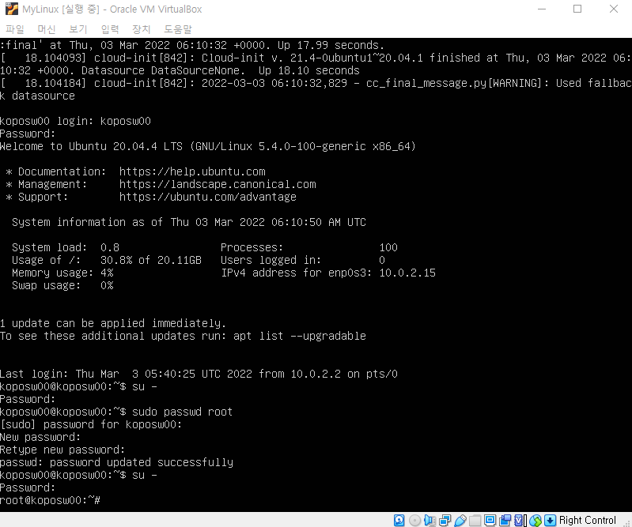
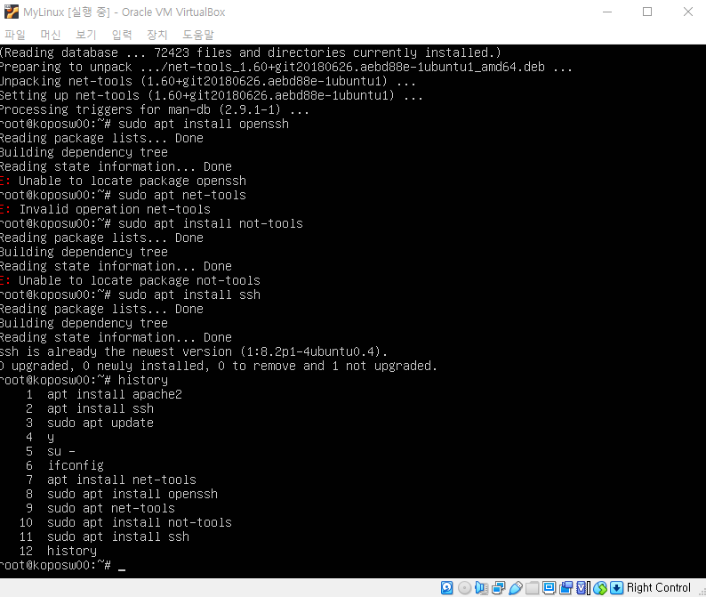
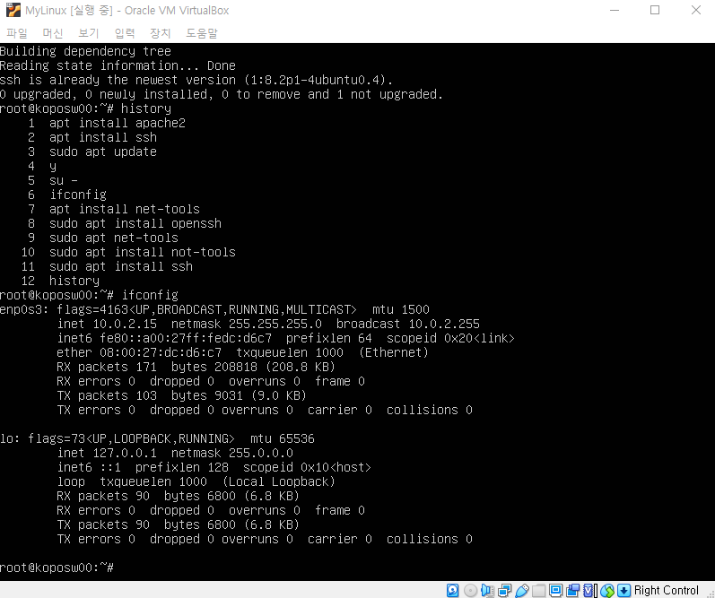

### 서버 구축 방법 종류

##### 1.서버(StandAlone)은 서버컴퓨터로만 구축하는 방법

##### 2. ClientServer : 유저컴퓨터와 서버컴퓨터가 분리되어 브라우저를 통해 연결되는 서버환경.

연결 과정에서의 약속 : protocol ex) http, smb(파일공유프로토콜),ftp(file transfer protocol)

이때 서버 컴퓨터는 IP가 하나. 여러 유저컴퓨터의 프로토콜을 지원하기위해 고유의 "port"를 사용.

http(80번 포트), ftp(21번 포트), Ssh (22번 포트), https (8080번 포트), Mysql (3306번 포트)

192.168.23.153:8080의 의미 => :8080 포트를 이용하여 앞 ip의 프로토콜 대기.

### 운영체계(제) (middle ware, Operating System)

하드웨어와 소프트웨어의 중간 위치. 이미 만들어진 API같은 느낌. (가장 기본적인 클릭시 어떻게 입력되고 이런 사소한 것들도 전부 설정해야했다.)=> 사용자의 편의성을 위해 OS가 개발되었다. 

### 유닉스와 리눅스

##### 유닉스 : 안정성, 대용량, 코어업무, 전문가들에게만 국한됨.

> 개인을 위한 유닉스를 만들어보자! => 리눅스

~~UtoL 로 변경하는 마이그레이션 프로젝트가 요즘 핫하다고 함.~~

머신러닝등을 가동할 때 리눅스를 쓴다.

리눅스를 배포하는 우분투, redHat 등등 

#### UNIX(운영체제 국제 표준) 기반의 리눅스, Mac OS.

##### 서버의 경우 gui가 불필요. tui로만 구축. cli와 tui는 무슨 차이일까?

gui : graphic user interface

#### 클라이언트 서버 개발환경 구축

Virtual Box (가상(머신)환경) 를 이용하여 window에 ubuntu를 설치. 여기서 바로 작업하는 것은 서버 클라이언트가 아님.

고로, 윈도우의 프로그램 putty라는 ssh client(22번 포트)를 이용하여 내 VB의 ubuntu 의 서버클라이언트로 접속.

~~AWS 1년 무료. 사이드로 수업 외적으로 해보고싶은 것들은 GCP AWS를 이용해서 만들어봐도 좋다! .~~

~~우분투는 1년에 두번 업데이트 배포를 한다.~~

컴퓨터 CPU 

RAM(주기억장치) : 프로그램을 실행한다.

HDD,SSD(보조기억장치) : 파일을 저장한다.

#### 리눅스의 간단한 코드 해석

root@koposw00:~$

앞@ : 접속한 계정이름

@뒤 : 접속한 PC이름

~ : 내컴퓨터  

$:프롬프트를 시작한다.

#:root로 로그인했을 때 $이아닌#으로 나온다.

root : 관리자

sudo : 관리자권한부여 (다 가능하지만 사용자의 비밀번호를 못본다. 근데 비밀번호 초기화는 할 수 있다.)

ex) sudo apt update //업그레이드 목록 받아오기

ctrl c : 현재 라인 나가기

su - : 관리자 계정으로 로그인을 하겠다.(계정변환)

일반 사용자에서 어떻게 관리자 비밀번호를 바꾸지?(처음에 만든 비밀번호는 특별해서 sudo의 권한을 잠시 가져올 수 있음)

관리자 변경 되었다! ~#이니까

shutdown -h now : 지금 터미널(이 검은 창) 끄기.

ifconfig : interface configuration

sudo install net-tools

sudo apt install ssh : 

ssh(보안터미널서비스)

ifconfig을 하여 카카오톡의 inet ip정보를 가져오고 

inet 10.0.2.15 를 가지고, VB의 설정- 네트워크- 포트포워딩 규칙에 적용한다.

- 호스트 IP : Host PC (자기 PC)의 IP
- 호스트 포트 : Host PC에서 사용하는 포트 번호
- 게스트 IP : 서비스를 제공할 가상 머신의 IP
- 게스트 포트 : 가상 머신에서 서비스를 제공에 사용하는 포트 번호

#### 오픈소스 ≠  무료

오픈소스에는 정책 License라는 개념이 있다.

ex) Mit License, Apache License etc

무료 => Free software. GNU는 freesoftware에 가깝다.

*자료구조와 알고리즘을 알고 프로그래밍하는 것과 아닌것은 천지차이! Think Data Structures 교재를 보고 공부하자!

##### 브라우저통해서 서버에 접속을 도와주는 "웹서버" 

ex) apache, tomcat

업데이트는 설치가 아님. 내가 원하는 업데이트 파일이 인터넷 어디에 있는지 리스트를 나열하는 것.

