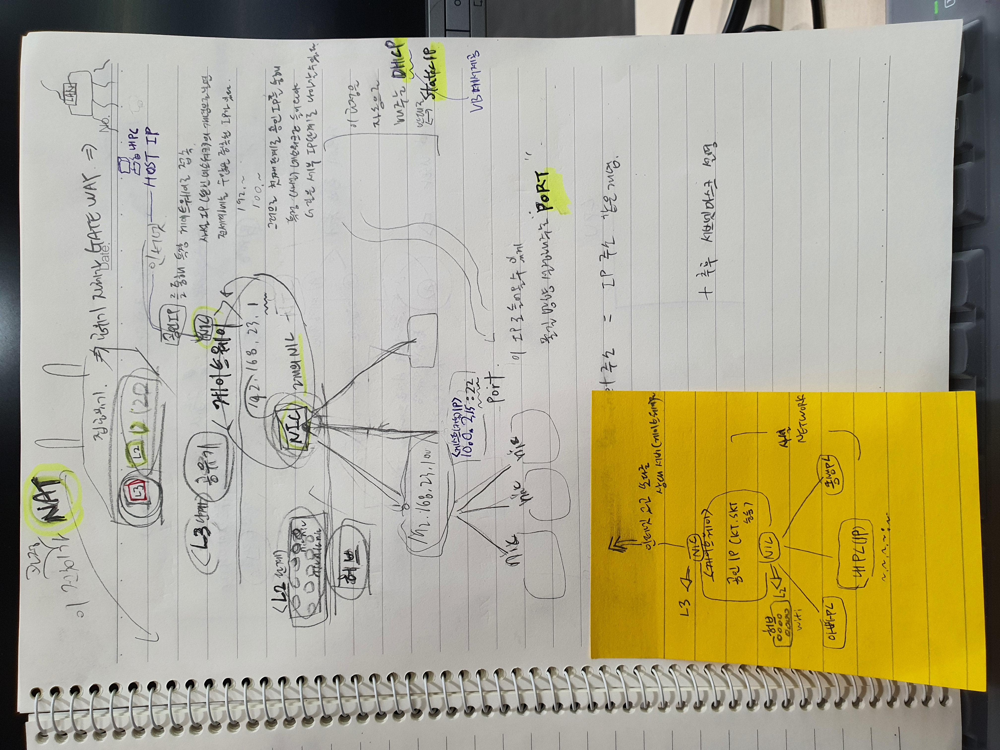

# 리눅스 2강

### 1. 사용자등록, 패스워드 설정

**1)관리자(root)와 일반사용자**

​		~~옛날 도스, 윈도우 초반에는 관리자 개념이 없었다고 한다. 그땐 개인용PC가 주였다. why? 여러 계정을 사용해야 관리자 개념이 필요한 것이기 때문~~

 **2)사용자와 그룹**

​	- 사용자권한(사진 속 A B C)

​	- 그룹권한(a )

​	- other(위 둘다 아닌)권한

파일의 권한설정

- owner의 권한

- owner 그룹의 권한

 **3)사용자 및 그룹 관리**

관리는 root관리자 권한으로 진행해야함.

​	방법1. su - : 계정전환(사용자계정 to 루트계정) / 방법2. sudo ~~~ 권한을 부여한 코드로 진행 

su - {계정명} : 루트계정 to 사용자계정

 adduser {새 사용자 이름}: 새 계정(사용자)추가

! 계정(사용자)를 추가하면 기본적으로 동일이름의 프라이머리 그룹이 생김. 지울 수 없다.

addgroup {사용자} {그룹}: 사용자를 그룹에 추가.

deluser : 계정삭제

delgroup : 그룹삭제

id : 아이디 보기

groups : 현재 사용자의 그룹보기

cat : 파일 보기

​		uid = 유저아이디/ gid = 그룹아이디

 **4)** **패스워드 설정**

passwd koposw00

### 2. 권한획득, 명령어 도움말

**1)권한획득**

​	방법1. su - {계정명} : 루트계정 to 사용자계정

 **2)명령어 도움말**

​	man 명령 : 명령어 도움말을 보여줌(manual)

​	 man adduser

### 3. 가상 터미널

**1)프로그램 설치**

**2)ssh, telnet설치**

~~예전엔 원격 접속을 위하여 telnet을 사용했지만 보안이 되지 않는(패킷) 기능이였다. 그리하여 지금은 사용하지 않는다. 요즘은 ssh사용!~~

1일차에 리눅스를 통해 ssh서버를 구축하고, 쁘티를 통해 ssh 클라이언트 서버로 들어갔었다.

**3) 사용자 PC에서 필요 프로그램 설치 **

****

#### 용어정리 :

**IP** : Internet Protocol (address)

​	168.126.63.1.../254  : ~63.까지만 같으면 같은 네트워크라 보고 접근할 수 있다.

IP의 32bit 주소체계(IPV4 IPVersion4) :

​	32개의 2진수 : 8자리.8자리.8자리.8자리 (식별이 어려움)

 	각 8자리를 인수로 정리 => 168.126.63.1 (식별이 쉬움)

​	이때, 32bit의 경우의 수는 2^32(40억 정도). IP가 불충분하다!

​	그리하여 IPV6 등장.

IPV6 (128bit)가 도입은 되었지만 체계가 복잡해 전문적인 곳에서 주로 사용.

​	그럼 어떻게 충당을 하나?

=> **NAT**(Network Address Translation)의 등장

중복 IP여도 GATEWAY와 SUBNETMASK가 달라, 여기에 PORT까지 설정해주면 원하는 특정 IP를 찾을 수 있지.

​	

​	**HUB** - 같은 네트워크 끼리 연결해주는 장비

​	**BRIDGE** - 허브끼리 연결해주는 장비 = L2 장비

​	**ROUTER** - 다른 네트워크로 이동할 수 있는 장비(라우팅) = L3 장비

​		라우터 장비의 Address = GATEWAY ADDRESS

​		집에서 사용하는 인터넷 공유기는 보통 허브 역할도 하고 라우터 역할도 하는 		L2 L3장비이다.

​	

​	**DNS**

​	-Domain Name : 특정 IP(구글, 네이버 등)에 접속을 할 때 IP주소를 찾기보다 도메인 네임을 설정하여 접속하기 편리하게 만든 이름.

​	-Domain Name Server : DNS에 IP번호를 문의하면 DN(네이버)가 나오고,

​	DN을 문의하면 IP를 준다. => "IP와 DN이 매핑되어있다."

​	매핑 되어있는 IP와 DN 정보들을 저장, 모아두는 곳 DNS

​	**Root**

​	**Administraitor(Admin)**
​	

​	**TCP/IP 네트워크**

​	**IP**

​	**PORT**

​		

​	한 서버에서 여러가지 서비스를 제공하기 위해 만든 PORT

​	총 65535(2진수)개의 포트가있다.

​	**DHCP**

동적으로 IP를 할당해주는 서버.

네트워크 안에 연결이 되면 , DHCP를 설정해놓은 서버가 있으면 서버에 들어온 pC에 자동으로 IP를 설정해줌.

이와반대로 일일이 설정해줘야 하는 방식 Static방식(고정IP).

​	**NAT**

​		인터넷에는 공인IP와 사설IP(ex, 교안의 NAS네트워크 등 외부에서 들어오지 못하는 닫혀있는 네트워크)가 있다.

인터넷 설정에 기본적으로 4가지 요소

**IP**

**Subnet(추후에)**

**gateway**

**DNS**

​	Gateway에는 두개의 nic이 있다.

​	 **NIC** : network interface card

​			한개는 인터넷에 연결, 한개는 내부 네트워크에 연결되어있다. (VB처럼 가상으로 서버를 만드는 경우 허구의 NIC or 컴퓨터의 LAN선 꼽는 곳 같은 경우 실재. )

​		내부 네트워크는 하이라키처럼 이루어져 있다. 네트워크 속 네트워크 속 네트워크...

​	네트워크에서 제일 중요. 통신의 기본 단계(하이라키 계단에서)에서 제일 윗단계. 게이트웨이를 통해서 다른 게이트웨이로, 즉 다른 서버로 통신이 가능.

192.168.23.1 에서 마지막 1이 게이트웨이.

2의 진수 256. 1개의 게이트웨이(하이라키) 하향 계단에서 총 256-1 개의 단계를 만들 수 있다.

​	**Static IP(고정IP)**

​	**Port forwarding**

게이트웨이의 하향 단계에서 윗단계는 아랫단계의 내용을 볼 수 없다. (박스안에 무엇이 들어있는지 볼 수 없다.)

그리하여 포트포워딩을 통해 위에서 아래로 물길 만들 듯이.

포트포워딩 번호로 하향 방향 IP를 잡아줌

**CPU와 코어, 메모리의 관계**

