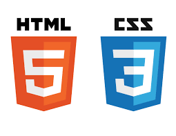
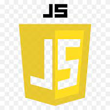
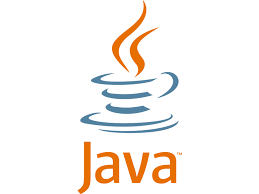
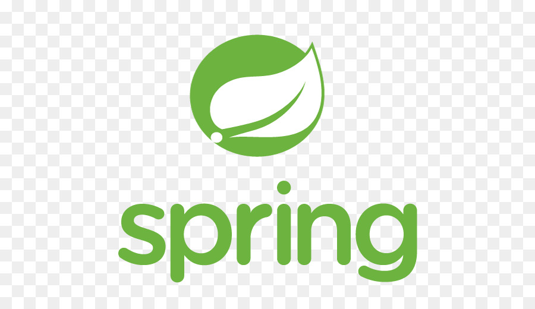
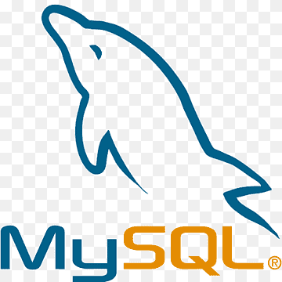

# 2022. 04 .14 수업내용 정리
## 코드 위주로..
### 1편과 2편으로 나누어서 정리, 오늘은 1편

<br>

+ 기본 태그 
  * a : 웹 페이지에는 다른 페이지나 사이트로 연결되는 수많은 하이퍼링크(hyperlink)가 존재합니다. <br>
    이러한 하이퍼 링크를 간단한 링크라고도 부르며, HTML에서는 <a>태그로 표현합니다. <br><br>
  
  ```html
  <a href="https://www.naver.com/" alt="네이버 링크">네이버</a> 
  <a href="https://www.naver.com/" alt="네이버 링크"></a> 
  <a href="https://www.naver.com/" alt="네이버 링크"><p>네이버 입구입니다.</p></a> 
  <!-- href 속성은 링크를 클릭하면 연결하려는 페이지나 사이트의 URL 주소를 명시합니다. 
       텍스트나 단락, 이미지 등 다양한 요소에 HTML을 사용할 수 있습니다. -->
  ```
  <br>
  
  위의 코드를 적용하면 아래 ▼ 와 같은 결과가 나온다. <br><br><br>
  <a href="https://www.naver.com/" alt="네이버 링크">네이버</a> <br><br>
  <a href="https://www.naver.com/" alt="네이버 링크"></a> <br><br>
  <a href="https://www.naver.com/" alt="네이버 링크"><p>네이버 입구입니다.</p></a> 
  
  <br><br>
  
  * ol, ul, li 
    - ol(ordered list): 순서가 있는 리스트는 ol 태그로 시작하며, 여기에 포함된 각각의 리스트 요소는 li 태그로 시작합니다. <br>
                        각 리스트의 요소 앞에는 기본 마커로 아라비아 숫자가 위치합니다. <br><br>
  
  ```html   
  <ol>
    <li>기본개념</li>
    <li>실습</li>
    <li>프로젝트</li>
  </ol>
  ```
  
  <br>
  위의 코드를 적용하면 아래 ▼ 와 같은 결과가 나온다. <br><br>
    1. 기본개념 <br>
    2. 실습 <br>
    3. 프로젝트 <br><br>
  
    -ul(unordered list): 순서가 없는 리스트는 ul 태그로 시작하며, 여기에 포함된 각각의 리스트 요소는 li 태그로 시작합니다. <br>
                         각 리스트의 요소 앞에는 기본 마커로 작은 원(bullet)이 위치합니다. <br><br>
  
  ```html
  <ul>
    <li>기본개념<li>
    <li>실습<li>
    <li>프로젝트<li>
  </ul>
  ```
  
  <br>
  
  위의 코드를 적용하면 아래 ▼ 와 같은 결과가 나온다.  <br><br>
    - 기본개념 <br>
    - 실습 <br>
    - 프로젝트 <br><br>
  
  아래는 중첩 리스트와 링크이미지 개념을 합친 예시이다. <br>
  
  ```html
  <ul>
    <li>프론트엔드</li>
      <ul>기술스택
        <li><a href="http://tcpschool.com/html/html_expand_css"></a></li>
        <li><a href="http://www.tcpschool.com/javascript/intro"></a></li>
        <li><a href="https://ko.reactjs.org/"></a></li>
        <li><a href="https://vuejs.org/"></a></li>
      </ul>
    <li>백엔드</li>
      <ul>기술스택
        <li><a href="https://www.java.com/ko/"></a></li>
        <li><a href="https://spring.io/"></a></li>
        <li><a href="https://www.docker.com/"></a></li>
        <li><a href="https://www.mysql.com/"></a></li>
      </ul>
  </ul>     
  ```
  <br>
  
  ▼▼▼ 위의 코드를 적용하면 아래와 같은 결과가 나온다. ▼▼▼ <br><br>
    + 프론트엔드 
      * 기술스택
        - 
        - 
        - 
        - 
    
    + 백엔드
      * 기술스택
        - 
        - 
        - 
        -  

 
