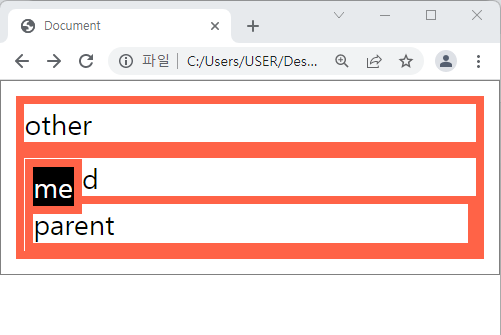

# 1. 선택자

### 가상 클래스 선택자

- 클래스 선택자처럼 동작하지만 클래스 선택자는 아니고, 여러가지 특수한 선택들을 하게 하는 그러한 선택자

##### 가상 클래스 선택자 예시

- element 특성에 따라 선택하게 만드는 선택자
- active : 눌렀을 때
- hover : 마우스를 올려놨을 때
- visited : 방문했을 때(보안 측면에서 제한된 기능 가능)

-  link : 방문 안했을 때

- focus : tab 등으로 클릭되었을 때(여러 이유로 맨 마지막에 적음)

```html
<style>

		a:link{
            color: black
        }

        a:visited{
            color: red;
        }
        a:active{
            color: green;
        }

        a:hover{
            color: yellow;
        }

       a:focus{
            color: white;
        }
</style>
```


### 다양한 선택자

##### 선택자 공부 : https://flukeout.github.io/

- A+B : A 다음에 나오는 B선택자
  - plate + apple : plate 선택자 다음에 나오는 apple 선택자 1개

- A ~ B : A 다음에 나오는 모든 B 선택자
  - bento ~ pickle : bento 선택자 다음에 나오는 pickle 선택자 모두
- A > B : A 바로 밑에 있는 모든 B 선택자
  - plate > apple : plate 바로 밑에 있는 apple 만 선택(only direct children)

------------여기서부터는 크게 쓰이지 않는다고 함------

- A:first-child : 첫번째로 등장하는 모든 A선택자
  - orange:first-child
- A:only-child : 어떤 element가 sibling이 없이 혼자 자식일 때
- A:last-child : 가장 뒤에 있는 element를 선택

- A:nth-child(N) : N번째에 있는 child 

- A:nth-last-child(N) : 뒤에서 N번째에 있는 child 

- A:first-of-type : 제일 처음 등장하는 A 선택자

- A:nth-of-type(odd, even) : 홀수번째나 짝수번째에 등장하는 A 선택자
- A:nth-of-type(수열) : 수열에 따른 A 선택자 선택
  - plate:nth-of-type(2n+3) : 3, 5, 7... 번째 plate 선택(n은 0부터 시작함) 
- A B:only-of-type : 단 하나의 B 선택자만 있는 A선택자 안의 B 선택자
  - plate apple:only-of-type : apple 타입이 1개만 있는 plate의 apple 선택

- A:last-of-type : A 중에 마지막 태그
- A:empty : 자식 타입이 아무것도 없는 A 타입

- A:not(X) : X가 아닌 모든 A 타입
  - apple:not(.small) : small class가 아닌 모든 apple


# 2. 타이포그래피

### 글자크기 : 'px' vs 'rem'

- px : 어떠한 경우에도 크기가 같음, 모니터 상의 화소 하나의 크기에 대응되는 단위
- rem : 사용자가 설정한 크기에 따라 가변적으로 크기가 바뀜, html 태그에 적용된 font-size의 영향을 받음
- 일반적인 경우 rem으로 사용하는게 낫다
- 2rem : font-size * 2


### 색 표현 : 'name' vs 'rgb' vs 'hex'

- `color: sth;` 으로 표현

- name : 색의 영어 이름으로 표현
  - red, tomato, blue ...
- rgb : rgb 값으로 색 표현
- hex : 16진수 6자리로 rgb표현 `#000000`


### 택스트 정렬

- text-align: sth;
- justify : 균등하게 정렬


### 폰트 설정

- font-family: sth;
- font를 나열했을 때, 앞의 font가 컴퓨터에 없으면 그 다음 font 사용
  - font-family: sth1, sth2, sth3;
  - sth1이 없으면 sth2 사용 
- 폰트 이름이 2단어 이상이면 " " 안에 넣어줘야 함
  - ex) font-family: "sth font";

- sans-serif, serif

  - sans-serif : 장식이 없는 폰트

  - serif : 장식이 있는 폰트


- 고정폭 vs 가변폭

  - 고정폭 : 고정폭이 필요하면 뒤에 monospace를 적어서 컴퓨터에 저장된 font 중에 고정폭 font를 적음

- font-weight

  - 폰트 두께를 나타냄

  - font-weight: bold; - 굵게

- line-height

  - 폰트 자간을 나타냄

  - line-height: 1.2; 1.2가 기본값

- font

  - font 내용을 한번에 적어주기(border랑 비슷한 듯)

  - 순서가 있으므로 순서대로 해야 함

  - font: font-style font-variant font-weight **font-size**/line-height **font-family**|caption|icon|menu|message-box|small-caption|status-bar|initial|inherit; 

  - 이 중에서 font-size와 font-size와 font-family는 필수로 포함되어야 하는 정보

  - ```html
    #type2{
            font:bold 5rem/2 arial, verdana, "Helvetica Neue", serif;
          }
    ```

   

### web font

- 한글은 web font크기가 크기떄문에 이를 고려해야 함
- google web font 사용

##### font 생성

- 폰트 다운로드 후, (네이버 등)
- http://www.web-font-generator.com 에서 폰트 생성
- css 파일에서 폰트 확인 후 사용


# 3. 조화

### 상속

- 부모 엘리먼트의 속성을 자식 엘리먼트가 물려받는 것

- 상속되지 않는 속성도 있음
  - border 등
  - https://www.w3.org/TR/CSS21/propidx.html 에서 확인 가능


### stylish

- chrome 확장 프로그램에 google stylish
- install 하면 적용됨
- stylish를 통해 직접 edit 가능


### 캐스케이딩(cascading, 폭포)

- 하나의 element에 대해서 다양한 효과가 영향력을 행사하려고 할 때 우선순위 설정

- 규칙1 : 웹브라우저 < 사용자 < 저자

```html
    <style>
        li{color: red;}
        #idsel{color: blue;}
        .classsel{color:green;}
    </style>
</head>
<body>
    <ul>
        <li>html</li>
        <li id="idsel" class="classsel" style="color:powderblue">css</li>
        <li>javascript</li>
    </ul>
</body>
```

- 규칙2 : style 속성 > id 선택자 > class 선택자 > 태그(li 등) 선택자 순
  - 구체적이고 명시적인 규칙이 우선
  - 포괄적인 규칙이 나중
- 규칙3 : 뒤에 `!important`를 붙이면 우선 적용
  - ex) li{color: red !important;}
  - 하지만 좋은 방법은 아니며, 우선 순위를 잘 따져서 적용하는게 좋음


# 4. 레이아웃

### box model

- border : 테두리
- padding : 태그 안의 간격
- margin : 태그의 밖의 간격

- 화면 전체를 사용하고 싶지 않다면 width와 height를 사용
  - inline 방식에서는 width와 height 값이 무시됨 

### box-sizing

- width 와 height 값에는 border값이 포함되지 않음
- 따라서 `box-sizing: border-box` 속성을 추가하면 border값이 포함 됨 

```html
<style>
div{
    margin: 10px;
    width: 150px;
    box-sizing: border-box;
    }
</style>
```

- 편하게 `*{box-sizing: border-box;}`를 선언해서 모든 태그에 적용


### 마진 겹침

- margin 값이 겹치는 현상
- 두 형제 태그 중 더 큰 margin 값이 간격이 됨
- **부모태그가 시각적으로 아무것도 없을 때 부모태그와 자식태그에서도 마진겹침이 일어남**


### 포지션

- element 가 어디에 위치할 것인가?

- offset

  - `position: relative;` 속성 필요

    - static : 정적 위치(default값) / 위치에 대한 값을 설정하지 않은 상태

  - left, top 속성 : n px 만큼 이동(left, top 우선)

  - ```html
    #me{
        position:relative;
        left:100px;
        top: 100px;
        }
    ```

- absolute(절대 위치)

  - `position: absolute;` 속성 추가로 절대적 위치 설정

  - left, top 을 통해 절대적 위치

  - **absolute를 쓰면 더 이상 부모태그에 속해있는 것이 아닌 것처럼 움직임**

  - absolute의 default 위치는 부모 속성 아래의 원래 위치

  - width와 height 도 다시 설정해줘야 함

  - 부모 태그 중 static이 아닌 position이 있으면 그부모태그를 기준으로 absolute 위치를 정함

    - ```html
      <div id="grand">
          grand
          <div id="parent">
              parent
              <div id="me">
                  me
              </div>
          </div>
      </div>
      ```

    - 여기서 grand의 position은 relative, parent는 static, me는 absolute라고 할 때, me의 left, top 값은 grand 기준으로 됨
    - 

- fixed(고정된)
  - position_3.html