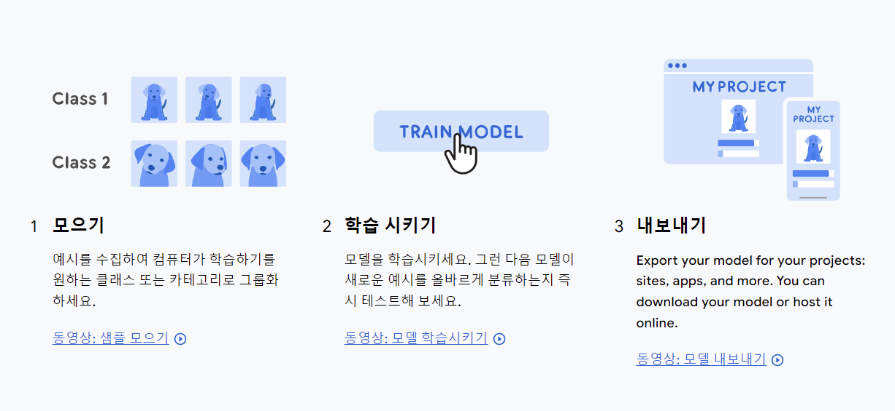

이 프로젝트는 "TEACHABLE MACHINE"을 이용하여 딥러닝 모델을 구현한 것 입니다.

마스크를 착용하고, 착용하지 않고를 구별할 수 있으며 

이는 정보를 담은 사진 데이터를 웹캠으로 찍거나, 업로드해서 기계를 학습시킬 수 있습니다.

teachable machine 프로그램은 간단한 알고리즘을 사용합니다.

<button type="button" id='startBtn' onclick="init()">START!</button>
<button type="button" id='stopBtn' onclick="stop()">STOP!</button>

