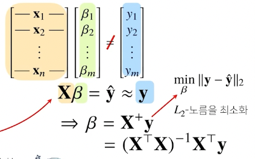

# 1. 벡터가 뭐에요

성분곱: hadamard product


## norm

벡터의 노름은 원점에서부터의 거리를 말함

1. L1 노름 : 각 성분의 변화량의 절대값을 모두 더합니다.

ㄴ Robust 학습, Lasso 회귀

2. L2 노름 : 피타고라스 정리를 이용해 유클리드 거리를 계산합니다.

ㄴ Laplace 근사, Ridge 회귀


벡터사이의 각도 구하기 (제2 코사인 법칙)


# 2. 행렬이 뭐에요

벡터를 원소로 가지는 2차원 배열


### 행렬의 내적?

numpy의 np.inner 는 i번째 행벡터와 j 번째 행벡터 사이의 내적을 성분으로 가지는 행렬을 계산 (수학에서의 일반적인 내적과 다름)


### 역행렬

행과 열 숫자가 같고, det가 0이 아닌 경우 ->  계산 가능


조건이 안되서 역행렬을 계산할 수 없다면

-  유사역행렬(pseudo-inverse) 또는 무어펜로즈 역행렬(Moore-Penrose) 이용 


```python
np.linalg.pinv(matrix)
```


행이 열보다 많을 때,

유사역행렬을 원래 행렬보다 먼저 곱해야만 항등행렬이 나옴

순서 바뀌면 다른 결과가 나옴

 

유사역행렬을 이용하여

연립방정식을 풀고, 선형회귀식을 찾을 수 있다.




이는 sklearn의 LinearRegression과 같은 결과를 이끌어낼 수 있다.


그림 출처: Naver connect Foundation

