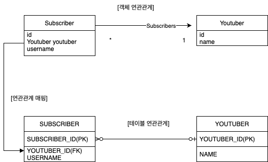

## 다대일 단방향 연관관계 매핑하기
- 객체와 테이블의 연관관계는 조금 다르다.
- 테이블
    - 외래 키 하나로 양쪽 조인이 가능하다.
    - 사실 방향이라는 개념이 없다. 
    - DB에서는 외래키가 한 쪽에만 있다.

- 객체
    - 참조용 필드가 있는 쪽으로만 참조 가능하다.
    - 한쪽만 참조하면 단방향
    - 양쪽이 서로 참조하면 양방향

## 연관관계의 주인
- 테이블은 **외래 키 하나**로 두 테이블이 연관관계를 맺는다.
- 객체 양방향 관계는 A->B, B->A 처럼 참조가 2군데이다.
- 객체 양방향 관계는 참조가 2군데 있다.  
둘 중 테이블의 외래키를 관리할 곳을 지정해야 한다.
- 연관관계의 주인은 외래키를 관리하는 참조이다.
- 연관관계 주인의 반대편은 외래 키에 영향을 주지 않으며,  
단순 조회만 가능하다. 

### [ex] 예시로 유튜버와 구독자를 나타내는 다대일을 나타내 보자.



많은 쪽 Subscriber(구독자)쪽이 N이고 Youtuber(유튜버)가 1인 경우이다. 많은 쪽에 외래키를 설정해 주었고, Subscriber에서 Youtuber로 참조를 한다고 하면 YOUTUBER_ID를 가지고 참조하면 됨. DB설계에서 외래키는 항상 "다"에 가야한다.


```java
@Entity
public class Youtuber {
    @Id @GeneratedValue
    @Column(name = "YOUTUBER_ID")
    private Long id;

    private String name;
}
```


```java
@Entity
public class Subscriber {

    @Id @GeneratedValue
    @Column(name = "SUBSCRIBER_ID")
    private Long id;

    @Column(name = "USERNAME")
    private String username;

    @ManyToOne
    @JoinColumn(name = "YOUTUBER_ID")
    private Youtuber youtuber;

    // getter, setter
}
```

- 다대일인 경우에는 @ManyToOne 어노테이션을 많은 쪽(여기서는 Subscriber)에 써주면 JPA에서 인식을 하여 Query가 우리가 원하는 데로 나가게 된다. 
- 외래키가 있는 곳이 연관관계의 주인이라고 했다. 그렇다면 위에서는 외래키가 어디 있을까? 바로 Subscriber에 있다. 다대일이라는 것은 해석에 따라 Youtuber가 될 수 있고, Subscriber가 될 수도 있다. 하지만 DB입장에서 보면 다대일이라는 것은 많은 쪽이 "다"라고 생각하면 된다. 
- @ManyToOne 어노테이션은 DB와 매핑하기 위해 존재하는 것이다. JPA에게 다대일이라고 알려주는 것이라 생각하면 된다.  
@JoinColum은 YOUTUBER_ID와 매핑하기 위한 어노테이션이다. 
- 여기서 양방향으로 하기 위해서는 코드 2줄만 "1"인쪽에 추가해주면 되는데, 일단 다대일만 짠 이후에 양방향이 필요하다면 그때 추가하는 것이 좋다.  


### JPA를 이용하기 위해서는 DB설계가 먼저 되어야 한다. 그리고 각 Entity마다 관계를 어노테이션을 이용해 알려줘야 한다. 
