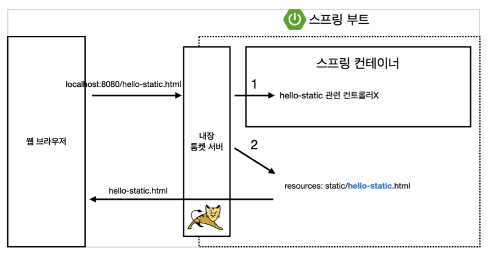
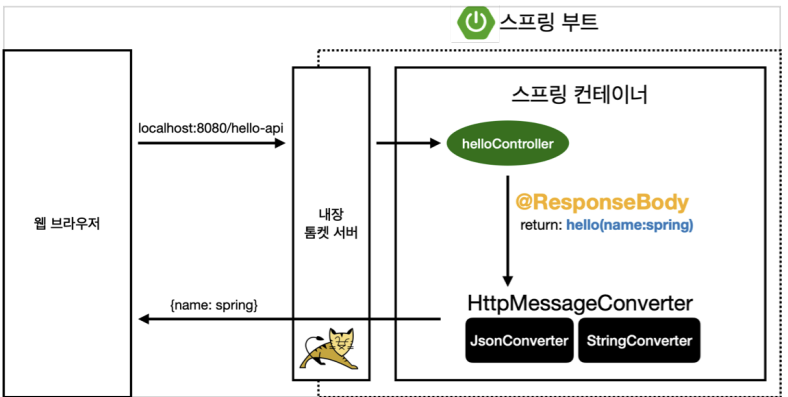

# 1. 정적 컨텐츠

- 파일을 그대로 웹브라우저에 내려주는 컨텐츠
- 스프링부트는 기본적으로 정적컨텐츠를 제공해준다.

## 정적 컨텐츠 만들기

- static 폴더에 html 파일을 만들면 그대로 만들어짐

- static > hello-static.html

  - ```html
    <!DOCTYPE HTML>
    <html>
    <head>
        <title>static content</title>
        <meta http-equiv="Content-Type" content="text/html; charset=UTF-8" />
    </head>
    <body>
    정적 컨텐츠 입니다.
    </body>
    </html>
    ```

- localhost:8080/hello-static.html 로 확인 가능하다.

  - 

## 정적 컨텐츠 원리

- 

  1. 처음에 내장톰캣서버가 요청을 받고, 스프링한테 요청을 넘기면,

  2. 스프링은 먼저 컨트롤러에서 hello-static 을 찾아본다

  3. 그다음 resources > static 에서 hello-static 을 찾아보고 있으면 반환함.

# 2. MVC 와 템플릿 엔진

- jsp, php 등이 템플릿 엔진
- html 을 그냥주는게 아니라 html 을 동적으로 주는 것
- 그걸 하기 위해서 controller, model, view 등 사용
  - view 는 화면을 그리는 데 집중
  - controller, model 은 비즈니스 로직에 집중
- 정적 컨텐츠와 차이는, 정적 컨텐츠는 파일을 그대로 전달하는 것이고, mvc 는 서버에서 변형해서 내려주는 방식

## Mvc 만들기

###  Controller 

- ```java
  @Controller
  public class HelloController {
  
      @GetMapping("/hello-mvc")
      public String helloMvc(@RequestParam("name") String name, Model model){
          model.addAttribute("name", name);
          return "hello-template";
      }
  }
  ```

  - @RequestParam 을 통해 name 을 설정한다
  - ex) localhost8080:hello-mvc?name=john
    - String name = john 으로 설정된다
  - @RequestParam(value = "name", required = "false") 로 설정하여서 param 값이 없어도 페이지 렌더링 가능하다
    - 이때는 "hello null" 이라고 뜬다

### hello-temlplate.html

- ```html
  <html xmlns:th="http://www.thymeleaf.org">
  <body>
  <p th:text="'hello ' + ${name}">hello! empty</p>
  </body>
  </html>
  ```

- localhost:8080/hello-mvc?name=john 
  - 


## Mvc, 템플릿 엔진 이미지

- 

  		1. 요청이 내장 톰캣 서버를 먼저 거쳐서 스프링에게 알려준다
  		2. 스프링에서는 요청(/hello-mvc) 가 helloController 에 매핑이 되어있으므로 메서드를 호출해준다
  		3.  return 값으로 hello-template, model name 은 john 으로 스프링에 넘겨준다
  		4. 스프링은 viewResolver 가 동작하여 templates/hello-template.html 을 찾아서 Thymeleaf 템플릿 엔진에게 처리해달라고 요청한다
  		5. 템플릿 엔진이 렌더링해서 **변환**을 한 Html 파일을 웹 브라우저에 반환

  

# 3. API

- json 데이터 구조 포맷으로 클라이언트에게 데이터를 전달하는 것

## Basic

### Controller

- ```java
  @Controller
  public class HelloController {
  
      @GetMapping("/hello-string")
      //응답 body 부분에 직접 넣어주겠다는 뜻
      @ResponseBody
      public String helloString(@RequestParam("name") String name){
          return "hello " + name;
      }
  }
  ```

  - @responseBody 를 통해서 html 의 body 부분을 직접 넣어주겠다는 뜻임 

### html

- Controller 의 return 값을 그대로 가진다
- 
  - 얼핏 보기에는 mvc 와 큰 차이가 없으나 소스를 보면 return 값 그대로임
  - 


## Api 를 통한 데이터 받기

### Controller

- ```java
  @Controller
  public class HelloController {
  
       @GetMapping("/hello-api")
      @ResponseBody
      public Hello helloApi(@RequestParam("name") String name){
          Hello hello = new Hello();
          hello.setName(name);
          return hello;
      }
  
      static class Hello {
          private String name;
  
          public String getName() {
              return name;
          }
  
          public void setName(String name) {
              this.name = name;
          }
      }
  }
  ```

  - 내부에 Hello 클래스를 만들고, 해당 클래스를 리턴한다.

### html

- localhost:8080/hello-api?name=john

- 

- json 방식으로 받게 된다.


## API 동작 원리

- 

    		1. 요청이 내장 톰캣 서버를 먼저 거쳐서 스프링에게 알려준다

  2. controller 에 hello-api 가 있으므로 메서드 호출
  3. @ResponseBody 가 붙어있으므로 Http 응답에 그대로 데이터를 넘기도록 동작(HttpMessageConverter 가 동작)
  4. 하지만 hello 가 문자가 아니라 객체(Hello 클래스) 이므로 json 방식으로 만들어서 http 에 반환하게 된다(JsonConverter 가 동작)