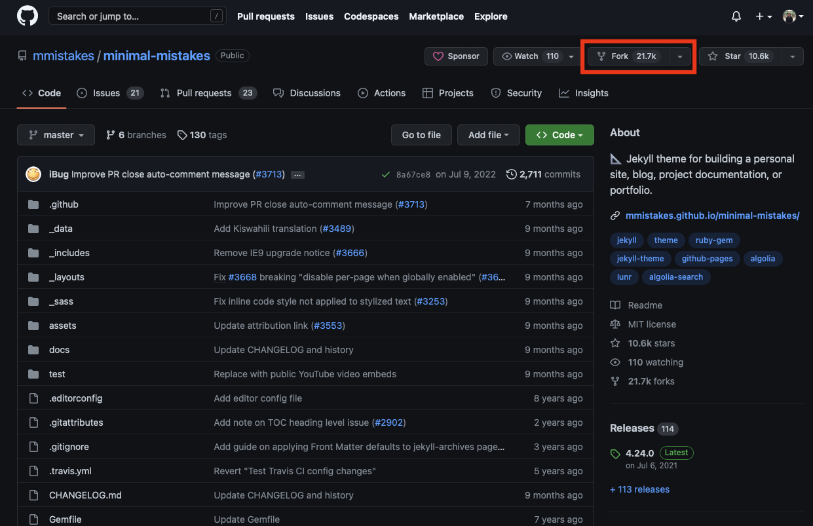

## 시작
일을 하면서 기술 블로그를 시작해봐야겠다는 생각을 했다. 데이터 분야 종사자이기 때문에 부끄럽지만 별다른 개발 지식이 없다. 그래서 이 시리즈(?)에서는 엄청난 개발 지식 없이 블로그를 만들기위한 최단 루트를 제시하고자한다.

### 마음에 드는 테마 선정
[테마 볼 수 있는 사이트](https://github.com/topics/jekyll-theme)
- 위 링크로 들어가서 마음에 드는 테마를 선정한다.
- 가장 인기가 많은 테마는 이유가 있을 거라고 생각해서 minimal-mistakes을 선택했다.
- Document도 잘 정리 되어있고, 대중적으로 사용하는 기본 테마인 만큼 웹 상에 참고할 수 있는 자료들이 많을 거라 생각했다. (적어도 중간은 갈 테마인것 같다)
- 마크다운으로 글을 업로드 했을 때 코드도 적당히 잘 보여서 문제는 무난한 선택지라고 생각했다.

### Fork 및 기본 설정



- Fork 이후엔 자신의 Github계정으로 복사가 된다.
- 이후에 Settings로 가서 Repository name을 변경해주는데 이 때에는 꼭 **자신의 Github아이디.guthub.io** 를 적어줘야 한다.


### 간단한 코드 수정
- config.yml 파일을 클릭하고 edit this file 클릭
- 블로그에 들어가는 큼직한 사항들이 들어있는 파일이다.
- 이 많은 코드 중 url 부분 (line 24 즈음)에 자신의 Repository name으로 수정하고 저장해준다. 이 부분은 내 블로그의 주소가 된다.

```python
# Before
url: # the base hostname & protocol for your site e.g. "https://mmistakes.github.io"

# After
url: "https://DonghyunAnn.github.io"
```

### 글 쓰기
- _posts 폴더를 새롭게 생성한다. 
- 그리고 날짜-파일명.md 형식으로 파일을 만든다 
(ex:2023-02-13-Start_Github.md)
- 데이터 분야에 관심이 있는 분들이 이 글을 보셨을 것이라 생각하는데, 그냥 jupyter notebook에서 좌측상단에 File/Download as/Markdown 으로 저장하면 편하게 파일을 생산할 수 있다.

