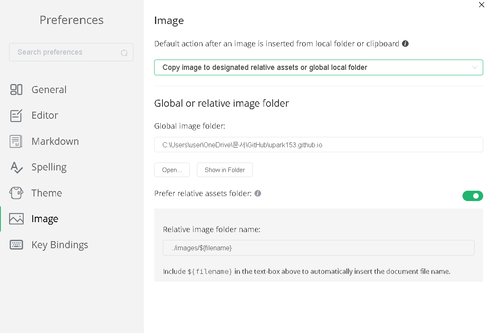

# 나만의 웹사이트를 만드는 방법 !

[테디노트](https://www.youtube.com/watch?v=ACzFIAOsfpM&t=260s "깃허브 블로그 개설 방법")님의 방법을 보며 따라해서 만들었습니다.  

## 1. 네이버, tistory, 브런치 와 같은 서비스 이용

- 장점: 이미 만들어져 있어서 바로 이용가능  
- 단점: custom에 용이하지 않다. 짜여진 틀 안에서...  
- 그리고, jupyter notebook과 같은 내용 공유, 소스코드 공유가 용이하지 않다.  

## 2. 그래! 그럼 직접 만들어 보는거야!

- 장점: 내가 원하는 방향성대로 모든걸 할 수 있다.  
- 단점: 엄청난 양을 학습해야함.  
- 배울것들: Front-End, Back-End (DB), git, 배포  
- 게다가 서버 호스팅 비용까지...  

## 3. 이러한 고민을 해결해 줄... GitHub Pages

- 장점: 원하는 방향성대로 할 수 있다.  
- 장점2: 호스팅 비용이 없다.  
- 장점3: Jupyter Notebook도 손쉽게 업로드 가능하다.  
- AdSense 돈벌이까지 ~? ( 이건 아직 잘모르겠다 )  

# 그렇다면 만들어 보자 !

## 만드는 과정 (준비물: GitHub 계정)

### 1. 마음에 드는 테마를 선택합니다.

- <https://github.com/topics/jekyll-theme>  
  
  > 굉장히 많은 테마가 있고, 우측에 Star을 많이 받을 수록,  
  > 인기가 많은 테마이다.  
  > 그 중에 minimal-mistakes 테마를 사용 해  
  > 블로그를 만들어 본다.  

### 2. Fork 합니다.

  

> Fork를 누르면 내 깃허브 계정에 코드 전체가 복사가 된다.  

- 도큐먼트를 꼼꼼히 확인합니다.  
- <https://mmistakes.github.io/minimal-mistakes/docs/configuration/>  

### 3. settings에서 이름을 변경합니다.

  
**Repository name을 반드시 변경 해 준다. ( 초기 minimal-mistakes )**  

- 앞에는 내 깃허브 계정 닉네임.github.io로 변경해 줘야 한다.  

### 4. _config.yml 파일에서 url을 수정합니다.

 

- **url에 주석을 지우고 블로그 주소를 넣어 준다**
- **여기까지 하면 블로그가 생성이 된다.**
- **다른 테마를 원하면 위와 같은 똑같은 과정을 거치면 생성이 된다.**

### 5. 블로그 글 작성하기

- **_posts 폴더를 생성한다.**
- **2023-05-28-first.md 파일을 생성한다.**
  
  
  > 오늘날짜를 명시 한 이후 마크다운(md)로 파일을 생성한다.  
  > 위 규칙을 지켜야 한다.
  > 년도-월-일(오늘날짜)-(url주소가 되는 부분).md

### 6. 블로그 글 작성 규칙 및 유의사항 (마크다운 문법사용)

- <https://jekyllrb.com/docs/posts/>  
- layout: single  
- title: 을 적습니다.  
  
  > [마크다운 작성 방법](https://teddylee777.github.io/jekyll/Jekyll-%EC%82%AC%EC%9A%A9%EC%9D%84-%EC%9C%84%ED%95%9C-markdown-%EB%AC%B8%EB%B2%95/ "마크다운 작성 방법")에 유의 하여 작성해야 한다.
  > 

# Github blog의 장점?

## 소스코드를 블로그로 발행할 수 있다.

- 소스코드를 마크다운 파일로 다운받아 2023-05-28-(url주소.한글은피하는게좋음).md 저장  
- 업로드 하면 그대로 블로그로 발행이 된다.
- ex) jupyter notebook etc...

# 조금 더 완성도 있는 블로그를 위해 단계별 정리.

## EP01. 개발환경 설치하기

1. github desktop 설치  
   
   
   
   
   
   
   
   

3. typora(현재 유료화 되서 대체할 에디터 Marktext) 
4. visual studio code

## EP02. 이미지 매우 간단하게 추가하기

1. Typora 대신 MartText로 이미지 넣기
   
   - 아래로 셋팅하면 이미지가 자동으로 폴더에 저장이 된다.

