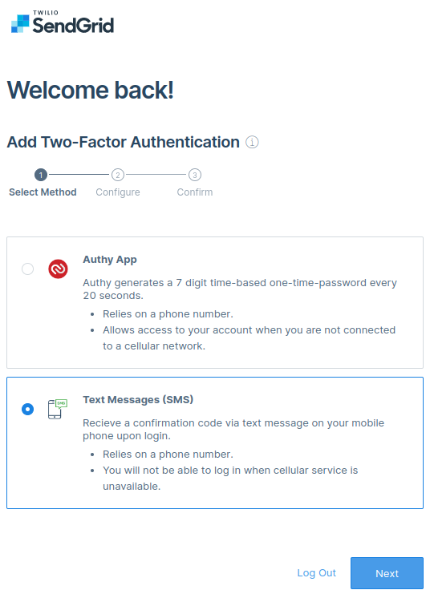
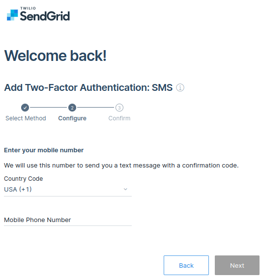
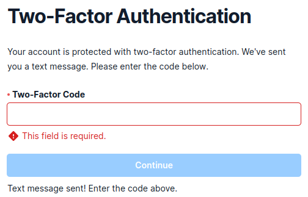
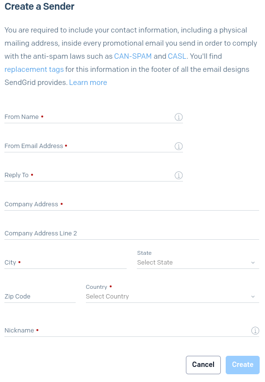
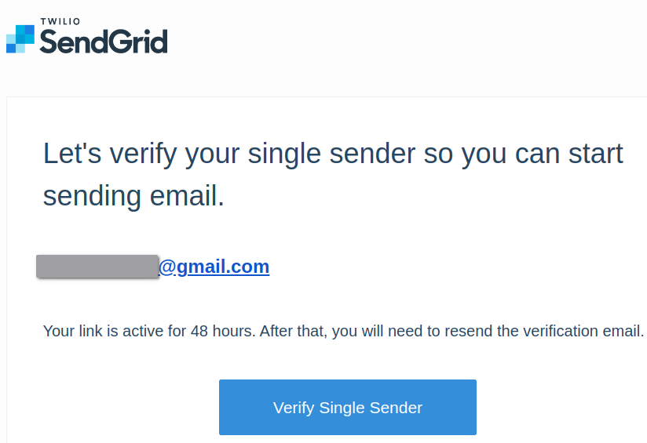
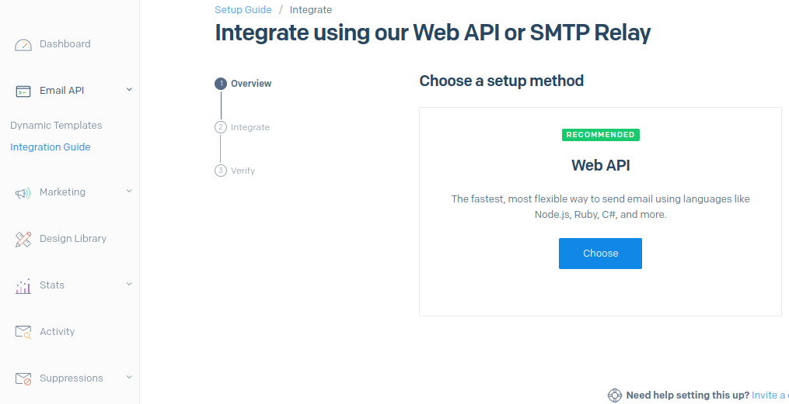

# 1. Introduction

This article is a continuation of the authentication methods that were covered in [part1](https://blog.rockthejvm.com/http4s-authentication-part1/). Here we will cover two more advanced authentication methods which include One Time Password(OTP) and Two Factor Authentication (2FA).

## 1.1 Requirements.

To follow along with this tutorial, you will need to add the following to your build.sbt file.

```scala
val scala3Version = "3.2.2"

val Http4sVersion = "0.23.18"
val OtpJavaVersion = "2.0.1"
val ZxingVersion = "3.5.1"
val SendGridVersion = "4.9.3

val http4sDsl =       "org.http4s"                  %% "http4s-dsl"          % Http4sVersion
val emberServer =     "org.http4s"                  %% "http4s-ember-server" % Http4sVersion
val otpJava =         "com.github.bastiaanjansen"    % "otp-java"            % OtpJavaVersion
val zxing =           "com.google.zxing"             % "javase"              % ZxingVersion
val sendGrid =        "com.sendgrid"                 % "sendgrid-java"       % SendGridVersion

lazy val otpauth = project
  .in(file("otpauth"))
  .settings(
    name := "othauth",
    version := "0.1.0-SNAPSHOT",
    scalaVersion := scala3Version,
    scalacOptions ++= Seq("-java-output-version", "8"),
    libraryDependencies ++= Seq(
      http4sDsl,
      otpJava,
      zxing,
      emberServer,
      sendGrid
    )
  )
```

`sendgrid-java` uses java 8, therefore we needed to add `scalacOptions ++= Seq("-java-output-version", "8")` to our build.

# 2. One Time Password (OTP)

A One Time Password is a form of authentication that is used to grant access to a single login session or transaction.

The One Time Password authentication method is defined in the [RFC 2289](https://datatracker.ietf.org/doc/html/rfc2289) internet standard which provides a detailed explanation of how OTP is implemented.

OTP tokens can either be generated by a software application running on a computer or phone, or they can also be generated using hardware and there is a wide array of devices on the market providing this functionality.

There are a variety of industry-standard algorithms that are used to generate OTP tokens such as SHA1, however, they require two inputs, a static value known as a secret key and a moving factor which changes each time an OTP value is generated. There a two main types of OTP tokens namely HOTP (HMAC-based One Time Password) and TOTP (Time-based One Time Password).

## 2.1 HMAC-based One Time Password (HOTP)

The `H` in HOTP stands for HMAC (Hash-based Message Authentication Code). This is a cryptographic technique that requires a hash function such as SHA1 and a set of parameters (secret key, moving factor). Under HOTP, the moving factor is based on a counter.
Each time a user requests for the HOTP, the counter is incremented. When the server receives the HOTP, it also increments its counter after validating the token, thereby keeping in sync with the OTP generator.
It is possible to generate many HOTP tokens without validating with the server, this throws the two entities out of sync, because of this, different HOTP generators provide different methods for resynchronization.
The HOTP standard is defined under [RFC 4226](https://www.ietf.org/rfc/rfc4226.txt) which gives a detailed explanation of how HOTP operates.

### 2.1.0 HOTP scala implementation

To implement HOTP in Scala, we will use the [otp-java](https://github.com/BastiaanJansen/otp-java) library by Bastiaan Jansen.
First, we'll need to acquire a secret key. The library provides a mechanism to generate this.

```scala
import com.bastiaanjansen.otp.*

val secret = SecretGenerator.generate()
```

Next, we will use the builder to generate an HOTP instance.

```scala
val hotp = new HOTPGenerator.Builder(secret)
              .withPasswordLength(6)
              .withAlgorithm(HMACAlgorithm.SHA1)
              .build()
```

Here we instantiate a new `HOTPGenerator` class, pass it the `secret`, password length as 6, and algorithm type as `SHA1`. We can now use `hotp` to generate the code.

```scala
val counter = 5
val code = hotp.generate(counter)
```

In the code above, we initialized the counter to 5 and used that the generate the `hotp` code.

When the server receives this code, it can verify it in the following way.

```scala
val isValid = hotp.verify(code, counter)
```

Remember the client and server must keep their counters in sync for the verification phase to work otherwise resynchronization is needed.

## 2.2 Time-based One Time Password (TOTP)

The TOTP token is generated similarly to HOTP with the main difference being the moving factor. Here the moving factor is based on a time counter. The time counter is calculated by dividing the current Unix time by a timestep value which is the life span of a TOTP usually 30 seconds.

### 2.2.0 TOTP scala implementation

Otp-java also provides an implementation for TOTP token generation.

```scala
import java.time.Duration

val secret = SecretGenerator.generate()

val totp = new TOTPGenerator.Builder(secret)
    .withHOTPGenerator(builder => {
            builder.withPasswordLength(6)
            builder.withAlgorithm(HMACAlgorithm.SHA1)
    })
    .withPeriod(Duration.ofSeconds(30))
    .build()
```

Here the `TOTPGenerator` class is instantiated with a `secret`, the `withHOTPGenerator()` method gives access to a `builder` that we use to set the password length and algorithm type. The last method is `withPeriod()` where we set the duration to 30 seconds, which is the lifespan for each `TOTP`.

```scala
val codeValue = totp.now()
```

The `now()` method on the `TOTPGenerator` class is used to generate the token.
In order to verify totp tokens, we can also use the `verify()` method.

```scala
totp.verify(code)
```

# 3. Two Factor Authentication (2FA)

Two Factor Authentication is an authentication method that requires a user to provide two distinct forms of identification to access a website or resource. Here's how it works.

1. When a user tries to perform a transaction or action on a system, he or she will present some credentials like an email or a phone number.
1. The system will send a temporary secure PIN-code or token to the user by email or phone number valid for only that session.
1. When the PIN-code is presented to the system and verified, access will be granted to the user otherwise it will be denied.

The code or token is the One Time Password that we generated in the previous sections

## 3.1 2FA implementation in scala

In this section, we will create a small application to showcase 2FA using java-otp, Http4s, SendGrid, Google Zxing, and Google Authenticator.

### 3.1.0 Creating the Database trait.

Let's create a scala file named `MyDatabase.scala` that will house the `MyDatabase` trait. We will need a case class to hold the user's information.

```scala
package com.rockthejvm

case class User(username: String, email: String, password: String, counter: Long)
```

Notice that we've added `counter` to keep track of the counter value used in `HOTP`. Now let's create our trait and odd a simple database.

```scala
import scala.collection.mutable

trait MyDatabase:
    val database: mutable.Map[Int, User] = mutable.Map(1 -> User("johnDoe", "john@email.com", "password", 1))
end MyDatabase
```

The `database` is a mutable Map of type `mutable.Map[Int, User]` containing a single user `johnDoe` assigned to an `id` of 1.

Next, we will add two functions to fetch the user's email and counter value given an `id`.

```scala
trait MyDatabase:
    ...
    def getCounterValue (id: Int, database: mutable.Map[Int, User] = database): Long =
            database(id).counter

    def getEmail(id: Int, database: mutable.Map[Int, User] = database) =
        database(id).email
end MyDatabase
```

The `getCounterValue()` and `getEmail()` functions take an `id` and an optional argument assigned to the `database`, they both use the `id` as a key to fetch the user's `counter` and `email` value respectfully.

```scala
trait MyDatabase:
    ...
    def incrementCounter (id: Int, database: mutable.Map[Int, User] = database) =
        val counter: Long = database(id).counter + 1
        database.update(id, User(database(id).username, database(id).email, database(id).password, counter))
end MyDatabase
```

The `incrementCounter()` will be used in the case of `Hotp` to increment the counter value by one after we successfully verify a One Time Password.

Here's the full code for MyDatabase.scala

```scala
package com.rockthejvm

import scala.collection.mutable

case class User(username: String, email: String, password: String, counter: Long)

trait MyDatabase:
    val database: mutable.Map[Int, User] = mutable.Map(1 -> User("johnDoe", "john@email.com", "password", 1))

    def getCounterValue (id: Int, database: mutable.Map[Int, User] = database): Long =
        database(id).counter

    def getEmail(id: Int, database: mutable.Map[Int, User] = database) =
        database(id).email

    def incrementCounter (id: Int, database: mutable.Map[Int, User] = database) =
        val counter: Long = database(id).counter + 1
        database.update(id, User(database(id).username, database(id).email, database(id).password, counter))
end MyDatabase
```

### 3.1.1 Creating the BarCodeService

Google Authenticator gives us two options to capture the OTP code, we can type it manually or scan a bar code. In this section, we will use the Google Zxing library to create barcode images for our application. Let's create a new scala file called `BarCodeService.scala` where we will add our trait.

```scala
package com.rockthejvm

import scala.util.*
import java.net.URLEncoder

trait BarCodeService extends MyDatabase:
    def getGoogleAuthenticatorBarCode(secretKey: String, account: String, issuer: String, generator: String): Try[String] =
        generator match
            case "Hotp" =>
                Try{
                s"otpauth://${generator.toLowerCase()}/" +
                URLEncoder.encode(issuer + ":" + account, "UTF-8").replace("+","%20") +
                "?secret=" + URLEncoder.encode(secretKey, "UTF-8").replace("+","%20") +
                "&issuer=" + URLEncoder.encode(issuer, "UTF-8").replace("+","%20") +
                "&conter=0"
                }
            case "Totp" =>
                Try{
                    s"otpauth://${generator.toLowerCase()}/" +
                    URLEncoder.encode(issuer + ":" + account, "UTF-8").replace("+","%20") +
                    "?secret=" + URLEncoder.encode(secretKey, "UTF-8").replace("+","%20") +
                    "&issuer=" + URLEncoder.encode(issuer, "UTF-8").replace("+","%20")
                }
end BarCodeService
```

The `getGoogleAuthenticatorBarCode()` method takes a `secretKey` which we create with `otp-java`, an `account` and `issuer` which are the email address and name of the business or person issuing the barcode, and a `generator` which is a string of either `Hotp` or `Totp` (used to choose the type of `otp`), this gives us a `Try[String]`. This function creates a `URI` in the format `otpauth://TYPE/LABEL?PARAMETERS` that we'll use to create the QR Bar Code image depending on the type of `generator` value we pass. The `Hotp` implementation contains an extra parameter, `counter=0`.

```scala
import com.google.zxing.common.BitMatrix
import com.google.zxing.MultiFormatWriter
import com.google.zxing.BarcodeFormat
import java.io.FileOutputStream
import com.google.zxing.client.j2se.MatrixToImageWriter

trait BarCodeService:
    ...
    def createQRCode(barCodeData: String, filePath: String, height: Int, width: Int) =
        val matrix: BitMatrix = new MultiFormatWriter().encode(barCodeData, BarcodeFormat.QR_CODE, width, height)
        val outVal: FileOutputStream = new FileOutputStream(filePath)
        MatrixToImageWriter.writeToStream(matrix,"png",outVal)
end BarCodeService
```

The `createQRCode()` function creates the BarCode image. It takes as parameters, `barCodeData` which is our `URI`, a `filePath`, and `height` and `width` of our image. The `MultiFormatWriter` class has an encode method that takes our arguments and creates a 2D matrix of bits.
The `writeToStream` method on the `MatrixToImageWriter` object takes the `matrix` (of type `BitMatrix`), `"png"` as the image format and a `FileOutputStream`, writes the image to a png file and saves it to the file path.

Here's the full code

```scala
package com.rockthejvm

import scala.util.*
import java.net.URLEncoder
import com.google.zxing.common.BitMatrix
import com.google.zxing.MultiFormatWriter
import com.google.zxing.BarcodeFormat
import java.io.FileOutputStream
import com.google.zxing.client.j2se.MatrixToImageWriter

trait BarCodeService:
    def getGoogleAuthenticatorBarCode(secretKey: String, account: String, issuer: String, generator: String): Try[String] =
        generator match
            case "Hotp" =>
                Try{
                s"otpauth://${generator.toLowerCase()}/" +
                URLEncoder.encode(issuer + ":" + account, "UTF-8").replace("+","%20") +
                "?secret=" + URLEncoder.encode(secretKey, "UTF-8").replace("+","%20") +
                "&issuer=" + URLEncoder.encode(issuer, "UTF-8").replace("+","%20") +
                "&conter=0"
                }
            case "Totp" =>
                Try{
                    s"otpauth://${generator.toLowerCase()}/" +
                    URLEncoder.encode(issuer + ":" + account, "UTF-8").replace("+","%20") +
                    "?secret=" + URLEncoder.encode(secretKey, "UTF-8").replace("+","%20") +
                    "&issuer=" + URLEncoder.encode(issuer, "UTF-8").replace("+","%20")
                }

    def createQRCode(barCodeData: String, filePath: String, height: Int, width: Int) =
        val matrix: BitMatrix = new MultiFormatWriter().encode(barCodeData, BarcodeFormat.QR_CODE, width, height)
        val outVal: FileOutputStream = new FileOutputStream(filePath)
        MatrixToImageWriter.writeToStream(matrix,"png",outVal)
end BarCodeService
```

### 3.1.2 Creating the OtpService

Let's create a scala file and save it as `OtpService.scala`. This service will contain the implementation for `Hotp` and `Totp` that we will use for this application.

```scala
package com.rockthejvm

import com.bastiaanjansen.otp.*

class OtpService(generator: String, id: Int) extends MyDatabase with BarCodeService:
    private val secret: Array[Byte] = SecretGenerator.generate()
end OtpService
```

We create it as a class in order to pass some arguments to the constructor during instantiation. As mentioned before, `generator` is a string of either `Hotp` or `Totp` while `id` points to a user in the database. This class extends `MyDatabase` and `BarCodeService` traits since we will make use of some of their functions.

We first create our `secret` as a private val using `otp-java`, since we will only be using it within this class

```scala
import java.time.Duration

class OtpService(generator: String, id: Int) extends MyDatabase with BarCodeService:
    ...
    enum Generator:
        case Hotp, Totp

        def getHotp: HOTPGenerator = new HOTPGenerator.Builder(secret)
            .withPasswordLength(6)
            .withAlgorithm(HMACAlgorithm.SHA1)
            .build()

        def getTotp: TOTPGenerator = new TOTPGenerator.Builder(secret)
            .withHOTPGenerator(builder => {
                    builder.withPasswordLength(6)
                    builder.withAlgorithm(HMACAlgorithm.SHA1)
            })
            .withPeriod(Duration.ofSeconds(30))
            .build()
    end Generator
end OtpService
```

The `Generator` enum is what we will use to choose between `Hotp` and `Totp` implementations depending on our needs, it also contains two methods, `getHotp`, and `getTotp` used to generate `HOTPGenerator` and `TOTPGenerator` instances respectfully. Note that Google Authenticator displays a token length of 6 and uses the `SHA1` algorithm. We supply these same values as we generate the `HOTPGenerator` and `TOTPGenerator` instances.

```scala
class OtpService(generator: String, id: Int) extends MyDatabase with BarCodeService:
    ...
    def getToken(generator: String = generator, id: Int = id): String = Generator.valueOf(generator) match
        case Generator.Hotp => Generator.Hotp.getHotp.generate(getCounterValue(id))
        case Generator.Totp => Generator.Totp.getTotp.now()
end OtpService
```

The `getToken()` function takes two optional arguments, a string, `generator` and an Int, `id` both of which are passed through the `OtpService` constructor. `generator` is passed to the `Generator.valeOf` enum method which yields either an `Hotp` or `Totp` `Generator` case. We pattern match on this to give us a token value.

```scala
class OtpService(generator: String, id: Int) extends MyDatabase with BarCodeService:
    ...
    private def verifyUtility (value: Try[Boolean], id: Int = id): String =
        value match
            case Success(v) =>
                v match
                    case true =>
                        incrementCounter(id)
                        s"Code Verified?: $v"
                    case false =>
                        s"Code Verified?: $v"
            case Failure(exception) =>
                exception.getMessage()

    def verifyCode(code: String, id: Int = id, generator: String = generator): String =
        Generator.valueOf(generator) match
            case Generator.Hotp =>
                verifyUtility(Try{Generator
                    .Hotp
                    .getHotp
                    .verify(code, getCounterValue(id))})
            case Generator.Totp =>
                verifyUtility(Try{Generator
                    .Totp
                    .getTotp
                    .verify(code)})
end OtpService
```

The `verifyCode()` function is used to check if the code the user sends our service is genuine. It takes a `code` (the otp token), a generator (either `Hotp` or `Totp` from the constructor), and the user's `id` (from the constructor) as arguments. Again we pattern match on `Generator.valueOf(generator)` and use the `verifyUtility()` to complete the verification process.

Both `getHotp` and `getTotp` from the `Generator` enum have a `verify()` method which we call then pass this value as a `Try[Boolean]` to `verifyUtility()`. The `verifyUtility()` function takes the `Try[Boolean]` and user `id` as arguments. When we pattern match on `Try[Boolean]` and the verification process results in a `Failure`, we produce a string with an error message, `exception.getMessage()`, in case it's a `Success` we produce a string telling the user if the code was verified or not.

If the code was verified correctly resulting in `true`, we increment the user's counter to keep in sync with Google Authenticator using the `incrementCounter(id)` function from `MyDatabase`.

```scala
class OtpService(generator: String, id: Int) extends MyDatabase with BarCodeService:
    ...
    val barCodeUrl:Try[String] = getGoogleAuthenticatorBarCode(new String(secret), "<youremail@email.com>", "<your name>", generator)
end OtpService
```

Finally `barCodeUrl` holds the result of running the `getGoogleAuthenticatorBarCode()` from the `BarCodeService` to generate the authentication `URI` of type `Try[String]`. You can insert your email and name as the issuer.

Here is the full code.

```scala
package com.rockthejvm

import com.bastiaanjansen.otp.*
import java.time.Duration
import scala.util.*

class OtpService(generator: String, id: Int) extends MyDatabase with BarCodeService:
    private val secret: Array[Byte] = SecretGenerator.generate()

    enum Generator:
        case Hotp, Totp

        def getHotp: HOTPGenerator = new HOTPGenerator.Builder(secret)
            .withPasswordLength(6)
            .withAlgorithm(HMACAlgorithm.SHA1)
            .build()

        def getTotp: TOTPGenerator = new TOTPGenerator.Builder(secret)
            .withHOTPGenerator(builder => {
                    builder.withPasswordLength(6)
                    builder.withAlgorithm(HMACAlgorithm.SHA1)
            })
            .withPeriod(Duration.ofSeconds(30))
            .build()
    end Generator

    def getToken(generator: String = generator, id: Int = id): String = Generator.valueOf(generator) match
        case Generator.Hotp => Generator.Hotp.getHotp.generate(getCounterValue(id))
        case Generator.Totp => Generator.Totp.getTotp.now()

    private def verifyUtility (value: Try[Boolean], id: Int = id): String =
        value match
            case Success(v) =>
                v match
                    case true =>
                        incrementCounter(id)
                        s"Code Verified?: $v"
                    case false =>
                        s"Code Verified?: $v"
            case Failure(exception) =>
                exception.getMessage()

    def verifyCode(code: String, id: Int = id, generator: String = generator): String =
        Generator.valueOf(generator) match
            case Generator.Hotp =>
                verifyUtility(Try{Generator
                    .Hotp
                    .getHotp
                    .verify(code, getCounterValue(id))})
            case Generator.Totp =>
                verifyUtility(Try{Generator
                    .Totp
                    .getTotp
                    .verify(code)})

    val barCodeUrl: Try[String] = getGoogleAuthenticatorBarCode(new String(secret), "<youremail@email.com>", "<your name>", generator)
end OtpService
```

### 3.1.3 Creating our EmailService

We need a way to send our QR Bar Code to the user's email address, for this section, we'll use Sendgrid's email java API, but it requires an API key.

#### 3.1.3.0 SendGrid API Key

Follow these steps to get your API Key

1. Head over to sendgrid.com and click on the pricing tab.
   SendGrid offers 100 emails per day for free, which is more than enough for this tutorial.
   Click the Start for free button to register

   

1. Fill in your email address and password and create the account.

   

1. Fill in the required information and click get started.

   

1. Check your inbox and click the link to set up 2FA.

1. Select the Text Messages option and click Next.

   

1. Select your country code and input your mobile number then click next.

   

1. Check your sms and fill in the authentication code and save.

   

1. Log back into SendGrid, You will be prompted for another authentication code.
   Sometimes it's not sent, your can resend it with the link provided. Then click continue.
   After which you will be sent to a welcome screen.

   

1. Click the create identity button.

   

1. Fill in the details and create a sender

   

1. Check the sender email you supplied to verify the single sender.

   

1. Under Email Api and Integration Guide, select Web API, then choose JAVA

   

1. Add an API key name then click the Create Key button.

   

1. Finally follow the steps in part 3 to add your key as an environment variable in the root of our project.

   

#### 3.1.3.0 The EmailService

In this section, we'll create the `EmailService` class to handle sending our QR BarCode to the user.

```scala
package com.rockthejvm

import com.sendgrid.helpers.mail.objects.Email
import java.nio.file.Paths

class EmailService(sendto: String):
    val from = new Email("hkateu@gmail.com")
    val to = new Email(sendto)

    val subject = "Sending with SendGrid is Fun"
    val message = s"""
        |<H3>Website Login</H3>
        |<p>Please complete the login process using Google Authenticator</p>
        |<p>Scan the QR Barcode attached and send us the token number.</p>
        """.stripMargin

    val file = Paths.get("barCode.png")
    val content = new Content("text/html", message)
end EmailService
```

We start by defining some variables needed to send an email. The `from` and `to` variables represent the person sending the email and the person to whom the email will be sent. SendGrid provides an `Email` class to structure these email addresses. Notice that we pass the email address of the person we are sending to through the `EmailService` constructor.

We also define `subject` as a string and `message` as a string containing HTML. The `file` variable is a `Path` to the BarCode png image. `content` is an instance of the `Content` class that tells SendGrid what type of message we are sending, in our case `text/html`.

```scala
import com.sendgrid.helpers.mail.Mail
import java.util.Base64

class EmailService(sendto: String):
    ...

    val mail = new Mail(from, subject, to, content)
    val attachments = new Attachments()
    attachments.setFilename(file.getFileName().toString())
    attachments.setType("application/png")
    attachments.setDisposition("attachment")
    val attachmentContentBytes = Files.readAllBytes(file)
    val attachmentContent = Base64.getEncoder().encodeToString(attachmentContentBytes)
    attachments.setContent(attachmentContent)
    mail.addAttachments(attachments)
end EmailService
```

SendGrid provides a `Mail` class that takes our `from`, `subject`, `to`, and `content` variables as parameters to structure our email. We then create `attachments` which is an instance of the `Attachments` class, it provides `setFilename()`, `setType()`, and `setDisposition()` methods to structure our attachment.

We use the `readAllBytes()` method from `Files` to convert our png image to type `Array[Byte]` and store it in `attachmentContentBytes`, then encode it to Base64 and store it in `attachmentContent` since SendGrid requires Base64 encoding to send attachments.

We then call `attachments.setContent(attachmentContent)` and `mail.addAttachments(attachments)` to add our file as an attachment to our `Mail` instance.

```scala
import com.sendgrid.{SendGrid, Method, Request, Response}
import scala.util.*
import org.http4s.dsl.io.*
import cats.effect.IO

class EmailService(sendto: String):
    ...
    val sg = new SendGrid(Properties.envOrElse("SENDGRID_API_KEY","undefined"))
    val request = new Request()
    val response: Try[Response] = Try {
        request.setMethod(Method.POST)
        request.setEndpoint("mail/send")
        request.setBody(mail.build())
        val res = sg.api(request)
        res
    }

    val checkStatus = response match
        case Success(res) =>
            IO(println(res.getBody())) >>
            IO(println(res.getStatusCode())) >>
            IO(println(res.getHeaders())) >>
            Ok("We sent you an email, please follow the steps to complete the signin process.")
        case Failure(ex) =>
            IO(println(ex.getMessage())) >>
            Ok("Oops, something went wrong, please try again later.")
end EmailService
```

`sg` is an instance of the `SendGrid` class that takes our API Key as an argument. Since the API Key is saved as an environment variable, we call `Properties.envOrElse("SENDGRID_API_KEY","undefined")` to fetch it. If it doesn't exist, this function will set it to `undefined`.

We create a `Request` class and use that to build our mail. Within the response variable we call `setMethod()`, `setEndpoint()`, and `setBody()` methods on the `request` class and return `sg.api(request)` as a `Try[Response]` which will hold the response from the SendGrid server.

Finally, we pattern match on `response`, in case our mail was sent successfully, we'll print the response body, status code, and headers in our console for debugging purposes and reply with a message telling the user to check their mail to complete the sign in process, otherwise we print out the error message and tell the user to try again later.

Here is the full code.

```scala
package com.rockthejvm

import com.sendgrid.{SendGrid, Method, Request, Response}
import com.sendgrid.helpers.mail.objects.{Email, Content, Attachments}
import com.sendgrid.helpers.mail.Mail
import java.nio.file.{Paths, Files}
import java.util.Base64
import scala.util.*
import org.http4s.dsl.io.*
import cats.effect.IO

class EmailService(sendto: String):
    val from = new Email("hkateu@gmail.com")
    val to = new Email(sendto)

    val subject = "Sending with SendGrid is Fun"
    val message = s"""
        |<H3>Website Login</H3>
        |<p>Please complete the login process using Google Authenticator</p>
        |<p>Scan the QR Barcode attached and send us the token number.</p>
        """.stripMargin

    val file = Paths.get("barCode.png")
    val content = new Content("text/html", message)

    val mail = new Mail(from, subject, to, content)
    val attachments = new Attachments()
    attachments.setFilename(file.getFileName().toString())
    attachments.setType("application/png")
    attachments.setDisposition("attachment")
    val attachmentContentBytes = Files.readAllBytes(file)
    val attachmentContent = Base64.getEncoder().encodeToString(attachmentContentBytes)
    attachments.setContent(attachmentContent)
    mail.addAttachments(attachments)

    val sg = new SendGrid(Properties.envOrElse("SENDGRID_API_KEY","undefined"))
    val request = new Request()
    val response: Try[Response] = Try {
        request.setMethod(Method.POST)
        request.setEndpoint("mail/send")
        request.setBody(mail.build())
        val res = sg.api(request)
        res
    }

    val checkStatus = response match
        case Success(res) =>
            IO(println(res.getBody())) >>
            IO(println(res.getStatusCode())) >>
            IO(println(res.getHeaders())) >>
            Ok("We sent you an email, please follow the steps to complete the signin process.")
        case Failure(ex) =>
            IO(println(ex.getMessage())) >>
            Ok("Oops, something went wrong, please try again later.")
end EmailService
```

### 3.1.4 Creating our FinalService

Let's create a FinalService.scala file and add the following contents

```scala
package com.rockthejvm

class FinalService(generator: String, id: Int):
    lazy val otpService = new OtpService(generator, id)
    lazy val emailService = new EmailService(otpService.getEmail(id))
end FinalService

```

The `FinalService` class will be used to instantiate our `OtpService` and `EmailService` services with the appropriate constructor arguments. The `OtpService` takes its arguments from the `FinalService` constructor while the `EmailService` will use `optService` to acquire the email address of the user when provided with his or her `id`.

### 3.1.5 Http4s Routes and Server

In this section, we create the routes and server using http4s. Let's create a new scala file called OtpAuth.scala and add the following.

```scala
import cats.effect.{IOApp, IO, ExitCode}
import com.xonal.FinalService

object OtpAuth extends IOApp:
    val tokenService = new FinalService("Hotp", 1)

    override def run(args: List[String]): IO[ExitCode] =  ???
```

Here we create an instance of `FinalService` to which we supply a `generator` of `Hotp` and `id` of 1 as constructor arguments.

```scala
import org.http4s.*
import org.http4s.dsl.io.*
import scala.util.*
    ...
    val routes: HttpRoutes[IO] =
        HttpRoutes.of[IO]{
            case GET -> Root / "login" =>
                tokenService.otpService.barCodeUrl match
                    case Success(burl) =>
                        IO{tokenService.otpService.createQRCode(burl, "barCode.png", 400, 400)} >>
                        IO{println(tokenService.otpService.getToken())} >>
                        tokenService.emailService.checkStatusatus
                    case Failure(_) =>
                        Ok("Error occurred generating QR Code...")
            case GET -> Root / "code" / value =>
                Ok(s"${tokenService.otpService.verifyCode(value)}")
        }

    override def run(args: List[String]): IO[ExitCode] =  ???
```

Next, we create our routes using the `HttpRoutes.of[IO]` method. When a user tries to log into the application using the `/login` route, we use the `tokenService` to try to create a `barCodeUrl` and pattern match on it. In case it was created successfully, we create the BarCode image by calling `tokenService.otpService.createQRCode(burl, "barCode.png", 400, 400)`.

Note: We also print the token value to the console for debugging purposes otherwise for security reasons it should be removed. This is done by running `println(tokenService.otpService.getToken())`.

We then run `tokenService.emailService.checkStatus` to send our email and get a response from the SendGrid server, otherwise, we tell the user an error occurred creating the code.

The `/code/value` route receives the code from the user and verifies it by calling `tokenService.otpService.verifyCode(value)` where `value` is the 6-digit code.

```scala
import com.comcast.ip4s.*
import org.http4s.ember.server.EmberServerBuilder
    ...
    val server = EmberServerBuilder
        .default[IO]
        .withHost(ipv4"0.0.0.0")
        .withPort(port"8080")
        .withHttpApp(routes.orNotFound)
        .build

    override def run(args: List[String]): IO[ExitCode] =  server.use(_ => IO.never).as(ExitCode.Success)
```

Finally, we use ember to create our `server` and add it the the `run` function.

Here is the full code.

```scala
import cats.effect.{IOApp, IO, ExitCode}
import org.http4s.*
import org.http4s.dsl.io.*
import com.comcast.ip4s.*
import org.http4s.ember.server.EmberServerBuilder
import scala.util.*
import com.xonal.FinalService

object OtpAuth extends IOApp:
    val tokenService = new FinalService("Hotp", 1)


    val routes: HttpRoutes[IO] =
        HttpRoutes.of[IO]{
            case GET -> Root / "login" =>
                tokenService.otpService.barCodeUrl match
                    case Success(burl) =>
                        IO{tokenService.otpService.createQRCode(burl, "barCode.png", 400, 400)} >>
                        IO{println(tokenService.otpService.getToken())} >>
                        tokenService.emailService.checkStatus
                    case Failure(_) =>
                        Ok("Error occurred generating QR Code...")
            case GET -> Root / "code" / value =>
                Ok(s"${tokenService.otpService.verifyCode(value)}")
        }

    val server = EmberServerBuilder
        .default[IO]
        .withHost(ipv4"0.0.0.0")
        .withPort(port"8080")
        .withHttpApp(routes.orNotFound)
        .build

    override def run(args: List[String]): IO[ExitCode] =  server.use(_ => IO.never).as(ExitCode.Success)
```

Finally can run our server and test our application.
Make sure you provide an actual email to our user, this is where the token will be sent.

```scala
trait MyDatabase:
    val database: mutable.Map[Int, User] = mutable.Map(1 -> User("johnDoe", "<actual email address>", "password", 1))
end MyDatabase

```

### 3.1.5 Testing our application.

```bash
curl -vv http://localhost:8080/login
*   Trying ::1:8080...
* Connected to localhost (::1) port 8080 (#0)
> GET /login HTTP/1.1
> Host: localhost:8080
> User-Agent: curl/7.71.1
> Accept: */*
>
* Mark bundle as not supporting multiuse
< HTTP/1.1 200 OK
< Date: Fri, 16 Jun 2023 14:59:55 GMT
< Connection: keep-alive
< Content-Type: text/plain; charset=UTF-8
< Content-Length: 77
<
* Connection #0 to host localhost left intact
We sent you an email, please follow the steps to complete the signin process.⏎
```

Here's what we printed to the console.

```bash
829449

202
{Strict-Transport-Security=max-age=600; includeSubDomains, Server=nginx, Access-Control-Allow-Origin=https://sendgrid.api-docs.io,
Access-Control-Allow-Methods=POST, Connection=keep-alive, X-Message-Id=w46GLwNYTLuqboNNO7gqAw, X-No-CORS-Reason=https://sendgrid.com/docs/Classroom/Basics/
API/cors.html, Content-Length=0, Access-Control-Max-Age=600, Date=Fri, 16 Jun 2023 14:59:46 GMT, Access-Control-Allow-Headers=Authorization, Content-Type,
On-behalf-of, x-sg-elas-acl}
```

We can see that SendGrid successfully sent our email.
You can now open your mail and scan the BarCode image with Google Authenticator then pass the 6-digit code to the verification URL. The code outputted by Google Authenticator should be the same as what's displayed in our console.

```bash
curl -vv http://localhost:8080/code/829449
*   Trying ::1:8080...
* Connected to localhost (::1) port 8080 (#0)
> GET /code/829449 HTTP/1.1
> Host: localhost:8080
> User-Agent: curl/7.71.1
> Accept: */*
>
* Mark bundle as not supporting multiuse
< HTTP/1.1 200 OK
< Date: Fri, 16 Jun 2023 15:01:10 GMT
< Connection: keep-alive
< Content-Type: text/plain; charset=UTF-8
< Content-Length: 20
<
* Connection #0 to host localhost left intact
Code Verified?: true⏎
```

The server feedback should be the same as above.

Repeat the same process for `Totp` by making the following change to OtpAuth.scala

```scala
val tokenService = new FinalService("Totp", 1)
```

Note that for `Totp` to work, make sure your phone and computer date and time are the same and current. You should be able to get the same results.

# 3. Conclusion

In this tutorial we learned about One Time Password Authentication, we explored HMAC-based One Time Password (HOTP) and Time-based One Time Password (TOTP) and created a small application where we implemented Two Factor Authentication using the knowledge we learned. 2FA has gained traction in recent years and as displayed, adds another layer of security to your application.
