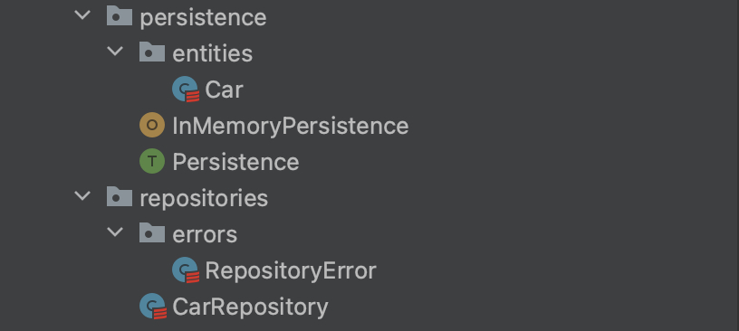
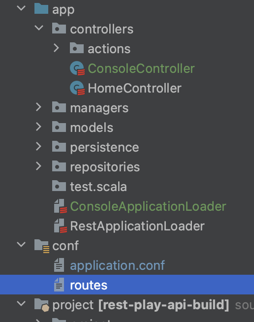
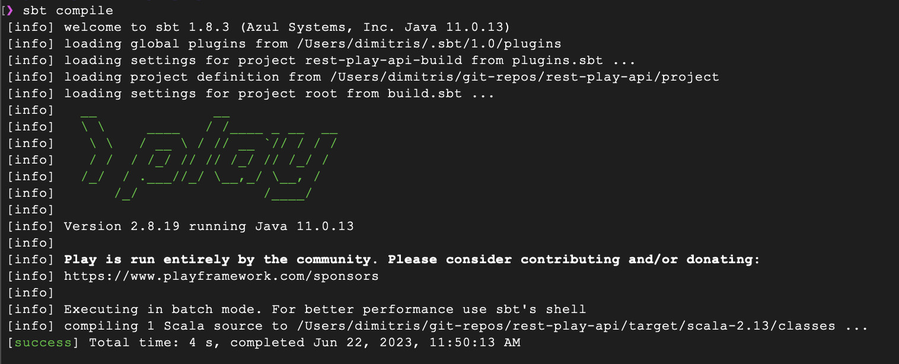

_by [Dimitris Tsolis](https://github.com/dimitrisre)_

## 1. Introduction

One of the simplest and well documented ways to build a web API is to follow the REST paradigm. REST APIs provide a simple and uniform way to
access data and not only through URLs, across the web.
[Play Framework](https://www.playframework.com/) "makes it easy to build web applications with Java & Scala", as it is stated on their site, and it's true. Using Akka under the hood, you get all the benefits of a Reactive system. In this article we will try to develop a basic skeleton for a REST API using Play and Scala.

## 2. Setting Up

Let's start by adding our dependency on our sbt files. 

On `plugins.sbt` add the following plugins. PlayScala plugin defines default settings for Scala-based applications. 

```scala
ThisBuild / libraryDependencySchemes += "org.scala-lang.modules" %% "scala-xml" % VersionScheme.Always

addSbtPlugin("com.typesafe.play" % "sbt-plugin" % "2.8.19")
addSbtPlugin("com.typesafe.sbt" % "sbt-native-packager" % "1.8.1")
```

Finally add on `build.sbt` we add our dependencies on our project
```scala
import sbt._
import Keys._

ThisBuild / version := "0.1.0-SNAPSHOT"

ThisBuild / scalaVersion := "2.13.11"

val playVersion = "2.8.19"

val playFramework = "com.typesafe.play" %% "play" % playVersion

lazy val root = (project in file("."))
  .settings(
    name := "rest-play-api",
    libraryDependencies ++= Seq(playFramework)
  ).enablePlugins(PlayScala)
```

After using all this you should be ready to create the codebase for our rest api.

## 3. Basic REST Api skeleton project

The image below shows the basic folder and package structure for our project. It is organized based on each layer of concern. 


On each layer we define the data (models) and logic (managers, services) that can help us organize and follow the growth of our project and not get lost. This example is extremely simple but for the sake of completion we include all layers. As our project becomes more and more complex, these layers are becoming more useful. Below we will see each layer individually.

## 3.1 Persistence

It is the layer where we define the basic persistence entities and persistence methods. We could use any method that we want, be a database, in memory, a file, should be defined and handled on this layer.



On a persistence trait we define basic functions given from our underlying persistence mechanism. Here we define the mechanism for example purposes. As we can see basic operations on a persisted dataset are defined. We use types A, B, C[_] to make our Persistence layer as abstract as possible. 

A defines the types we save in our datastore. B defines the type of our primary key and C[_] defines the type of data structure that we use for persisting our entities. As you will see on the sections that follows for our specific example A corresponds to Car type, B corresponds to Long and C[_] to a ListBuffer. 
With this implementation we can easily swap this Layer and use other persistent types.

```scala
package persistence

trait Persistence[A, B, C[_]]{
  val db: C[A]
  def insert(entity: A): A
  def find(id: B): Option[A]
  def update(entity: A): Unit
  def delete(id: B): Unit
  def findAll(): List[A]
}
```


Our persisted entity for this model we use a simple Car object:

```scala
package persistence.entities

import models.CarDTO

case class Car(id: Long, brand: String, model: String, cc: Int)

object Car{
  implicit class CarOps(car: Car) {
    def fromDTO(carDTO: CarDTO): Car = Car(carDTO.id.getOrElse(0L), carDTO.brand, carDTO.model, carDTO.cc)

    def toDTO(): CarDTO = CarDTO(Some(car.id), car.brand, car.model, car.cc)
  }
}
```

and for an implementation for our persistence mechanism we use an in memory singleton object. 
It is a simple ListBuffer and we can do basic operations to insert, find, update, and delete Car entities.
We implement basic validations as to avoid duplicates on insert and missing entities on delete and update. 

```scala
package persistence

import persistence.entities.Car

import scala.collection.mutable.ListBuffer
import scala.util.Random

object InMemoryPersistence extends Persistence[Car, Long, ListBuffer]{
  override val db: ListBuffer[Car] = ListBuffer.empty
  val idGenerator = Random

  def insert(car: Car): Car = {
    val idx = db.indexWhere(_.id == car.id)
    val newCar = car.copy(id=idGenerator.nextLong())
    if(idx > -1) throw new RuntimeException(s"Duplicate element with id: ${car.id}")
    else db.addOne(newCar)

    newCar
  }
  def find(id: Long): Option[Car] = db.find(_.id == id)

  def update(car: Car): Unit = {
    val idx = db.indexWhere(_.id == car.id)
    if(idx > -1) db.update(idx, car)
    else throw new RuntimeException(s"No element to update with id: ${car.id}")
  }

  def delete(id: Long): Unit = {
    val idx = db.indexWhere(_.id == id)
    if(idx > -1 ) db.remove(idx)
    else throw new RuntimeException(s"No element to delete with id: ${id}")
  }

  def findAll(): List[Car] = db.toList
}
```

Close to our persistence mechanism we define our repositories, responsible for handling all the specifics for saving, retrieving etc.
```scala
package repositories

import persistence.Persistence
import persistence.entities.Car
import repositories.errors.RepositoryError

import scala.collection.mutable.ListBuffer
import scala.util.Try

class CarRepository(val db: Persistence[Car, Long, ListBuffer]){
  def findById(id: Long): Either[RepositoryError, Option[Car]] = handleIfErrors(db.find(id))
  def save(car: Car): Either[RepositoryError, Car] = handleIfErrors(db.insert(car))
  def update(car: Car): Either[RepositoryError, Unit] = handleIfErrors(db.update(car))
  def delete(id: Long): Either[RepositoryError, Unit] = handleIfErrors(db.delete(id))
  def findAll(): Either[RepositoryError, List[Car]] = handleIfErrors(db.findAll())

  private def handleIfErrors[A](f: => A) =
    Try(f).fold(e => Left(RepositoryError(e.getMessage)), v => Right(v))

}
```
```scala
package repositories.errors

case class RepositoryError(message: String)
```
## 3.2 Managers
On this layer we define our managers. Usually containing logic to manage other resources like repositories, transactions, connections, security etc and contains business logic (here is too simple) of our application.
Here we define a simple manager for car entities:

```scala
package managers

import managers.errors.ManagerError
import models.CarDTO
import repositories.CarRepository
import repositories.errors.RepositoryError

trait Manager{
  def get(id: Long): Either[ManagerError, Option[CarDTO]]
  def save(car: CarDTO): Either[ManagerError, CarDTO]
  def update(car: CarDTO): Either[ManagerError, Unit]
  def delete(car: CarDTO): Either[ManagerError, Unit]
  def getAll(): Either[ManagerError, List[CarDTO]]
}

class CarManager(repository: CarRepository) extends Manager {
  override def get(id: Long): Either[ManagerError, Option[CarDTO]] =
    repository
      .findById(id)
      .fold(error => Left(toManagerError(error)), car => Right(car.map(_.toDTO())))


  override def save(carDTO: CarDTO): Either[ManagerError, CarDTO] =
    repository
      .save(carDTO.toDB())
      .fold(error => Left(toManagerError(error)), car => Right(car.toDTO()))


  override def update(carDTO: CarDTO): Either[ManagerError, Unit] =
    repository
      .update(carDTO.toDB())
      .fold(error => Left(toManagerError(error)), _ => Right(()))

  override def delete(carDTO: CarDTO): Either[ManagerError, Unit] =
    repository
      .delete(carDTO.id.getOrElse(0L))
      .fold(error => Left(toManagerError(error)), _ => Right(()))

  override def getAll(): Either[ManagerError, List[CarDTO]] =
    repository
      .findAll()
      .fold(error => Left(toManagerError(error)), carList => Right(carList.map(_.toDTO())))

  private def toManagerError(repositoryError: RepositoryError) = ManagerError(repositoryError.message)

}

```
```scala
package managers.errors

case class ManagerError(val message: String)
```

On this layer we use the CarDTO (data transfer object).
```scala
package models

import persistence.entities.Car
import play.api.libs.json.{Format, Json}

case class CarDTO(id: Option[Long], brand: String, model: String, cc: Int)

object CarDTO{
  implicit val format: Format[CarDTO] = Json.format[CarDTO]

  implicit class CarDTOOps(carDTO: CarDTO) {
    def fromDB(car: Car): CarDTO = CarDTO(Some(car.id), car.brand, car.model, car.cc)

    def toDB(): Car = Car(carDTO.id.getOrElse(0L), carDTO.brand, carDTO.model, carDTO.cc)
  }
}
```
We use this pattern cause we want each layer to be independent from the layer below.

## 3.3 Controllers
This is the layer where we define ouρ APIs public endpoints.

```scala
package controllers

import controllers.actions.CarActions
import play.api.mvc.{BaseController, ControllerComponents, PlayBodyParsers}
import managers.CarManager
import models.CarDTO
import play.api.libs.json.Json

import scala.concurrent.ExecutionContext

class HomeController(val carManager: CarManager, val controllerComponents: ControllerComponents)(implicit val ec: ExecutionContext)
  extends BaseController
    with CarActions{

  def get(id: Long) = Action{
    carManager
      .get(id)
      .fold(
        error => BadRequest(error.message),
        result => result.map(car => Ok(Json.toJson(car))).getOrElse(NoContent)
      )
  }

  def getAll() = Action {
    carManager
      .getAll()
      .fold(
        error => BadRequest(error.message),
        result => Ok(Json.toJson(result))
      )
  }

  def update() = Action(parse.json[CarDTO]){ implicit request =>
      carManager
      .update(request.body)
      .fold(
        error => BadRequest(error.message),
        _ => NoContent
      )
  }

  def delete(id: Long) = CarAction(id){ implicit request =>
    request.carDTO.map(car =>
    carManager
      .delete(car)
      .fold(
        error => BadRequest(error.message),
        _ => NoContent
      )
    ).getOrElse(BadRequest)
  }

  def save() = Action(parse.json[CarDTO]){ implicit request =>
    carManager
      .save(request.body)
      .fold(
        error => BadRequest(error.message),
        car => Ok(Json.toJson(car))
      )
  }

  def index() = Action{
    Ok("This is a test")
  }

  override def playBodyParsers: PlayBodyParsers = controllerComponents.parsers
}
```

We use the Action Component that is a function of type Request => Result. The component receives an http request and after we pass this through all our layers and transformations our application responts with a valid http response or a respective error code with an informative message.

We can define our own Actions throw ActionBuilders as we do with CarAction on CarActions trait.

```scala
package controllers.actions

import managers.CarManager
import models.CarDTO
import play.api.mvc.{ActionBuilder, ActionTransformer, AnyContent, BodyParser, BodyParsers, PlayBodyParsers, Request, WrappedRequest}

import scala.concurrent.{ExecutionContext, Future}

trait CarActions {
  def playBodyParsers: PlayBodyParsers
  def carManager: CarManager
  implicit val ec: ExecutionContext

  class CarRequest[A](val carDTO: Option[CarDTO], request: Request[A]) extends WrappedRequest[A](request)

  def CarAction(id: Long) = new ActionBuilder[CarRequest, AnyContent]
      with ActionTransformer[Request, CarRequest] {
    def transform[A](request: Request[A]): Future[CarRequest[A]] = {
      Future{
        carManager.get(id).fold(_ => new CarRequest(None, request), car => new CarRequest(car, request))
      }(executionContext)
    }

    override def parser: BodyParser[AnyContent] = playBodyParsers.default

    override protected def executionContext: ExecutionContext = ec
  }
}
```

This is especially useful in case we need to refine the request to our application. In this specific example we create a [WrappedRequest](https://www.playframework.com/documentation/2.8.x/api/scala/play/api/mvc/WrappedRequest.html) to add the entity information on our Request when a user passes the id on a call.
We use the [ActionBuilder](https://www.playframework.com/documentation/2.8.x/api/scala/play/api/mvc/ActionBuilder.html) to create an Action that takes a CarRequest instead of a Request. We mix in the [ActionTransformer](https://www.playframework.com/documentation/2.8.x/api/scala/play/api/mvc/ActionTransformer.html) so we can transform the Request object to a CarRequest by doing a call to our manager layer and retrieving a car DTO.

We also need to describe the correspondence between URIs and function calls on our controller. This is achieved through the routes file, that is placed inside our conf directory:


```scala
GET     /                 controllers.HomeController.index()
GET     /car/:id          controllers.HomeController.get(id: Long)
GET     /cars             controllers.HomeController.getAll()

+ nocsrf
DELETE  /car/delete/:id    controllers.HomeController.delete(id: Long)
+ nocsrf
PUT     /car/update        controllers.HomeController.update()
+ nocsrf
POST    /car/save          controllers.HomeController.save()
```
Here we define the HTTP method for a specific URI and the method from our controllers layer that will get called when the URI is hit.

## 3.4 Application Loader
Finally we need to put all of the above together and define our main application entry.


Application loaders is the way to wire everything together and make our application ready to available for service. We provide a context and get back an application. 


```scala
  final case class Context(
      environment: Environment,
      initialConfiguration: Configuration,
      lifecycle: ApplicationLifecycle,
      devContext: Option[DevContext]
  )
```
The [Context](https://www.playframework.com/documentation/2.7.x/api/scala/play/api/ApplicationLoader$$Context.html) is consisted from system data needed for the application to run.like the environment which describes where all the classes will be found for this application, where the application will be deployed and in which mode, dev, test, production.
We also find the initialConfiguration which is the configuration that the application may need to get to the running state. It up to the developer to use, extend or ignore this initial configuration object.
The lifecycle is where we can define hooks for startup initialization or cleanup.
The devContext is extra data provided when the application is initialized in dev mode.

To load an application we need to provide all the neccessary components like the routes of our application, the configuration needed which consists of the [built in components](https://www.playframework.com/documentation/2.7.x/api/scala/play/api/BuiltInComponents.html) that we extend with our components like our managers, controllers and routes. Here is where we instanciate our classes.

Here we define and initialize our main entry point. Initialize all needed components like Managers, Repositories, Routers etc. and finally return an instance of our application. 

```scala
import controllers.HomeController
import managers.CarManager
import persistence.InMemoryPersistence
import play.api.mvc.EssentialFilter
import play.filters.HttpFiltersComponents
import play.api.routing.Router
import play.api.{Application, ApplicationLoader, BuiltInComponentsFromContext}
import play.filters.csrf.CSRF
import repositories.CarRepository
import router.Routes


class RestApplicationLoader extends ApplicationLoader{
  def load(context: ApplicationLoader.Context): Application = {
    val components = new RestApiComponents(context)

    components.application
  }
}

class RestApiComponents(context: ApplicationLoader.Context)
  extends BuiltInComponentsFromContext(context) with HttpFiltersComponents{

  lazy val carRepository: CarRepository = new CarRepository(InMemoryPersistence)
  lazy val carManager: CarManager = new CarManager(carRepository)
  lazy val homeController: HomeController = new HomeController(carManager, controllerComponents)
  lazy val router: Router = new Routes(httpErrorHandler, homeController, "/")

  override def httpFilters: Seq[EssentialFilter] = super.httpFilters
}
```

We could have different versions of our application and switch between them. This is achieved by the application.conf file where we define which is the main ApplicationLoader class. 

```conf
play.application.loader=RestApplicationLoader

play.filters {
    enabled += "play.filters.csrf.CSRFFilter"
}
```
If for example we had another application loader implementation like a console application loader: 
```scala
import controllers.ConsoleController
import managers.CarManager
import persistence.InMemoryPersistence
import play.api.mvc.EssentialFilter
import play.api.routing.Router
import play.api.{Application, ApplicationLoader, BuiltInComponentsFromContext}
import play.inject.ApplicationLifecycle
import repositories.CarRepository

class ConsoleApplicationLoader() extends ApplicationLoader {
  override def load(context: ApplicationLoader.Context): Application = {
    new ConsoleApiComponents(context).application
  }

}

class ConsoleApiComponents(context: ApplicationLoader.Context)
  extends BuiltInComponentsFromContext(context) {
  lazy val carRepository: CarRepository = new CarRepository(InMemoryPersistence)
  lazy val carManager: CarManager = new CarManager(carRepository)
  lazy val consoleController:ConsoleController =  new ConsoleController(carManager)

  applicationLifecycle.addStopHook(() => consoleController.stop())
  consoleController.start()
  
  override def router: Router = Router.empty

  override def httpFilters: Seq[EssentialFilter] = Seq.empty

}
```
with this controller:
```scala
package controllers

import managers.CarManager
import models.CarDTO
import play.api.mvc.ControllerComponents

import scala.concurrent.{ExecutionContext, Future}
import scala.util.{Failure, Success, Try}

class ConsoleController (val carManager: CarManager)(implicit val ec: ExecutionContext) {
  def start(): Unit = {
    var choice = 1
    do {
      dumpChoices()
      choice = scala.io.StdIn.readInt()
      choice match {
        case 1 =>  carManager.getAll().fold(e => println(s"Error: ${e.message}"), cars => cars.foreach(println))
        case 2 =>  carManager.save(readCarValues())
        case 3 =>  updateCarValues()
        case 4 =>  deleteCar()
      }
    }while(choice != 10)
  }

  def stop(): Future[_] = Future.successful(())

  def dumpChoices(): Unit = {
    println(
      """1. Dump the database
        |2. Insert a new car
        |3. Update an existing car
        |4. Delete a car
        |10. Exit
        |""".stripMargin)
  }

  def readCarValues(): CarDTO = {
    println("Enter car brand:")
    val brand = scala.io.StdIn.readLine()
    println("Enter car model:")
    val model = scala.io.StdIn.readLine()
    println("Enter car cc:")
    val cc = scala.io.StdIn.readInt()

    CarDTO(None, brand, model, cc)
  }

  def updateCarValues(): Unit = {
    val carId = Try(scala.io.StdIn.readLong()) match {
      case Success(value) => value
      case Failure(exception) =>
        println(exception.getMessage)
        return ()
    }

    val carDTOOpt = carManager.get(carId).getOrElse(None)

    carDTOOpt.map { carDTO =>
      println("Enter car brand:")
      val brand = Option(scala.io.StdIn.readLine()).filter(_.nonEmpty)
      println("Enter car model:")
      val model = Option(scala.io.StdIn.readLine()).filter(_.nonEmpty)
      println("Enter car cc:")
      val cc = Try(scala.io.StdIn.readInt()).toOption

      val brandUpdated = brand.map(b => carDTO.copy(brand = b)) orElse Some(carDTO)
      val modelUpdated = model.flatMap(m => brandUpdated.map(_.copy(model = m))) orElse brandUpdated
      val ccUpdated = cc.flatMap(c => modelUpdated.map(_.copy(cc = c))) orElse modelUpdated

      carManager.update(ccUpdated.get)
    }
  }

  def deleteCar(): Unit = {
    val carId = Try(scala.io.StdIn.readLong()) match {
      case Success(value) => value
      case Failure(exception) =>
        println(exception.getMessage)
        return ()
    }

    carManager.get(carId).getOrElse(None).map(carManager.delete)
  }
}
```

we could change the application.conf and add the class name for this loader
```conf
play.application.loader=ConsoleApplicationLoader

play.filters {
    enabled += "play.filters.csrf.CSRFFilter"
}
```

## 4 Dependency Injection
In this simple example we initialize all needed classes "by hand", manual Dependency injection, but as the project is getting more complex we may want to switch to a more advanced framework, like [Guice](https://github.com/google/guice) or [Macwire](https://github.com/softwaremill/macwire). 
For example instead of having all components initialized on RestApiComponents we could have them grouped in different component traits and on the application loader we could just mix in those traits. In those traits a DI framework could help as drop the tedious work of manually passing all variables needed.
In the example below is the alternative method described above:

We could add a components package containing our grouped components:


that have this structure:

```scala
package components
import com.softwaremill.macwire._
import managers.CarManager

trait ManagerComponents {
  lazy val carManager: CarManager = wire[CarManager]
}
```
```scala
package components

import com.softwaremill.macwire.wire
import persistence.entities.Car
import persistence.{InMemoryPersistence, Persistence}
import repositories.CarRepository

import scala.collection.mutable.ListBuffer

trait RepositoryComponents {
  lazy val persistence: Persistence[Car, Long, ListBuffer] = InMemoryPersistence
  lazy val carRepository: CarRepository = wire[CarRepository]
}
```

So the application loader would be tranformed like this:
```scala
import components.{ManagerComponents, RepositoryComponents}
import controllers.HomeController
import play.api.mvc.EssentialFilter
import play.filters.HttpFiltersComponents
import play.api.routing.Router
import play.api.{Application, ApplicationLoader, BuiltInComponentsFromContext}
import router.Routes


class RestApplicationLoader extends ApplicationLoader{
  def load(context: ApplicationLoader.Context): Application = {
    val components = new RestApiComponents(context)

    components.application
  }
}

class RestApiComponents(context: ApplicationLoader.Context)
  extends BuiltInComponentsFromContext(context)
    with HttpFiltersComponents
    with ManagerComponents
    with RepositoryComponents {

  lazy val homeController: HomeController = new HomeController(carManager, controllerComponents)
  lazy val router: Router = new Routes(httpErrorHandler, homeController, "/")

  override def httpFilters: Seq[EssentialFilter] = super.httpFilters
}
```
We combine the ManagerComponets and RepositoryComponents and we have our instances with minimum effort to initialize them. For this example this is an over engineered change, but in a more complex project this could be very usefull.

We need to add the framework dependency on build.sbt
```scala
import sbt._
import Keys._

ThisBuild / version := "0.1.0-SNAPSHOT"

ThisBuild / scalaVersion := "2.13.11"

val playVersion = "2.8.19"
val macWireVersion = "2.5.8"

val playFramework = "com.typesafe.play" %% "play" % playVersion
val macwire = "com.softwaremill.macwire" %% "macros" % macWireVersion % "provided"

lazy val root = (project in file("."))
  .settings(
    name := "rest-play-api",
    libraryDependencies ++= Seq(playFramework, macwire)
  ).enablePlugins(PlayScala)
```
## 5 Building and running the project
In order to build and run our project we start an sbt compile and run our application.

```bash
sbt compile
sbt run
```

After running sbt compile you should see something like this:



After running sbt run you should see something like this:


## 6 Conclusion
Play framework is an easy to learn framework compared to others like (Spring MVC) and uses under the hood technologies like Akka that are established, have extensive documentation and tools to debug. It is designed so you can use parts of the framework as you need, and this makes your applications lighter. It's integration with Scala is very good, but it follows a more Object oriented approach than a more functional one like http4s. You can write tests for your application using ScalaTest which for a Scala developer it is a plus.
All in all it is a fun and easy way to write from simple to more complex applications, definitely get your hands dirty with Play framework.

[Here is the code for this project](https://github.com/dimitrisre/rest-play-api)