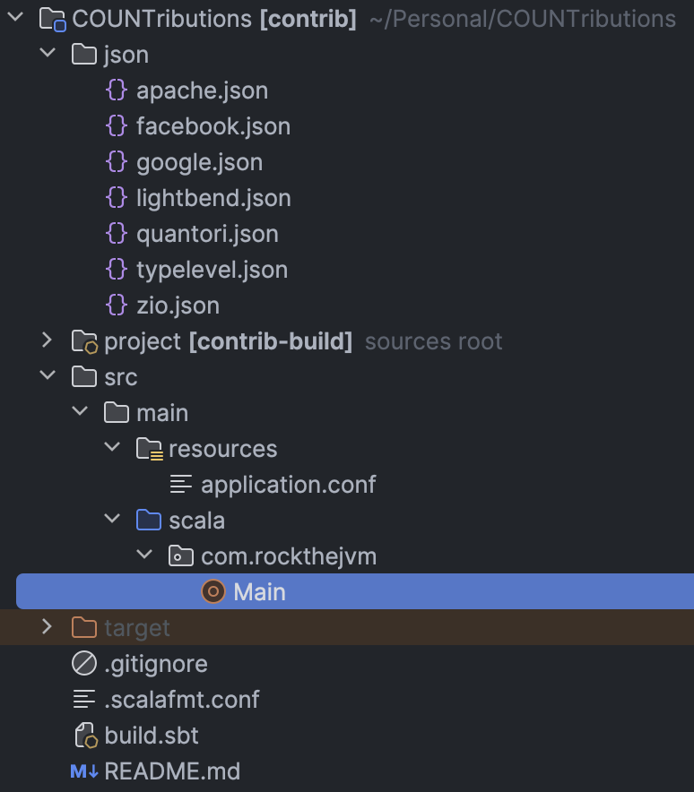

_by [Anzori (Nika) Ghurtchumelia](https://github.com/ghurtchu)_

## 1. Introduction

🚀 Welcome to a journey where functional programming meets the social media hub for developers - GitHub! 🌐.
If you've ever wondered how to turbocharge your software projects with parallelism, you're in for a treat. 
Today, we're diving into the world of Scala and Cats-Effect fibers by solving a practical problem.

Picture this: GitHub as the bustling city for developers, with repositories as towering skyscrapers and code collaborations. Now, what if I told you there's a way to navigate this huge metropolis within seconds? Enter functional programming, the superhero caped in composability and scalability 😊.

In the vast landscape of open-source collaboration, aggregating the valuable contributions of an organization's contributors can be a challenge. In this blog, we embark on a journey to streamline and enhance this process using the power of parallelism. Join me as we unravel an efficient solution to aggregate contributors concurrently. Let's dive into the world of parallelism and witness how we can transform the task of "contributors aggregation" into a "piece of cake".

Simply put, we're creating an HTTP server to compile and organize contributors from a specific GitHub organization, like Google or Typelevel. The response will be sorted based on the quantity of each developer's contributions.

## 2. Project Structure

We will use Scala 3.3.0, SBT 1.9.4 and a handful of useful libraries to complete our project. 

The initial project skeleton looks like the following:


- `json` folder contains the JSON outputs for each organization
- `src/main/scala/com/rockthejvm/Main.scala` is a single file 150 LOC solution
- `src/main/resources/application.conf` defines the project configuration (in this case only a GitHub token for authorizing GitHub requests)
- `.scalafmt.conf` is used to format the code (UX is important, even for backend devs 😉)
- `build.sbt` is responsible for building the project and generating `app.jar` which we can run with `java` or `scala`

Let's have a look at the libraries listed in `build.sbt`:
```scala
val Http4sVersion = "0.23.23"

lazy val root = (project in file("."))
  .settings(
    organization := "com.rockthejvm",
    name := "contrib",
    scalaVersion := "3.3.0",
    libraryDependencies ++= Seq(
      "org.http4s" %% "http4s-ember-server" % Http4sVersion,
      "org.http4s" %% "http4s-ember-client" % Http4sVersion,
      "org.http4s" %% "http4s-dsl" % Http4sVersion,
      "com.typesafe.play" %% "play-json" % "2.10.3",
      "com.github.pureconfig" %% "pureconfig-core" % "0.17.4",
      "ch.qos.logback" % "logback-classic" % "1.4.12" % Runtime,
    ),
  )
```

- first three dependencies which start with `org.http4s` are concerned with the HTTP server & client and handy dsl for creating `HttpRoutes`
- `play-json` is a JSON library for Scala
- last two libraries will be used for managing project configuration and logging respectively

## 3. Prerequisites
Before doing anything, please generate GitHub token and put it in `src/main/resources/application.conf`, like this:


It is necessary to use GitHub token because we'll be using GitHub API for which the requests must be authorized. Also, GitHub token will ensure that GitHub API rate limiter will allow us to issue many requests at once.

## 4. Planning
What are we going to do and how exactly? To answer this questions we must investigate existing GitHub API so that we know what kind of data is exposed and how.

Some of the interesting questions can be:
- How can I fetch basic data about organization?
- How do I find out how many public projects are owned by the organization?
- What is the number of contributors for each project owned by organization?
- ...

## 5. Quickstart

Let's just create a `Main.scala` and run a basic HTTP server with health check endpoint to ensure that everything is fine.

```scala
package com.rockthejvm

import cats.effect.{IO, IOApp}
import org.http4s.dsl.io.*
import org.http4s.ember.server.EmberServerBuilder
import org.http4s.HttpRoutes
import org.typelevel.log4cats.Logger
import org.typelevel.log4cats.slf4j.Slf4jLogger
import org.typelevel.log4cats.syntax.LoggerInterpolator
import com.comcast.ip4s.*

object Main extends IOApp.Simple {

  given logger: Logger[IO] = Slf4jLogger.getLogger[IO]

  override val run: IO[Unit] =
    (for {
      _ <- info"starting server".toResource
      _ <- EmberServerBuilder
        .default[IO]
        .withHost(host"localhost")
        .withPort(port"9000")
        .withHttpApp(routes.orNotFound)
        .build
    } yield ()).useForever

  def routes: HttpRoutes[IO] =
    HttpRoutes.of[IO] { case GET -> Root =>
      Ok("hi :)")
    }
}
```

To start the app we need to execute `sbt` and `run` commands:

- `sbt`
- `run`

and then test our server by curling it:

`curl localhost:9000`

To illustrate all that:
- 

Great! Now it's time to define some domain models. It turns out that GitHub API responses support JSON format, it means that we'll need to define custom JSON serializers.


