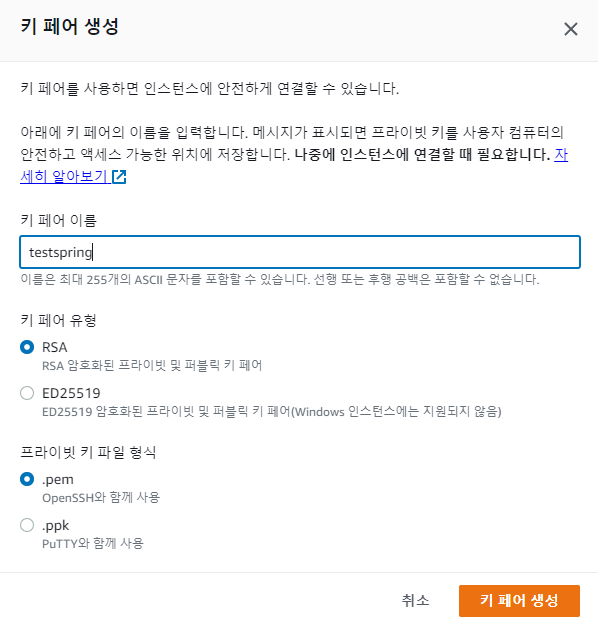
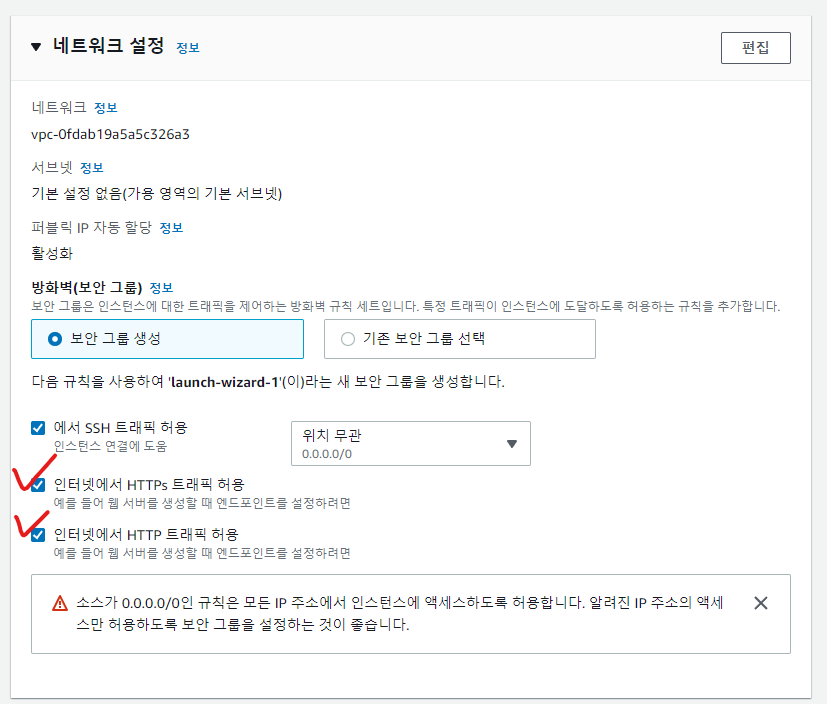
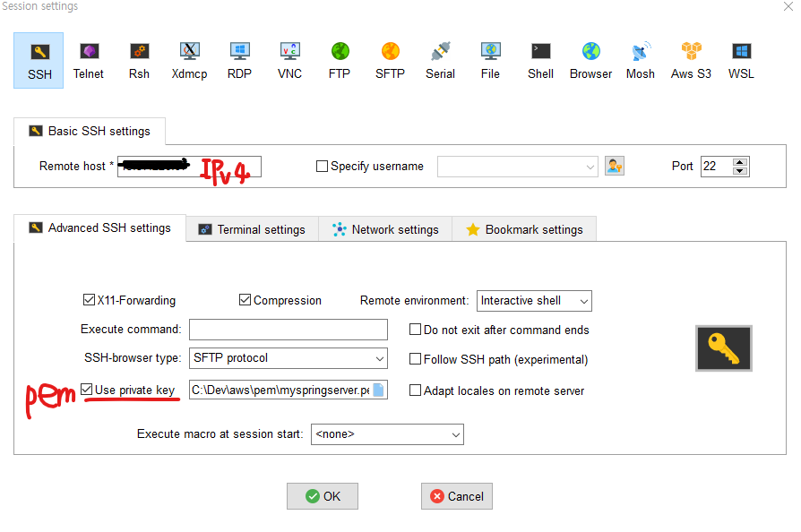
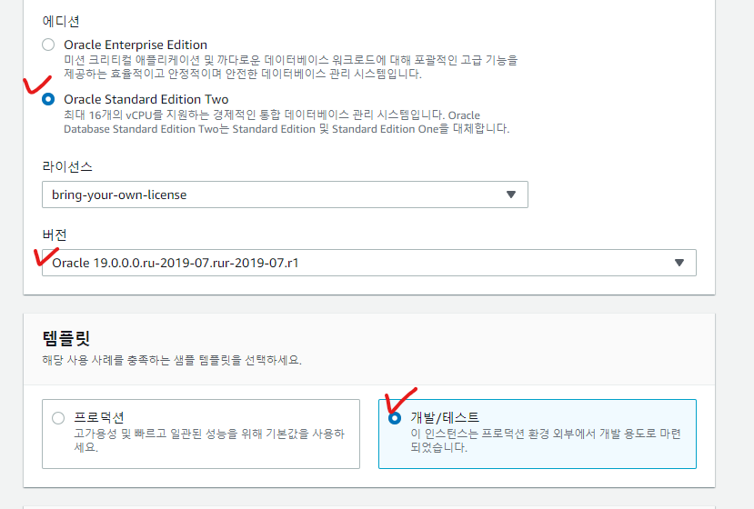
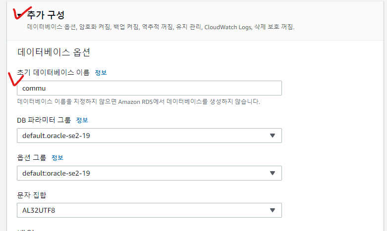
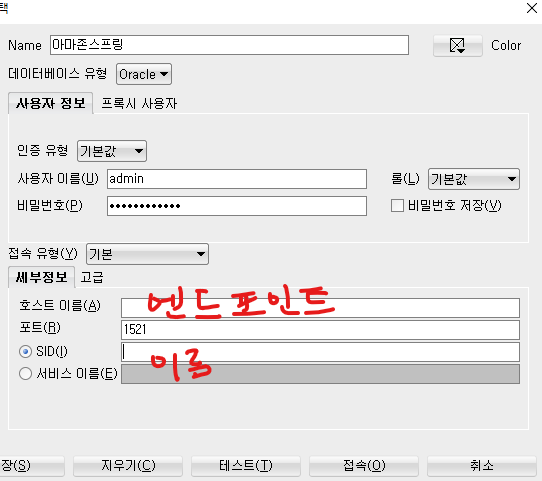

> ## AWS 시작하기

> #### 인스턴스 삭제

- 인스턴스 종료 -> 삭제
- 사용하지 않으면 삭제하기 -> 과금될수 있음.

> #### SSH 원격 접속프로그램 설치

- Putty

- MobaXterm - 현재 주로 사용

- 퍼블릭 Ipv4주소를 가져와서 MobaXterm에 Session에 SSH에 세팅하기

  

- 아마존 리눅스 계정 ec2-user 접속
- 해당 계정에 jdk, tomcat, 환경변수 등록 해야함

> #### 아마존 리눅스 계정 세팅

- pwd : 접속중인 계정확인
- yum : 패키지 설치 및 제거 관리자
- 명령어 - yum list | grep jdk / 목록중에 jdk 검색에 해당하는 것을 볼때
- sudo : 관리자 명령
- open jdk 설치 명령어 - sudo yum install -y java-1.8.0-openjdk-devel.x86_64
- 환경변수 확인 - echo $JAVA_HOME
- Tomcat 다운로드 및 설치 tar.gz 링크 주소 - https://dlcdn.apache.org/tomcat/tomcat-9/v9.0.65/bin/apache-tomcat-9.0.65.tar.gz
- 앞에 wget + 주소 - 다운로드 명령어
- ls : 다운받은 것 확인 명령어
- tar xvfz apache* : 압축해제 명령어
- rm -r apache*.gz :  톰캣 압축파일 삭제
- cd /usr/local : 폴더 이동
- sudo mkdir tomcat : 생성
- cd /home/ec2-user : 이동
- sudo mv apache* /usr/local/tomcat/tomcat9 : 파일이동
- cd /usr/local/tomcat 로 이동해서 ls로 이동되어 있는지 확인

> #### 리눅스 VI 사용하기

- sudo touch abc.txt 파일생성

- vi abc.txt로 vi환경으로 들어가기

- Shift + : 누르고 q or q!누르면 vi 종료

- Shift + : 누르고 wq 저장하고 vi종료

- sudo vi /etc/profile 들어가기 환경변수 작업 경로

- 맨아래에 export 하고 저장하면서 나오기

- 첫번째 JAVA_HOME의 경로의 경우 readlink -f /usr/bin/java를 통해 확인하기

  > export JAVA_HOME=/usr/lib/jvm/java-1.8.0-openjdk-1.8.0.332.b09-1.amzn2.0.2.x86_64/jre/bin
  > export PATH=$PATH:$JAVA_HOME/bin;$CATALINA_HOME/bin;
  > export CLASSPATH=$JAVA_HOME/jre/lib:$JAVA_HOME/lib/tools.jar
  > export CATALINA_HOME=/usr/local/tomcat/tomcat9

- exit로 나갔다가 다시 들어가기
- echo $JAVA_HOME로 확인하기
- sh는 리눅스 bat는 윈도우

- 만들고 인스턴스 재부팅
- cd /usr/local/tomcat/tomcat9/bin 로 들어가서 sudo ./startup.sh로 실행시키기
- ps -ef | grep tomcat로 톰캣 시작 확인
- sudo netstat -anp | grep 8080으로 포트확인
- sudo netstat -tlnp 전체 포트 확인
- 퍼블릭 IPv4 주소 : 8080 로 연결

이후 web.xml과 servlet-context.xml에 경로를 수정을 해줘야한다

upload 경로를 만들어서 옮겨준다

> #### Oracle에서 설정

- 접속완료
