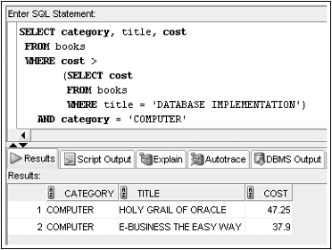



📋 This is my note-taking from what I learned in the class "Advanced Database Concepts"


<div class="notice--danger">{{ notice-2 | markdownify }}</div>

<!-- 📋 This is my note-taking from what I learned in the LinkedIn Learning course "Explore a Career in SQL Development"
{: .notice--danger} -->

<br>

# Objective

- Determine when using a sub-query is appropriate
- Identify which clauses can contain sub-queries
- Distinguish between an outer query and a sub-query
- Use a single-row sub-query in a WHERE clause
- Use a single-row sub-query in a HAVING clause
- Use a single-row sub-query in a SELECT clause
- Distinguish between single-row and multiple-row comparison operators
- Use a multiple-row sub-query in a WHERE clause
- Use a multiple-row sub-query in a HAVING clause
- Use a multiple-column sub-query in a WHERE clause
- Create an inline view using a multiple-column sub-query in a FROM clause
- Compensate for NULL values in sub-queries
- Distinguish between correlated and uncorrelated sub-queries
- Nest a sub-query inside another sub-query
- Use a sub-query in a DML action
- Process multiple DML actions with a MERGE statement

<br>

# Sub-Queries and Their Uses

- Sub-query: A query nested inside another query
- Used when a query is based on an unknown value
- Requires SELECT and FROM clauses
- Must be enclosed in parentheses
- Place on right side of comparison operator

<br>

# Types of Sub-Queries

| Sub-Query                 | Description                                                                                              |
| :------------------------ | :------------------------------------------------------------------------------------------------------- |
| Single-row sub-query      | Returns to the outer query one row of results that consists of one column                                |
| Multiple-row sub-query    | Returns to the outer query more than one row of results                                                  |
| Multiple-column sub-query | Returns to the outer query more than one column of results                                               |
| Correlated sub-query      | References a column in the outer query, and executes the sub-query once for every row in the outer query |
| Uncorrelated sub-query    | Executes the sub-query first and passes the value to the outer query                                     |

<br>

# Single-Row Sub-Queries

- Can only return one result to the outer query
- Operators include `=`, `>`, `<`, `>=`, `<=`, `< >`

## Single-Row Sub-Query in a WHERE Clause

- Used for comparison against individual data

```
SELECT category, title, cost
  FROM books
  WHERE cost >
        (SELECT cost
        FROM books
        WHERE title = 'DATABASE IMPLEMENTATION')
    AND category = 'COMPUTER';
```



## Single-Row Sub-Query in a HAVING Clause

- Required when returned value is compared to grouped data

```
SELECT category, AVG(retail-cost) "Average Profit"
  FROM books
  GROUP BY category
  HAVING AVG(retail-cost) > (SELECT AVG(retail-cost)
                              FROM books
                              WHERE category = 'LITERATURE');
```


## Single-Row Sub-Query in a SELECT Clause

- Replicates sub-query value for each row displayed

```
SELECT title, retail
              (SELECT TO_CHAR(AVG(retail),999.99)
                FROM books) "Overall Average"
  FROM books;
```


<br>

# Summary

<br>

---

<br>

    🖋️ This is my self-taught blog! Feel free to let me know
    if there are some errors or wrong parts 😆

[Back to Top](#){: .btn .btn--primary }{: .align-right}
