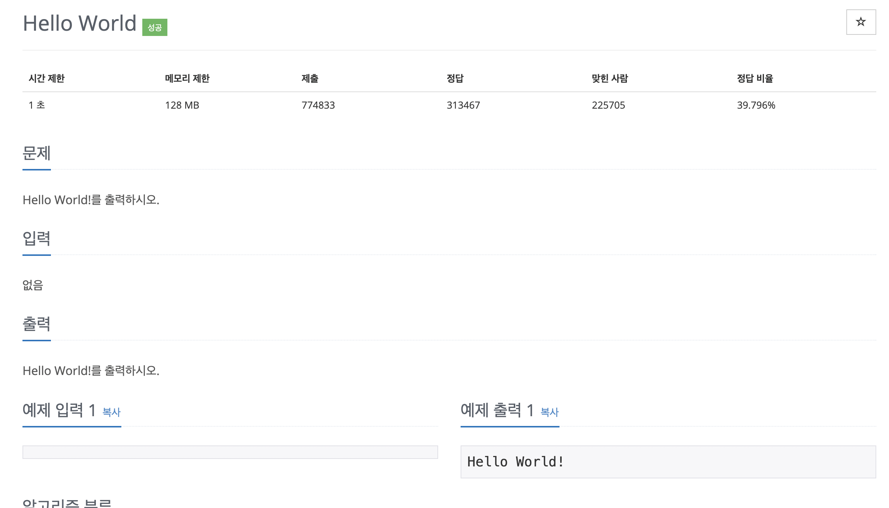

---

layout: single

title: "[백준] 2557번 : Hello World - JAVA [자바]" 

categories: 
    - baekjoon

tags: [baekjoon,java]

toc: true

---

<br />
<br />
<br />
<br />



<br />
<br />

# 방법 1 (System 클래스 - 표준 입출력)

<br />

<br / >


<br />
<br />

```java
public class Main {

    public static void main(String[] args) {
        System.out.println("Hello World!");


    }

}
```

<br />
<br />

**참고로 백준은 알고리즘은 클래스명을 Main으로 해주어야한다** ,. -> 정답율이 낮은 이유가 여기에 !! 
<br />
<br />

# 방법 2  (BufferdWriter)

<br />
<br />

```java
import java.io.BufferedWriter;
import java.io.IOException;
import java.io.OutputStreamWriter; 

public class Main {

    public static void main(String[] args) throws IOException {
        BufferedWriter bw = new BufferedWriter(new OutputStreamWriter(System.out));
        bw.write("Hello World!");
        bw.flush();
        bw.close();


    }

}
```

<br />
<br />

방법2의 경우 앞으로 백준 알고리즘을 해결하는데 있어 많이 사용하게될 방법 중 하나이다.

BufferedWriter / BufferedReader 는 Buffer에 있는 IO 클래스! 

이 클래스들은 데이터를 하나씩 읽어오는 것이 아니라 **버퍼에 저장해두었다가 한 번에 출력 또는 데이터를 보낸다.**

ex ) 1000개의 데이터를 1개씩 빼오는게 아니라 임시로 한공간에 담아둔 뒤 한 번에 보내는 방법이니 성능면에서 당연 우수!!! ( 속도가 빠르다고 이해하면 ok .. but 빠른e 이유가 이것뿐만은 아니래요 )

특히 ! scanner는 BufferReader보다 상당히 느린데, 이게 문제가 되는 것이 백준을 풀다 보면 시간 초과로 통과하지 못하는 경우가 더러 있다. 따라서 이를 익혀두는 것이 좋다 ! 
<br />
<br />

# 방법3 (StringBuilder)

<br />
<br />

```java
public class Main {

    public static void main(String[] args) {
        StringBuilder sb = new StringBuilder();
        sb.append("Hello World!");
        System.out.println(sb);


    }

}
```

<br />
<br />
StringBuilder를 이용하는 방법이다.

이 또한 BufferdWriter와 유사하게 데이터를 모아두었다가 한 번에 출력한다. 

문자열을 조작할 때 매우 유용한 방법이다.

특징이 있다면 StringBuilder에서 문자열을 이어 붙인다는 점이다. 
<br />
<br />

# 방법4 (StringBuffer)

<br />
<br />

```java
public class Main {

    public static void main(String[] args) {
        StringBuffer sb = new StringBuffer();
        sb.append("Hello World!");
        System.out.println(sb);


    }

}
```

<br />
<br />

StringBuilder와 거의 비슷하다 다만 StringBuilder와 차이점이 있다면  **StringBuffer은 동기화를 지원**한다.

즉 Multi-Thread 상황에서 문자열이 리소스로 사용된다면 StringBuffer을 사용해주어야한다. (StringBuffer은 동기화를 지원하지 않는다.)

아무래도 동기화를 지원하다 보니 StringBuilder보단 느리지만 그래도 문자열에 있어 String 보다 훨씬 빠르다! 
