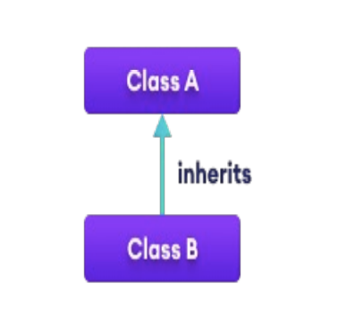
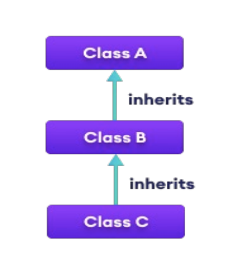
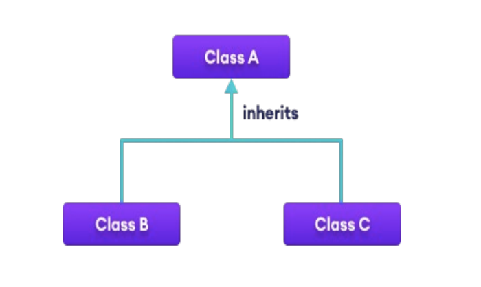
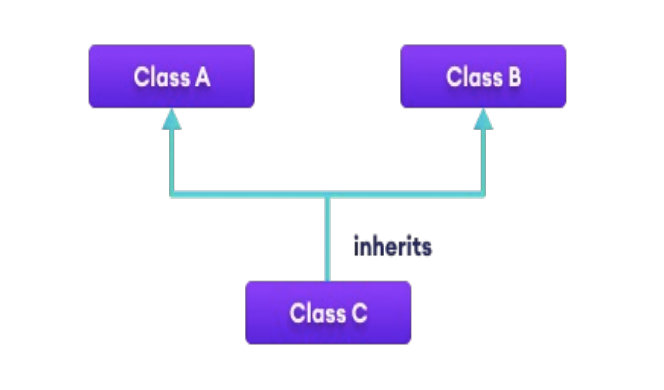
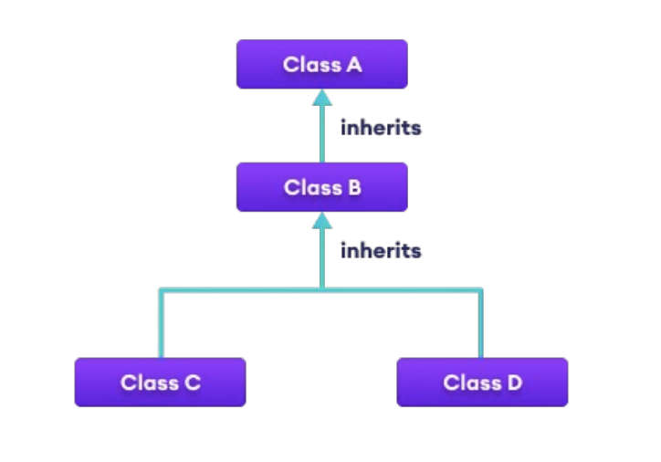

<!-- 

📋 This is my note-taking from what I learned in the c# tutorials!

- Reference tutorials link: <https://www.w3schools.com/cs/index.php>
  

<div class="notice--danger">{{ notice-2 | markdownify }}</div> -->

📋 This is my note-taking from what I learned in the class "Programming 2"
{: .notice--danger}

<br>

# Objective of Inheritance

- Designing classes that inherit from other classes
- Study relationship between `base` and `derived` classes
- Understanding `protected` and `internal` members
- base
- this
- override
- new
- abstract
- sealed

<br>

# Inheritance (Derived and Base Class)

In C#, inheritance allows us to create a new class from an existing class. It is a key feature of Object-Oriented Programming (OOP).

The class from which a `new class is created` is known as the base class (parent or superclass). And, the new class is called derived class (child or subclass)

The `derived class inherits the fields and methods of the base class`. This helps with the code reusability in C#.

In C#, it is possible to inherit fields and methods from one class to another. We group the "inheritance concept" into two categories:

- Derived Class (child) - the class that inherits from another class
- Base Class (parent) - the class being inherited from

To inherit from a class, use the `:` symbol.

In the example below, the Car class (child) inherits the fields and methods from the Vehicle class (parent):

```
class Vehicle // base class (parent)
{
  public string brand = "Ford"; // vehicle field

  public void honk() // vehicle method
  {
    Console.WriteLine("Tuut, tuut!");
  }
}

class Car : Vehicle // derived class (child)
{
  public string modelName = "Mustang"; // car field
}

class Program
{
  static void Main(string[] args)
  {
    // create a myCar object
    Car myCar = new Car();

    // call the honk() method (From the Vehicle class) on the myCar object
    myCar.honk();

    // display the value of the brand field (from the Vehicle class) and the value of the modelName from the Car class
    Console.WriteLine(myCar.brand + " " + myCar.modelName);
  }
}
```

Inherit the derived class Dog from the base class Animal. The Dog class can now access the fields and methods of Animal class.


Use the `: symbol` to perform inheritance

```
class Animal
{
  // fields and methods
}

// Dog inherits from Animal
class Dog : Animal
{
  // fields and methods of Animal
  // fields and methods of Dog
}
```

```
using System;

namespace Inheritance
{
  // Base class
  class Animal
  {
    public string name;

    public void display()
    {
      Console.WriteLine("I am an animal");
    }
  }

  // Derived class of Animal
  class Dog : Animal
  {
    public void getName()
    {
      Console.WriteLine("My name is " + name);
    }
  }

  class Program
  {
    static void Main(string[] args)
    {
      // Object of derived class
      Dog labrador = new Dog();

      // Access field and method of base class
      labrador.name = "Rohu";
      labrador.display();

      // Access method from own class
      labrador.getName();
      Console.ReadLine();
    }
  }
}

/* Output:
I am an animal
My name is Rohu
*/
```



Why And When To Use "Inheritance"?

- It is useful for code reusability: reuse fields and methods of an existing class when you create a new class.

Tip: Also take a look at Polymorphism, which uses inherited methods to perform different tasks.


<div class="notice--danger">{{ notice-2 | markdownify }}</div>

<br>

## `is-a` Relationship in Inheritance

In C#, inheritance is an `is-a` relationship. We use inheritance only if there is an `is-a` relationship between two classes.

- Dog `is a` Animal
- Apple `is a` Fruit
- Car `is a` Vehicle

We can derive Dog from Animal class. Similarly, Apple from Fruit and Car from Vehicle class.

<br>

## `protected` Members in Inheritance

When we declare a field or method as `protected`, it can only be `accessed from the same class and its derived classes`.

```
using System;

namespace Inheritance
{
  // Base class
  class Animal
  {
    protected void eat()
    {
      Console.WriteLine("I can eat");
    }
  }

  // Derived class of Animal
  class Dog : Animal
  {
    static void Main(string[] args)
    {
      Dog labrador = new Dog();

      // Access protected method from base class
      labrador.eat();
      Console.WriteLine();
    }
  }
}
```

<br>

## Types of Inheritance

| Types                    | Diagram                                                  | Description                                                                                                                                                                                    |
| :----------------------- | :------------------------------------------------------- | :--------------------------------------------------------------------------------------------------------------------------------------------------------------------------------------------- |
| Single Inheritance       |        | In single inheritance, a single derived class inherits from a single base class.                                                                                                               |
| Multi-Level Inheritance  |    | In multi-level inheritance, a derived class inherits from a base and then the same derived class acts as a base class for another class.                                                       |
| Hierarchical Inheritance |  | In hierarchical inheritance, multiple derived classes inherit from a single base class.                                                                                                        |
| Multiple Inheritance     |      | In multiple inheritance, a single derived class inherits from multiple base classes. C# doesn't support multiple inheritance. However, we can achieve multiple inheritance through interfaces. |
| Hybrid Inheritance       |        | Hybrid inheritance is a combination of two or more types of inheritance. The combination of multi-level and hierarchical inheritance is an example of Hybrid inheritance.                      |

<br>

## Method Overriding in Inheritance

If the `same method` is present in both the `base class` and the `derived class`, the `method in the derived class overrides the method in the base class`. This is called method overriding in C#.

```
using System;

namespace Inheritance
{
  // Base class
  class Animal
  {
    public virtual void eat()
    {
      Console.WriteLine("I eat food");
    }
  }

  // Derived class of Animal
  class Dog : Animal
  {
    // Overriding method from Animal
    public override void eat()
    {
      Console.WriteLine("I eat Dog food");
    }
  }

  class Program
  {
    static void Main(string[] args)
    {
      // Object of derived class
      Dog labrador = new Dog();

      // Accesses overridden method
      labrador.eat();
    }
  }
}
```

<br>

## `base` Keyword in Inheritance

In the previous example, we saw that the method in the `derived class overrides the method in the base class`.

However, what if we `want to call the method of the base class` as well?

In that case, we `use the base keyword to call the method of the base class from the derived class`.

```
using System;

namespace Inheritance
{
  // Base class
  class Animal
  {
    public virtual void eat()
    {
      Console.WriteLine("Animals eat food");
    }
  }

  // Derived class of Animal
  class Dog : Animal
  {
    // Overriding method from Animal
    public override void eat()
    {
      // Call method from Animal class
      base.eat();

      Console.WriteLine("Dogs eat Dog food");
    }
  }

  class Program
  {
    static void Main(string[] args)
    {
      Dog labrador = new Dog();
      labrador.eat();
    }
  }
}
/* Output:
Animals eat food
Dogs eat Dog food
*/
```

<br>

## `new` Modifier

When used as a declaration modifier, the `new` keyword explicitly hides a member that is inherited from a base class. When you hide an inherited member, the derived version of the member replaces the base class version.

To hide an inherited member, declare it in the derived class by using the same member name, and modify it with the `new` keyword.

```
public class BaseC
{
  public int x;
  public void Invoke(){}
}

public class DerivedC : BaseC
{
  new public void Invoke(){}
}
```

### Example 1: The use of the `new` modifier

```
public class BaseC
{
  public static int x = 55;
}

public class DerivedC : BaseC
{
  // Hide field 'x'
  new public static int x = 100;

  static void Main()
  {
    // Display the new value of x
    Console.WriteLine(x);

    // Display the hidden value of x
    Console.WriteLine(BaseC.x);
  }
}

/* Output:
100
55
*/
```

- BaseC(base class) and DerivedC(derived class) use the same field name 'x', which hides the value of the inherited field
- Use the new modifier
- Access the hidden members of the base class by using their fully qualified names

### Example 2

```
public class BaseC
{
  public class NestedC
  {
    public int x = 200;
    public int y;
  }
}

public class DerivedC : BaseC
{
  // Nested type hiding the base type members
  new public class NestedC
  {
    public int x = 100;
    public int y;
    public int z;
  }

  static void Main()
  {
    // Creating an object from the overlapping class
    NestedC c1 = new NestedC();

    // Creating an object from the hidden class
    BaseC.NestedC c2 = new BaseC.NestedC();

    Console.WriteLine(c1.x);
    Console.WriteLine(c2.x);
  }
}

/* Output:
100
200
*/
```

- A nested class hides a class that has the same name in the base class
- Use the new modifier to eliminate the warning message
- Access the hidden class members by using their fully qualified names

<br>

# Polymorphism and Overriding Methods

Polymorphism is one of the features provided by `Object Oriented Programming`. Polymorphism simply means occurring in more than one form. That is, the same entity(method or operator or object) can perform different operations in different scenarios.

Polymorphism means "many forms", and it occurs when we have many classes that are related to each other by inheritance.

Like we specified before; Inheritance lets us inherit fields and methods from another class. Polymorphism uses those methods to perform different tasks. This allows us to perform a single action in different ways.

For example, think of a base class called Animal that has a method called animalSound(). Derived classes of Animals could be Pigs, Cats, Dogs, Birds - And they also have their own implementation of an animal sound (the pig oinks, and the cat meows, etc.):

```
class Animal // Base class (parent)
{
  public void animalSound()
  {
    Console.WriteLine("The animal makes a sound");
  }
}

class Pig : Animal // Derived class (child)
{
  public void animalSound()
  {
    Console.WriteLine("The pig says: wee wee");
  }
}

class Dog : Animal // Derived class (child)
{
  public void animalSound()
  {
    Console.WriteLine("The dog says: bow wow");
  }
}
```

Now we can create Pig and Dog objects and call the animalSound() method on both of them:

```
class Animal // Base class (parent)
{
  public void animalSound()
  {
    Console.WriteLine("The animal makes a sound");
  }
}

class Pig : Animal // Derived class (child)
{
  public void animalSound()
  {
    Console.WriteLine("The pig says: wee wee");
  }
}

class Dog : Animal // Derived class (child)
{
  public void animalSound()
  {
    Console.WriteLine("The dog says: bow wow");
  }
}

class Program
{
  static void Main(string[] args)
  {
    Animal myAnimal = new Animal(); // Create a Animal object
    Animal myPig = new Pig(); // Create a Pig object
    Animal myDog = new Dog(); // Create a Dog object

    myAnimal.animalSound();
    myPig.animalSound();
    myDog.animalSound();
  }
}

/* Output:
The animal makes a sound
The animal makes a sound
The animal makes a sound
*/
```

👆 Not The Output I Was Looking For!

The output from the example above was probably not what you expected. That is because the base class method overrides the derived class method, when they share the same name.

However, C# provides an option to `override` the base class method, by adding the `virtual` keyword to the method inside the base class, and by using the `override` keyword for each derived class methods:

```
class Animal // Base class(parent)
{
  public virtual void animalSound()
  {
    Console.WriteLine("The animal makes a sound");
  }
}

class Pig : Animal // Derived class (child)
{
  public override void animalSound()
  {
    Console.WriteLine("The pig says: wee wee");
  }
}

class Dog : Animal // Derived class (child)
{
  public override void animalSound()
  {
    Console.WriteLine("The dog says: bow bow");
  }
}

class Program
{
  static void Main(string[] args)
  {
    Animal myAnimal = new Animal(); // Create a Animal object
    Animal myPig = new Pig(); // Create a Pig object
    Animal myDog = new Dog(); // Create a Dog object

    myAnimal.animalSound();
    myPig.animalSound();
    myDog.animalSound();
  }
}

/* Output:
The animal makes a sound
The pig says: wee wee
The dog says: bow wow
*/
```

Example:

```
class Program
{
  // Method does not take any parameter
  public void greet()
  {
    Console.WriteLine("Hello");
  }

  // Method takes one string parameter
  public void greet (string name)
  {
    Console.WriteLine("Hello" + name);
  }

  static void Main (string[] args)
  {
    Program p1 = new Program();

    // Call method without any argument
    p1.greet();

    // Call method with an argument
    p1.greet("Tim");
  }
}

/* Output
Hello
Hello Tim
*/
```

- In the above, we have created a class Program inside which we have two methods of the same name greet().
- Here, one of the greet() methods takes no parameters and displays "Hello"
- While the other greet() method takes a parameter and displays "Hello Tim"
- Hence, the greet() method behaves differently in different scenarios. Or we can say greet() is `polymorphism`

<br>

## Type of Polymorphism

There are two types of polymorphism:

1. Compile Time Polymorphism / Static Polymorphism
2. Run-Time Polymorphism / Dynamic Polymorphism

### 1. Compile Time Polymorphism / Static Polymorphism

In `Compile Time Polymorphism`, the compiler identifies which method is being called at the compile time.

In C#, we achieve `Compile Time Polymorphism` through 2 ways:

> 𝟣. Method Overloading
>
> In C# class, we can create methods with the same name in a class if they have `different numbers of parameter` and `types of parameter`
>
> ```
> using System;
>
> class Program
> {
>   // Method adds two integer numbers
>   void totalSum(int a, int b)
>   {
>     Console.WriteLine("The sum of numbers is " + (a + b));
>   }
>
>   // Method adds two double-type
>   // totalSum() method is overloaded
>   void totalSum(double a, double b)
>   {
>     Console.WriteLine("The sum of numbers is " + (a + b));
>   }
>
>   static void Main(string[] args)
>   {
>     Program sum1 = new Program();
>     sum1.totalSum(5, 7);
>     sum1.totalSum(53.3, 8.7);
>   }
> }
>
> /* Output
> The sum of numbers is 12
> The sum of numbers is 62.2
> */
> ```
>
> - In the above, the class Program contains a method named totalSum> () that is overloaded.
> - The totalSum() method prints:
>   : - sum of integers if two integers are passed as an argument
>   : - sum of doubles if two doubles are passed as an argument

> 𝟤. Operator Overloading
>
> Some operators in C# behave differently with different operands. For example, `+` operator is overloaded to perform numeric addition as well as string concatenation
>
> `+` operator is used to add two entities. However, in C#, `+` operator performs two operations:
>
> 1. Adding two numbers
>    ```
>    int x = 7;
>    int y = 5;
>    int sum = x + y;
>    Console.WriteLine(sum);
>    // Output: 12
>    ```
> 2. Concatenating two strings
>    ```
>    string firStr = "harry";
>    string secStr = "Styles";
>    string concatenatedStr = firStr + secStr;
>    Console.WriteLine(concatenatedStr);
>    // Output: harryStyles
>    ```

### 2. Run-Time Polymorphism / Dynamic Polymorphism

In `Run-Time Polymorphism`, the method that is called is determined at the run-time not at compile time.

The `Run-Time Polymorphism` is achieved by:

>

<br>

## Override

The `override` keyword is used together with the `virtual` keyword, which is applied to the base class method. The `virtual` keyword allows the base class method to be overridden by derived classes. Then, in the derived class, you can use the `override` keyword to provide a specific implementation for that method.

```
class BaseClass
{
  public virtual void Print()
  {
    Console.WriteLine("BaseClass");
  }
}

class DerivedClass : BaseClass
{
  public override void Print()
  {
    Console.WriteLine("DerivedClass");
  }
}
```

In this example, the `DerivedClass` overrides the `Print()` method from the `BaseClass`. When you create an instance of `DerivedClass` and call the `Print()` method, it will execute the overridden implementation in the derived class.

<br>



Why And When To Use "Inheritance" and "Polymorphism"?

It is useful for code reusability: reuse fields and methods of an existing class when you create a new class.


<div class="notice--danger">{{ notice-2 | markdownify }}</div>

<br>

---

<br>

    🖋️ This is my self-taught blog! Feel free to let me know
    if there are some errors or wrong parts 😆

[Back to Top](#){: .btn .btn--primary }{: .align-right}
