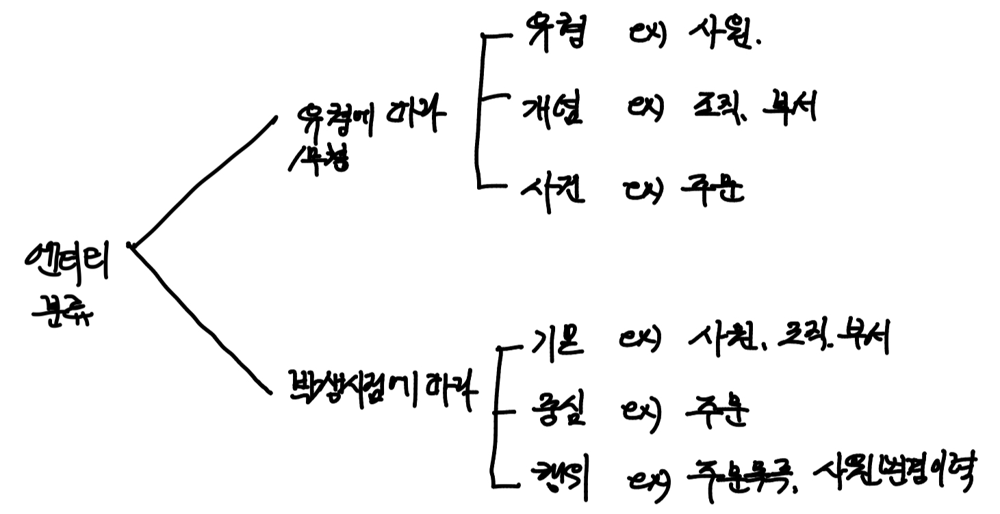

# 엔티티(Entity)

> 이번 포스팅에선, ERD를 이루는 Entity에 대해서 정리해보도록 하겠습니다.
>
> 데이터 모델의 3대요소, Things, Attributes, Relationships 중 Things에 해당하는 Entity.
>
> 엔티티는 결국 테이블로 변경되는 것을 이해하면서, 엔티티가 가져야할 여러 조건들, 특징에 대해서 이해해봅시다.
>
> 이 글은 '이경오의 SQL + SQLD 비밀노트'를 정리한 내용입니다.
>
> **혹시 틀린 내용이 있다면, 지적해주시면 감사드리겠습니다.

### 엔티티의 정의

* 비즈니스 관점에서 IT시스템을 통해 저장 및 관리 해야하는 <u>*집합*</u>적인 어떤 것(Thing)
* 엔티티는 *<u>사람, 사물, 사건, 개념</u>* 등의 명사(noun)에 해당
* 엔티티는 비즈니스 관점에서 IT 시스템을 통해 관리가 필요한 관심사에 해당
* 비즈니스를 구현하기 위해서 저장해야하는 어떤 것

### 엔티티와 인스턴스

* 하나의 엔티티는 여러개의 인스턴스를 갖습니다.

* 엔티티는 인스턴스의 집합이라고 할 수 있습니다.

  ex) '사원'이라는 엔티티, '홍길동'이라는 인스턴스

  ex) '지하철역'이라는 엔티티, '2호선 강남역'이라는 인스턴스

### 엔티티의 표기법

> 위의 엔티티 그림을 참고해주세요

* 엔티티는 모서리가 둥근 사각형(바커 표기법 기준)을 그린 후 맨 위에 엔티티명을 기재합니다.

### 엔티티의 특징

* 업무에서 필요로 하는 정보

  * 비즈니스 요구 조건 만족을 위해 반드시 필요하고, 저장 및 관리하고자 하는 정보

    ex) 가수 엔티티는 엔터조직에서는 필요하지만, 일반 회사에서는 필요하지 않을 수 있다.

* 식별가능해야 함

  * 유일한 식별자에 의해서 식별이 가능해야 한다.(식별자 - PK:Primary Key, 고유키 까지 개념이 이어진다.)
  * 집합(엔티티, 테이블) 내에서 단 1건을 꼭 짚어낼 수 있어야한다.

* 인스턴스의 집합

  * **<u>영속적으로 존재하는 2개 이상의 인스턴스 집합이어야 한다.</u>**
  * 따라서, 인스턴스가 2개 이상 존재하지 않은 집합은 엔티티라고 할 수 없다.

* 업무 프로세스에 이용

  * 엔티티는 비즈니스 프로세스에 반드시 이용해야 한다. -> 이용하지 않은 엔티티는 버려야 합니다. 메모리 낭비
  * 업무 프로세스에 의해 INSERT, SELECT, UPDATE, DELETE 등이 발생하지 않는 고립된 엔티티의 경우, 엔티티를 제거하거나 아니면 누락된 프로세스가 존재하지 않는지 살펴보고 해당 프로세스를 추가해야한다.

* 속성을 포함

  * **<u>엔티티는 반드시 속성(Attribute)가 포함되어야 한다.(2개 이상)</u>**

  * 속성을 포함하지 않고 엔티티 이름만 가지고 있는 경우는 관계가 생략되어 있거나, 업무 분석이 미진하여 속성 정보가 누락되는 경우에 해당한다.

* 관계의 존재

  * 엔티티는 다른 엔티티와 최소 1개 이상의 관계가 있어야한다.
  * **<u>단, 통계성 엔티티나 코드성 엔티티의 경우 관계를 생략할 수 있다.</u>**
  * 업무의 특성에 따라 관계가 없는 엔티티를 따로 도출하기도 한다!

### 엔티티의 분류

#### 유무형에 따른 분류

**유형 엔티티** ex) 사원, 물품, 강사

* 물리적인 형태가 존재하는 엔티티
* 안정적이고 지속적으로 활용되는 엔티티

**개념 엔티티** ex) 조직, 보험상품

* 물리적인 형태가 존재하는 것은 아니지만, 비즈니스적으로 관리해야할 개념적 정보를 저장하는 엔티티

**사건 엔티티** ex) 주문, 청구, 미납

* 비즈니스를 수행함으로써 발생되는 엔티티
* 유형/개념 엔티티에 비해 데이터의 발생량이 많음
* 다양한 통계 자료에 이용될 수 있음

#### 발생시점에 따른 분류

**기본 엔티티** ex) 사원, 부서, 고객, 상품, 자재

* 비즈니스에서 스스로 태어난 존재에 대한 정보
* 타 엔티티와의 관계에서 생성되는 것이 아닌 독립적으로 생성이 가능한 엔티티
* 기본 엔티티는 타 엔티티의 부모 역할을 하게 된다.

**중심 엔티티** ex) 계약, 사고, 예금원장, 청구, 주문, 매출

* 기본 엔티티로부터 발생하며, 비즈니스에 있어서 중심적인 역할을 하는 엔티티
* 데이터의 양이 많이 발생하고 타 엔티티와의 관계속에서 행위 엔티티를 도출

**행위 엔티티** ex) 주문목록, 사원변경이력

* 2개 이상의 부모 엔티티로부터 발생되는 엔티티
  * ex) 주문목록의 경우, 주문(중심 엔티티)와 고객(기본 엔티티) 사이에서 도출된다.
* 다양하고 복잡한 비즈니스를 처리하는 과정에서 데이터양이 많아질 수 있음
* 상세 설계 단계, 프로세스와 상관 모델링을 진행하면서 도출

### 엔티티의 명명규칙

* 가능한한 업무 담당자들이 사용하는 용어 사용
* **약어는 되도록 지양하기!(약어X)**
* 엔티티는 **단수명사**여야 한다.
* 엔티티의 이름은 해당 모델 내에서 유일한 이름
* 엔티티의 생성 의미에 맞게 이름을 부여

### Reference

* 이경오의 SQL+SQLD 비밀노트 - 이경오 저
