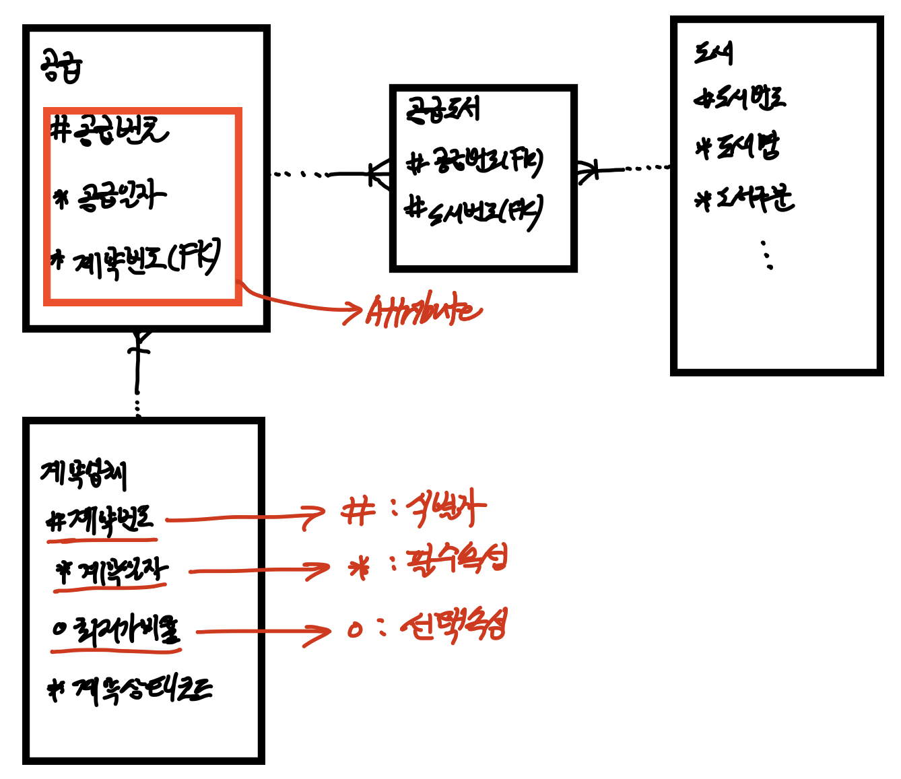
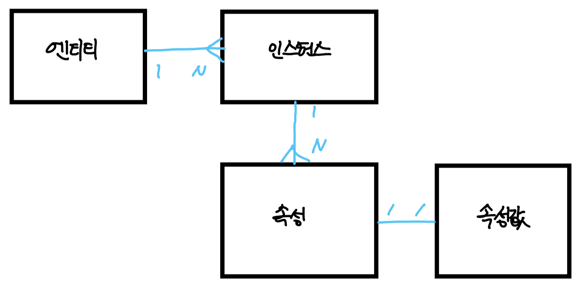
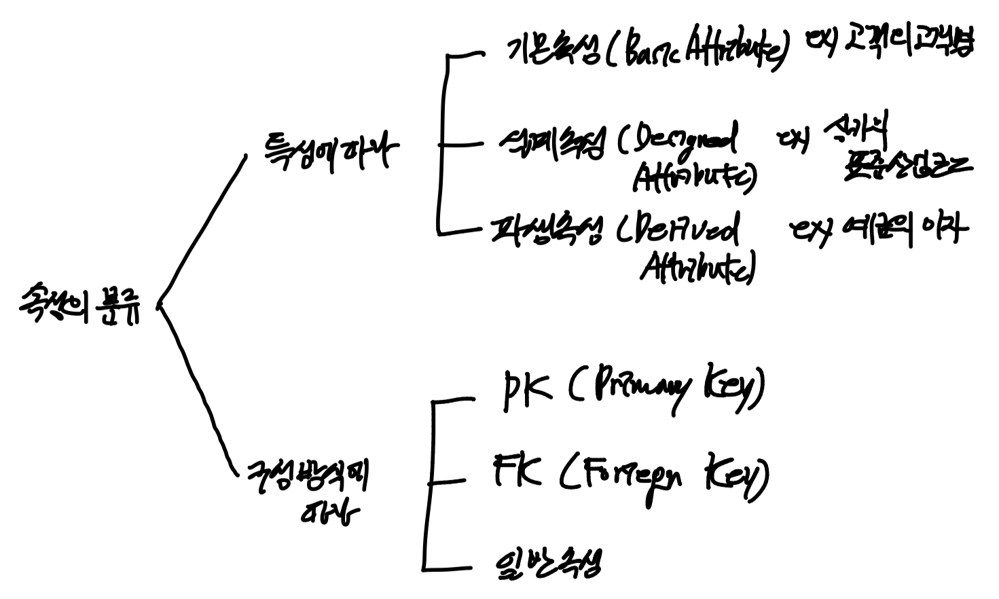

# 속성(Attribute)

> 이번 포스팅에선, 속성에 대해서 알아보겠습니다.
>
> 데이터 모델의 3대요소, Things, Attributes, Relationships 중 Attributes에 해당하는 Attribute.
>
> 이 글은 '이경오의 SQL + SQLD 비밀노트'를 정리한 내용입니다.
>
> **혹시 틀린 내용이 있다면, 지적해주시면 감사드리겠습니다.

### 속성의 정의

* 엔티티에 대한 설명이자, 인스턴스의 구성요소

* 의미상 더이상 분리되지 않는다.

  ex) '상가' 엔티티의 '상호명'은 의미상 분리 되지 않는다.

* 비즈니스에서 필요로 하는 정보 

  ex) '고객' 엔티티의 '고객명'

---

### 엔티티, 인스턴스, 속성, 속성값

* 속성은 엔티티에 대한 자세하고 구체적인 정보를 나타낸다.

* 각각의 속성은 구체적인 값을 갖는다. -> 속성값

* 엔티티, 인스턴스, 속성, 속성값 사이의 관계

  * **1개의 엔티티는 2개 이상의 인스턴스의 집합**

    ex) 고객에는 '홍길동', '이순신' 인스턴스가 존재한다.

  * **1개의 엔티티는 2개 이상의 속성을 갖는다.** 

    ex) 각각의 고객은 고객명과 가입일을 갖는다.

  * **1개의 속성은 1개의 속성값을 갖는다.**

    ex) 고객의 고객명은 '홍길동'이라는 속성값을 갖는다.

### 속성의 표기법

> 위의 erd 그림을 참고해주세요

* '#' : 식별자인 속성
* '*' : 필수 값인 속성
* '◦' : 선택 값인 속성

### 속성의 특징

* 반드시 비즈니스에서 필요로 하고 IT 시스템에서 저장 및 관리하고자 하는 정보

  ex) 고객의 고객번호

* 정규화 이론에 따라 속성이 속해 있는 엔티티의 주식별자에 함수적 종속성을 가져야 한다.

  ex) 식별자인 고객번호(식별자)가 고객의 이름과 고객의 가입일을 결정한다(=알수있다.).

* 하나의 속성에는 1개의 값만 가진다. 하나의 속성에 여러 개의 값이 있는 다중 값일 경우 별도의 엔티티를 이용하여 분리한다.

  ex) 고객의 연락처에 전화번호와 이메일이 둘 다 있는 경우, 이들을 따로 분리해서 저장해야한다.

### 속성의 분류

#### 특성에 따른 분류

**기본 속성(Basic Attribute)**

* 비즈니스 분석을 통해 도출된 속성

  ex) 고객 엔티티의 '고객명'은 기본속성

**설계 속성(Designed Attribute)**

* 비즈니스 분석을 통해 도출된 것은 아니지만 데이터 모델 설계를 하면서 도출되는 속성

  ex) 고객 엔티티의 '고객등급코드' 속성은 설계 속성

**파생 속성(Derived Attribute)**

* 다른 속성에 의해서 계산이나 변형이 되어 생성되는 속성

  ex) 예금엔티티에서 이자율을 통해 계산된 '이자'는 파생속성

#### 구성 방식에 따른 분류

**PK(Primary Key) 방식**

* 엔티티에서 단 하나의 인스턴스를 식별할 수 있는 속성

  ex) 고객 엔티티에서 고객번호

  ex) 주문 엔티티에서 주문번호(복합키형식 : 고객번호 + 주문일자)

**FK(Foreign Key) 방식**

* 타 엔티티와의 관계를 통해 포함된 속성

  ex) 주문 엔티티에서의 고객번호(고객번호는 고객엔티티에서 가져옴)

**일반 속성**

* 엔티티 내에 존재하면서 PK 혹은 FK 속성이 아닌 속성

  ex) 고객 엔티티에서 고객명

### 도메인

* 속성이 가질 수 있는 값의 범위

  ex) 학생 엔티티의 학점 속성의 도메인 -> 0.0 ~ 4.5

  ex) 학생 엔티티의 핸드폰번호 속성 -> 길이가 20자 이내인 문자열

* 각 속성의 속성값은 정의된 도메인 이외의 값을 가질 수 없다.

### 속성의 명명 규칙

* 비즈니스에서 사용하는 이름을 부여
* 속성명을 **서술식으로 명명하지 않음**
* 약어 사용은 가급적 하지 않기(**약어X**)
* 전체 데이터 모델 내에서 유일한 이름으로 하기

### Reference

* 이경오의 SQL+SQLD 비밀노트 - 이경오 저
