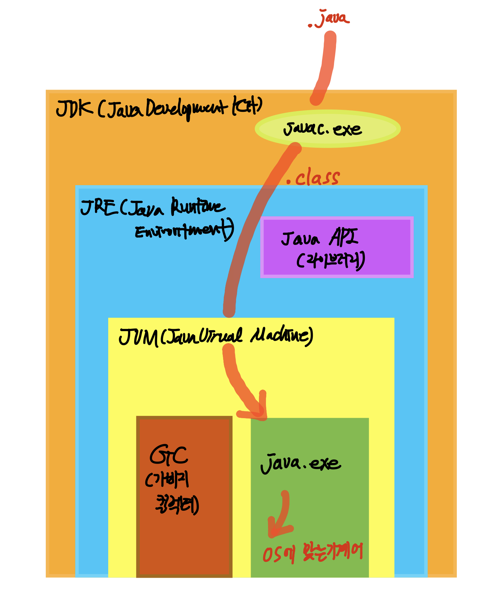

# Java

> 자바 언어에 대해서 필요한 배경 지식을 담은 내용으로, 객체지향 프로그래밍, Garbage Collector, JVM 등은 더 자세히 다른 포스팅에서 다룬다.
>
> **혹시 틀린 내용이나 부족한 내용이 있으면 댓글로 지적해주시면 큰 도움이 됩니다.

### Java

* 썬 마이크로시스템즈에서 개발한 객체지향 프로그래밍 언어이다.(1996.01 발표)
* 풍부한 라이브러리(Java API) 존재

### Java언어의 특징

1. 운영체제에 독립적이다.
   * 기존의 C나 C++을 생각해보자, 이들은 운영체제에 독립적인 코드도 있지만, 운영체제에 종속적인 라이브러리나 코드가 있어서, 운영체제마다 다르게 코드를 짜야하는 경우가 있다.
   * 자바의 경우 모든 코드(.java)가 .class(바이트코드)로 변환되고 JVM을 통해서 운영체제에 따라서 기계어로 번역된다. 따라서 개발자는 하나의 언어로 모든 곳에서 운영되는 개발을 할 수 있다. -> **"Write once, run everywhere"**
2. 객체지향 언어이다.
3. 자동 메모리 관리(Garbage Collector)
   * 자바로 작성된 프로그램이 실행될 때, 자동으로 메모리를 관리해주는 시스템
   * JVM(자바 가상 머신)안에 존재한다.
4. 네트워크와 분산처리를 지원한다.
   * 자바 언어는 인터넷, 대규모 분산 환경을 염두에 두고 개발되었다.
   * 자바는 다양한 네트워크 프로그래밍을 Java API(라이브러리)를 통해서 비교적 짧은 시간에 개발할 수 있도록 지원한다.
5. 멀티쓰레드를 지원한다.
   * 일반적으로 멀티쓰레드의 지원은 운영체제에 따라 구현방법, 처리 방식이 상이하다.
   * 이 또한, Java API(라이브러리)로 제공되어 구현이 쉽다.
   * 쓰레드에 대한 스케줄링은 자바 인터프리터(java.exe)가 관리한다.
6. 동적 로딩(Dynamic Loading)을 지원한다.
   * 자바로 작성된 애플리케이션은 여러 클래스로 구성되어 있다.
   * 자바 애플리케이션은 실행 시, 모든 클래스가 로딩되는 것이 아니라, 필요한 시점에 클래스를 로딩하여 사용할 수 있다.

### Java API

* 자바의 라이브러리, 라이브러리 문서를 의미한다.

* 코드에서 아래와 같이 활용한다.

  ```java
  import java.util.*;
  ```

### JDK(Java Development Kit)

* 자바 개발에 필요한 모든 것들이 담긴, 말 그대로 도구 키트이다.
* 자바실행 환경(JRE), 개발에 필요한 실행파일(javac.exe) 등을 담고 있다.
* JDK의 bin 디렉토리 안의 주요 실행 파일은 다음과 같다.
  * javac.exe : 자바의 컴파일러(`.java` -> `.class`(바이트 코드))
  * java.exe : 자바 인터프리터, 컴파일러가 생성한 바이트 코드를 해석하고 실행한다.
  * javap.exe : 역어셈블러, 컴파일된 클래스파일을 다시 원래의 소스 코드로 변환(`.class` -> `.java`)

### JRE(Java Runtime Environment)

* 자바실행환경
* 자바로 작성된 응용프로그램이 실행되기 위한 최소 환경
* JVM, Java API를 포함하고 있다.

### JVM(Java Virtual Machine)

* 자바 가상 머신으로, 자바 프로그램 실행 환경을 만들어주는 소프트웨어이다.

* 자바 애플리케이션이 운영체제에 독립적일 수 있는 요인이다.

* JVM 자체는 운영체제에 독립적이지 않다.

  -> 자바 다운받을 때를 기억해보자, 우리는 운영체제에 따라 다른 JDK를 다운받았다.

### 정리 with 큰 그림



1. 개발자가 소스코드를 작성한다.(`.java`)
2. 자바 컴파일러(javac.exe)가 자바 소스 코드를 바이트 코드로 변환한다.(`.java` -> `.class`)
3. 자바 인터프리터(java.exe)가 바이트 코드를 해석하고 실행한다.(`.class` -> OS에 맞는 기계어)
4. Garbage Collection - 백그라운드에서 비동기적으로 쓰지 않는 메모리 반환
5. 프로그램 실행 및 종료

* 물론, 사이에 많은 과정들이 더 있다. 자세한 과정은 JVM에서 추가적으로 다룰 예정

### Reference

* 자바의 정석 - 남궁성 저

