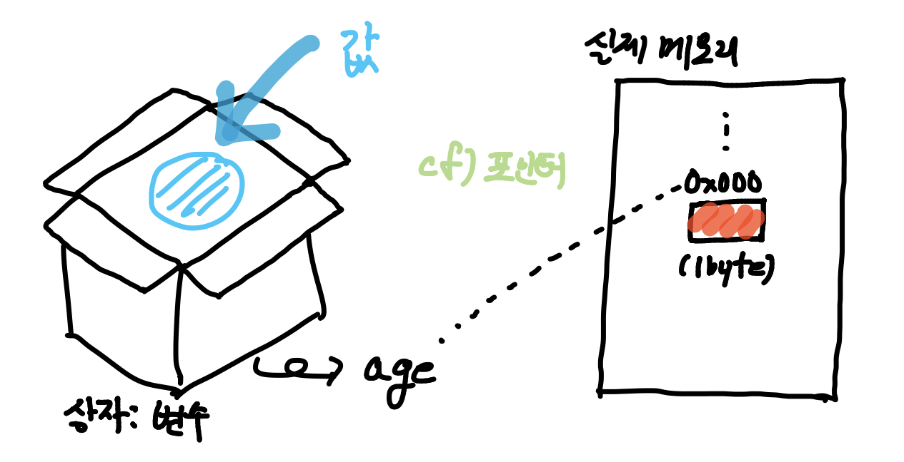
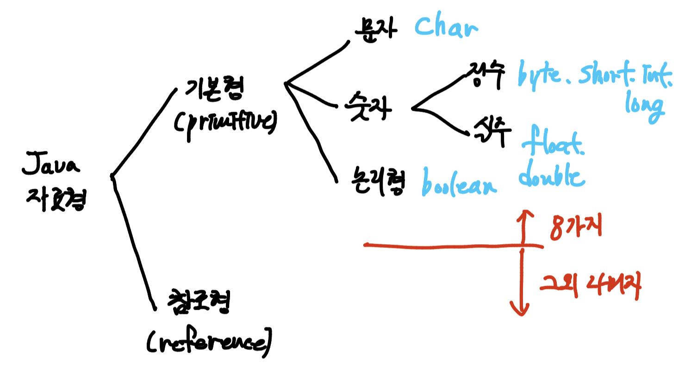

# Variable(변수)

> 자바의 정석에는 이런 말이 나와 있다.
>
> "중요한 프로그래밍 능력 중의 하나가 바로 '값(data)'을 잘 다루는 것"
>
> 프로그래밍을 처음하는 것이 아니라, 변수 단원은 스킵할까 했지만,
>
> 한 번쯤 제대로 복습과 정리가 필요할 것 같아 정리를 하고 넘어가고자 한다.
>
> **혹시 틀린 내용이 있다면 댓글 주시면 감사드립니다.

### 변수(Variable)



* 수학에서는 '변하는 값'을 의미하지만, 프로그래밍에선 '단 하나의 값을 저장할 수 있는 메모리 공간'을 의미한다.(위의 그림)

#### 변수 선언

* 필요한 메모리 공간을 확보하고, 해당 공간에 이름을 지정하는 일

* 위의 그림에서 상자를 마련하는 일이라고 생각하자.(실제론 메모리 공간)

  ```java
  int age;
  ```

* `int`는 **변수타입**으로, 변수에 저장될 값이 어떤 '타입(type)'인지 지정한다.
* `age`는 **변수이름**으로, 메모리 공간에 붙여주는 이름이다.
  * 우리가 값을 변수에 저장하는 것은 특정한 값을 메모리 공간에 저장하고 편하게 불러와서 사용하기 위함이다.
  * 실제 메모리 주소는 `0x123FF..`와 같이 매우 길고 복잡하다.
  * 개발자가 매번 해당 주소를 통해서 값을 활용하는 것은 매우 비효율 적인 것이므로, 메모리 주소에 '변수이름'을 통해서 접근하고 불러오고 값을 활용하는 것이다.
* 위와 같이 변수를 선언하면, 메모리의 빈 공간에 '변수타입'에 안맞은 크기의 저장공간이 확보되고, 앞으로 이 저장공간은 '변수이름'을 통해 사용할 수 있게 된다.

#### 변수의 초기화

* 변수를 사용하기 전에 처음으로 값을 저장하는 것

  ```java
  int age;		// 변수 선언
  age = 27;		// 변수 초기화
  // 일반적으로 아래와 같이 한번에 사용
  int height = 177;
  ```

* 변수를 선언한 이후 부터는 변수를 사용할 수 있지만, 그 전에 '초기화(initialization)'이 필요

  => 메모리는 여러 프로그램이 공유하는 자원이기 때문에, 전에 다른 프로그램에 의해 저장된 알 수 없는 '쓰레기 값(garbage value)'가 남아 있을 수 있기 때문이다.

  

### 변수의 타입

* 우리는 위에서 변수를 선언할 때, 메모리 공간을 얼마나 활용할 것인지, 그리고 해당 값이 어떻게 다뤄질 것인지를 정하기 위해서 **변수타입**을 지정했다.

  =>숫자에서의 `+` 과 문자에서의 `+` 은 다른 의미를 갖는다.

* 변수의 타입에는 다양한 자료형이 있으며, 자료형에 대해서 알아보겠다.

#### 자료형(data type)

* 값(data)과 종류(type)에 따라 값이 저장될 공간의 크기와 저장형식을 정의한 것이 자료 형(data type)이다.
* 변수를 선언할 때, 저장하려는 값과 특성을 고려하여 알맞은 자료형을 변수의 타입으로 지정하면 된다.



* 자료형은 위와 같이 '기본형'과 '참조형'으로 나눌 수 있다.

* **기본형 변수(primitive type)** : 변수에 실제 값을 저장

  * 논리형 : boolean(1byte)

  * 문자형 : char(2, 유니코드)

  * 정수형 : byte(1), short(2), int(4), long(8)

  * 실수형 : float(4), double(8)

    **괄호 안의 숫자는 메모리 크기

* **참조형 변수(reference type)** : 변수에 값이 저장된 객체의 주소를 저장

  * 8개의 기본형을 제외한 나머지 타입

  * 참조변수를 선언할 때, 변수의 타입으로 클래스 이름을 사용한다. 즉, 클래스의 이름이 참조변수의 타입이다.

    => **새로운 클래스를 선언한다 == 새로운 참조형을 추가한다.**

    ```java
    // Student 클래스는 따로 선언했다고 가정
    Student std1;
    ```

  * 참조형 변수 선언과 초기화의 예제를 보자

    ```java
    Data today = new Date();
    ```

    1. `Date` 객체를 연산자 `new`를 통해서 생성 : 생성된 객체의 주소가 나옴
    2. 해당 주소가 대입연산자(`=`)에 의해 `today`에 저장

  * 참조형 변수는 null 또는 객체의 주소를 갖는다. JVM이 32bit이면 4byte의 주소를 갖고, 64bit이면 8byte의 주소를 갖는다.


### 상수(Constant)와 리터럴(Literal)

#### 상수(Constant)

* 변수와 동일하게 값을 저장할 수 있는 공간.

* 변수와 달리 한 번 값을 저장하면, 다른 값으로 변경할 수 없음

* 상수 선언 및 초기화

  ```java
  final int BORN_YEAR = 2023;
  ```

  * 상수는 반드시 선언과 동시에 초기화 해야 하며, 그 후에는 값을 변경하는 것이 허용되지 않는다.
  * 상수는 일반적으로 이름을 모두 대문자로 하는 것이 coding convention

* 상수를 활용하는 이유는 코드의 의미를 명확히 하며, 수정의 용이성을 위함이다.

  ```java
  // 상수 활용X
  int circle = (3 * 3) * 3.14;
  
  // 상수활용O
  final int pie = 3.14;
  final int radius = 3;
  int circle1 = (radius * radius) * pie;
  ```

  * 만약 수많은 circle을 만들었는데, 특정 값을 바꿔야한다고 해보자, 그러면 모든 곳을 다 바꿔야하는데, 상수를 활용하면 pie와 radius에 지정된 값만 바꿔주면 된다.

#### 리터럴(Literal)

* 일반적으로 수학에서 사용하는 '상수'라는 단어를 의미하는 것이 리터럴이다.

* 이미 상수를 '한 번 값을 저장하고, 변경할 수 없는 공간'이라고 정의했기에, 특정 값 자체를 의미하는 단어다.

  ```java
  int age = 27;	// age는 변수, 27은 리터럴
  final int BORN_YEAR = 2023; 	// BONN_YEAR은 상수, 2023은 리터럴
  ```

* 리터럴에는 접미사가 붙는 경우가 있다. 아래 사례만 기억하자

  ```java
  int octNum = 010;		// 8진수: 10진수로 8
  int hexNum = 0x10;	// 16진수: 10진수로 16
  int binNum = 0b10;	// 2진수: 10진수로 2
  long big = 1123123l;	// 마지막에 l을 붙여서 long임을 명시 
  float rate = 1.232f;	// 마지막에 f를 붙여서 float임을 명시
  ```

  * 리터럴은 int, double을 기본으로 받아들이기 때문에 long과 float인 경우에만 특별히 접미사를 붙여주면 된다는 것만 기억하자.

* 타입이 불일치 되는 경우

  ```java
  int i = 'A';
  long l = 123;
  dobule d = 3.14f;
  ```

  => 타입이 달라도, 저장범위가 넓은 타입에 좁은 타입의 값이 저장되는 것은 허용된다.

#### 문자 리터럴과 문자열 리터럴

* 종종 헤깔리는 경우가 있어서, 코드 예제로 정리해보겠다.

```java
char c = 'J';	// 작은 따옴표임을 확인하자. 하나의 문자만 들어갈 수 있다.
String name = "Java"	// 큰 따옴표임을 확인하자.
char c2 = '';	// 에러. ''안에 반드시 하나의 문자가 필요
char c3 = ' ';	// OK. 공백문자로 c3 초기화
String s = "";	// OK. 내용이 없는 빈 문자열

// String의 경우 클래스. 참조형으로 아래와 같이 선언하는 것이 맞지만, 위와 같이 허용
String s2 = new String("JJ");

// String 결합
String name = "Ja" + "va";	// name은 "Java"
String str = name + 8.0;	// "Java8.0"
```

* String 결합에서 기억해야할 점

  기본형과 참조형 구별없이 어떤 타입의 변수도 문자열과 덧셈연산을 수행하면 그 결과 문자열이 된다. -> 결합 순서가 중요

  ```java
  System.out.println(7 + 7 + "");	// 14
  System.out.println("" + 7 + 7);	// 77
  ```

​		=> 따라서 기본형 타입을 문자열로 변환할 때, 빈문자열("")을 더해주면 간단하다.


### Reference

* 자바의 정석 - 남궁성 저