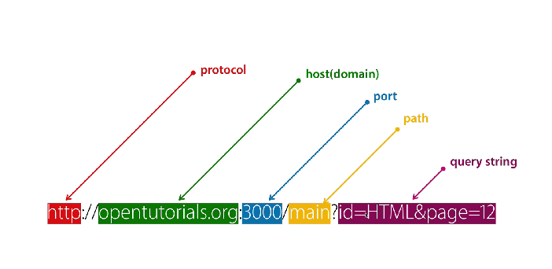
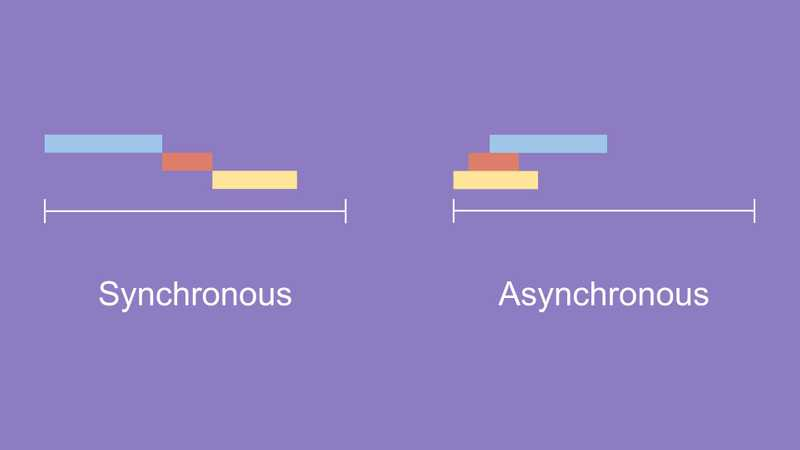

# 1. URL



- query string(id)에 따라서 다른 페이지를 보여줌

- query string을 가져오기 위해서 필요한 코드

  - ```js
    ...
    var url = require('url');
    ...
    var app = http.createServer(function(request,response){
        var _url = request.url;
        //queryData 객체로 받아서 사용
        var queryData = url.parse(_url, true).query;
        console.log(queryData.id);
        if(_url == '/'){
          _url = '/index.html';
        }
        if(_url == '/favicon.ico'){
          return response.writeHead(404);
        }
        response.writeHead(200);
        
        //html문서에 querydata.id 표시
        response.end(queryData.id);
     
    });
    app.listen(3000);
    ```

- 여기에 변수 template을 넣고, response.end에 template을 넣으면 됨

  - ```js
    var title = queryData.id;
    ...
    var template = `
    html 문서
    ...
    ${title}
    `;
    response.end(template);
    ```

    

# 2. Read

- fs변수 설정 후, fs.readFile()을 통해서 다른 text를 읽음

- ```js
  ...
  var fs = require('fs');
  ...
  fs.readFile(`data.txt`,'utf-8', (err, data)=>{
      var template = `
      HTML문서
      ${data};
      `;
      response.end(template);
  }     
  ```

  - data.txt를 utf-8방식으로 읽어서 data변수로 받음

  - data.txt를 ${queryData.id}를 통해 변경가능


# 3. 조건에 따른 홈화면, 에러화면 출력

- 변수 pathtime 설정

  - ```js
    var app = ...(...{
    ...
    //pathname은 port와 query string 사이 값
    var pathname = url.parse(_url, true).pathname;
    ...
    // pathname이 '/'' 이면 정상
    if(pathname === '/'){
        fs.readFile(`data\\${queryData.id}`,'utf-8', (err, description)=>{
            /// querydata.id 값이 없으면 최초페이지
          if(queryData.id === undefined){
            var title = 'Welcome';
            var description = "Hello, Node.js"
            /// querydata.id값이 있으면 id값으로 문서표시
          }else{
        var title = queryData.id;
          }
        var template = `html문서`
        // query string이전에 다른 값이 있으면 비정상
    }else{
        response.writeHead(404);
        response.end('Not found');
      }
    });
    
    app.listen(3000);
    
    ```

- 이렇게 하면 더 편할 듯 하다(fs.readFile)에서 err값을 활용(읽을 페이지가 없으면 err != null)

  - ```js
    fs.readFile(`data\\${queryData.id}`,'utf-8', (err, description)=>{
        //err != null이고 pathname !== '/'(메인페이지가 아니면) 에러
        //메인페이지에서도 err != null 이기 때문
        if(err != null & pathname !== '/'){
        response.writeHead(404);
        response.end("Not Found");
        //그렇지 않으면 페이지 표시
        }else{
        if(queryData.id === undefined){
        var title = 'Welcome';
        var description = "Hello, Node.js"
        }else{
        var title = queryData.id;
        }
        var template = `
        <!doctype html>
        <html>
        <head>
        <title>WEB1 - ${title}</title>
        <meta charset="utf-8">
        </head>
        <body>
        <h1><a href="/">WEB</a></h1>
        <ol>
        <li><a href="/?id=HTML">HTML</a></li>
        <li><a href="/?id=CSS">CSS</a></li>
        <li><a href="/?id=JavaScript">JavaScript</a></li>
        </ol>
        <h2>${title}</h2>
        <p>${description}</p>
        </body>
        </html>
        `;
        response.writeHead(200);
        response.end(template);
        }
    });
    ```


# 4. file을 읽고 list로 출력

- fs.readdir()을 통해서 특정 dir안에 있는 파일 목록을 읽음

- ```js
  var testFolder = 'data';
  ...
  fs.readdir(testFolder, (err, filelist) => {
  	console.log(filelist);
  });
  // data 폴더 안에 있는 file명이 array형태로 출력됨
  ```

- data폴더 안에 있는 파일들을 for문으로 출력하여 var list에 넣음

  - ```js
    var list = `<ul>`;
          for(var i = 0;i < filelist.length;i++){
            list += `<li><a href="/?id=${filelist[i]}">${filelist[i]}</a></li>`
          };
    list += `</ul>`
    ```

- template에 ${list}를 넣어주면 끝


# 5. 동기 / 비동기



- 동기 방식은 서버에 요청을 보냈을 때 응답이 돌아와야 다음 동작 수행 가능

- 비동기 방식은 요청을 보냈을 때 응답 상태와 상관없이 당므 동작을 수행 할 수 있음

- readfile 함수를 통해 확인

  - fs.readFileSync - 동기방식의 readfile

  - ```js
    //sample.txt = B
    
    var fs = require('fs');
    
    console.log('A');
    var result = fs.readFileSync('sample.txt', 'utf8');
    console.log(result);
    console.log('C');
    ```

    - 출력 값은 A, B, C로 순서대로 출력

  - fs.readFile - 비동기방식의 readfile(기본값)

  - ```
    console.log('A');
    fs.readFile('sample.txt', 'utf8', (err, result)=>{
        console.log(result);
    });
    console.log('C');
    ```

    - 출력값은 A, C, B 순서로 출력
    - 동기적 코드의 실행 결과는 동기적 코드가 전부 실행 되고나서 값을 반환
    -  비동기는 동기보다 복잡하지만 결과가 주어지는데 시간이 걸려도 그 시간동안 다른 작업을 할 수 있어서 보다 효율적


# 6. package manager

- 설치 : `npm install pm2 -g`
- 시작 : `pm2 start app.js`

- 모니터링 : `pm2 monit`
- 실행되고 있는 리스트 : `pm2 list`
- 로그기록 보기(console.log 확인 등) : `pm2 log` 
- 리스트 내 프로세스 정지, 재시작, 삭제 : `pm2 stop`, `pm2 restart`, `pm2 delete`
- js파일 계속 감시하면서 업데이트 : `pm2 start app.js -- watch`


# 7. form으로 글생성 UI 만들기

- form action=""을 통해 input과 textarea값을 post방식으로 전송

  - ```html
    <form action="http://localhost:3000/process_create" method="post">
        <p><input type="text" name="title"></p>
        <p>
            <textarea name="description"></textarea>    
        </p>
        <p>
            <input type="submit">
        </p>
    </form>
    ```

    - method를 post방식으로 하여 url에 보내는 데이터를 표시안함

- `pathname === '/create'`일 때 template에 위에 form태그 넣기

  - ```js
    ...
    else if(pathname==='/create'){
              var title = 'WEB - create';
              var template = templateHTML(title, list, `
              <form action="http://localhost:3000/create_process" method="post">
                <p><input type="text" name="title" placeholder="title"></p>
                <p>
                    <textarea name="description" placeholder="description"></textarea>    
                </p>
                <p>
                    <input type="submit">
                </p>
              </form>
              `);
                response.writeHead(200);
                response.end(template);
            }
            ...
    ```

- `pathname === '/create_process' `일 때(form action) 데이터를 바음

  - ```js
    var qs = require('querystring');
    ...
    else if(pathname==='/create_process'){
              var body = "";
              request.on('data', function(data){
                body += data;
              });
              request.on('end', function(){
                var post = qs.parse(body);
                 // post의 객체로 title, description을 바음
                var title = post.title;
                var description = post.description;
                response.writeHead(200);
                response.end('success');
              })
    
            }
            ...
    ```

    - request는 createServer함수의 콜백함수로, 요청할 때 웹브라우저가 보낸 정보
    - response는 응답할 때 우리가 웹브라우저에 전송할 정보

    - `request.on('data',(_data)=>{})`는 조각조각의 _data를 수신할 때 마다 함수를 호출하여 수신한 정보를 주기로 되어 있음. 즉, body 변수에 callback이 실행될 때마다 data를 추가함
    - `request.on('end',()=>{})`는 데이터 수신이 끝나면 실행되는 callback함수임. 데이터 수신이 끝났을 때 수행을 적으면 될 듯
      - 그 안에 `var post = qs.parse(body);`를 넣어서 body데이터의 querystring을 리스트형태로 받음
        - ex) {title : 'Nodejs', description : 'Nodejs is...'}

- `fs.writeFile('파일위치', 파일내용, 'utf8', (err)=>{})` 로 파일 저장

  -  위 request.on('end', ()=>{})의 익명함수 안에 넣으면 됨

  - ```js
    request.on('end', ()=>{
                var post = qs.parse(body);
                var title = post.title;
                var description = post.description;
                fs.writeFile(`data\\${title}`, description, 'utf8', (err)=>{
                  response.writeHead(302, {location : `/?id=${title}`});
                  response.end("success");
                })
              })
    ```

    - 여기서 글 작성 후 redirection을 해주기 위해 response.writeHead의 302로 redirection


# 8. update 구현

- /update 페이지에서 create와 같으나, input과 textarea에 value값으로 표시

- 그리고 type="hidden"으로 기존 id 값을 그대로 유지

  - ```js
    else if(pathname ==='/update'){
              var title = queryData.id;
              var template = templateHTML(title, list, `
              <h2>${title}</h2>
              <form action="/update_process" method="post">
                <input type="hidden" name="id" value="${title}">
                <p><input type="text" name="title" value="${title}" placeholder="title"></p>
                <p>
                    <textarea name="description" placeholder="description">${description}</textarea>    
                </p>
                <p>
                    <input type="submit">
                </p>
              </form>
              `,'');
                response.writeHead(200);
                response.end(template);
            }
    ```

- update_process는 create_process와 비슷

- fs.rename으로 이름을 변경하고, fs.writeFile을 통해 글 내용 수정(다시 쓰는 것과 같음)

  - ```js
    else if(pathname==='/update_process'){
              var body = "";
              request.on('data', (data)=>{
                body += data;
              });
              request.on('end', ()=>{
                var post = qs.parse(body);
                var id = post.id;
                var title = post.title;
                var description = post.description;
                fs.rename(`data\\${id}`, `data\\${title}`, (err)=>{
                  fs.writeFile(`data\\${title}`, description, 'utf8', (err)=>{
                    response.writeHead(302, {location : `/?id=${title}`});
                    response.end("success");
                  })
                })
              })
            }
    ```

    - fs.rename('업데이트 할 data', '업데이트된 data', (err)=>{})
      - fs.rename의 객체함수에 fs.writeFile을 넣어서 rename 이후에 writeFile실행


# 9. 삭제 구현 (delete)

- 삭제는 a href가 아니라 form 태그로 해야 함

- 삭제 구현 body의 html

  - ```html
    <form action="delete_process" method="post">
        <input type="hidden" name="id" value="${title}">
        <input type="submit" value="delete">
    </form>
    ```

- unlink를 통해 페이지 삭제 unlink(path, callback)

  - ```js
    else if(pathname==='/delete_process'){
              var body = "";
              request.on('data', (data)=>{
                body += data;
              });
              request.on('end', ()=>{
                var post = qs.parse(body);
                var id = post.id;
                fs.unlink(`data\\${id}`,err=>{
                  response.writeHead(302, {location : `/`});
                  response.end("");
                })
              })
            }
    ```


# 10. 모듈화

- 객체를 모듈화하여 사용

- js 파일을 lib폴더에 넣은 후 module.exports 로 모듈화

  - ```js
    module.exports = {
        HTML:...
        list:...
      }
    ```

- main.js에 변수 이름 설정

  - ```js
    var template = require('./lib/template')
    
    ```

- 이후 template.HTML()과 temlpate.list()로 사용
