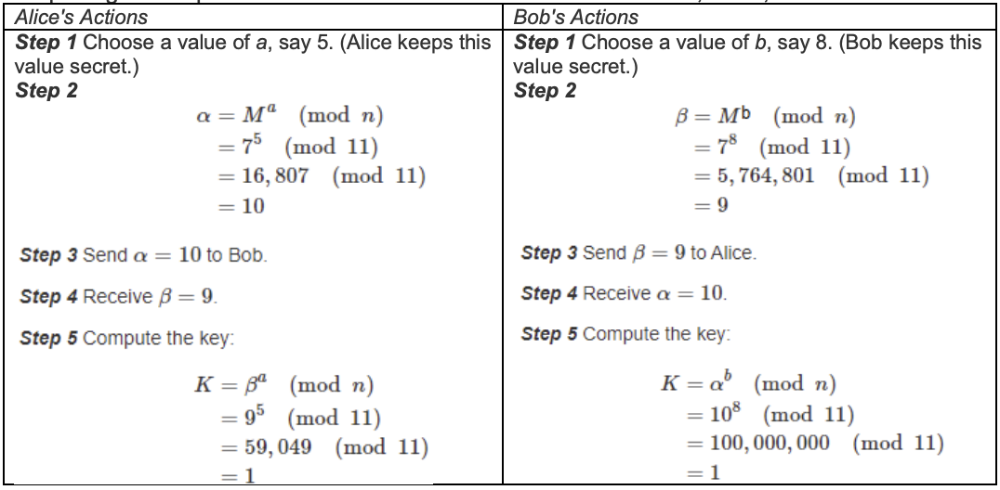
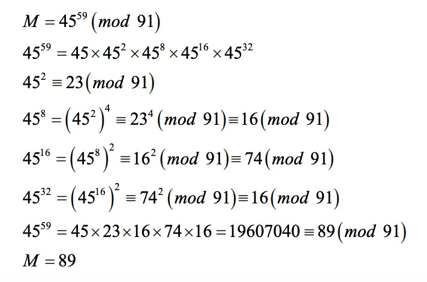
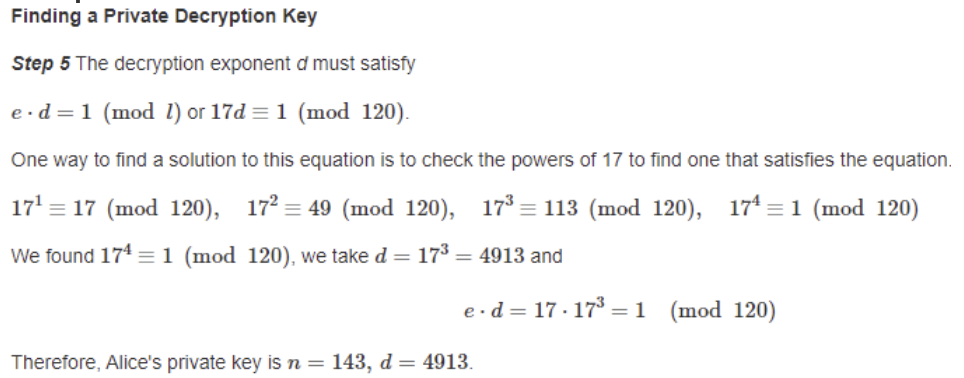
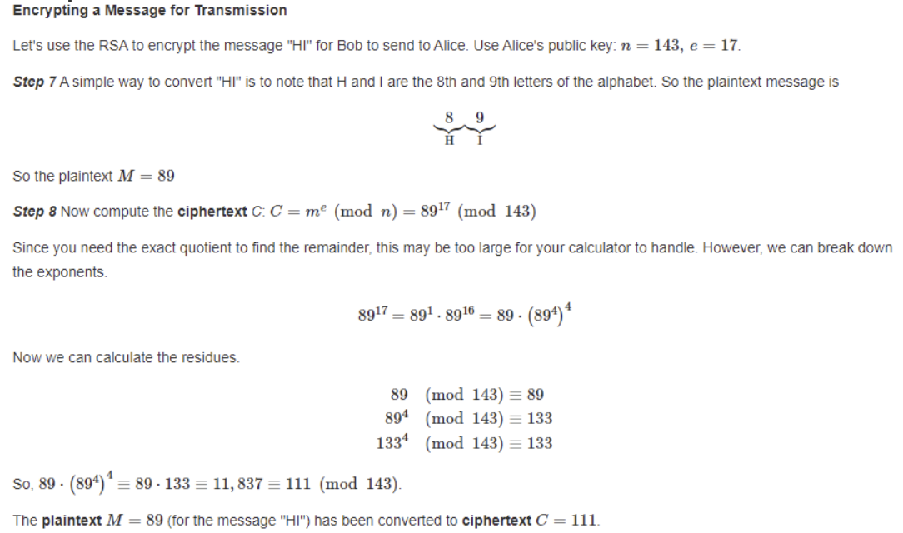
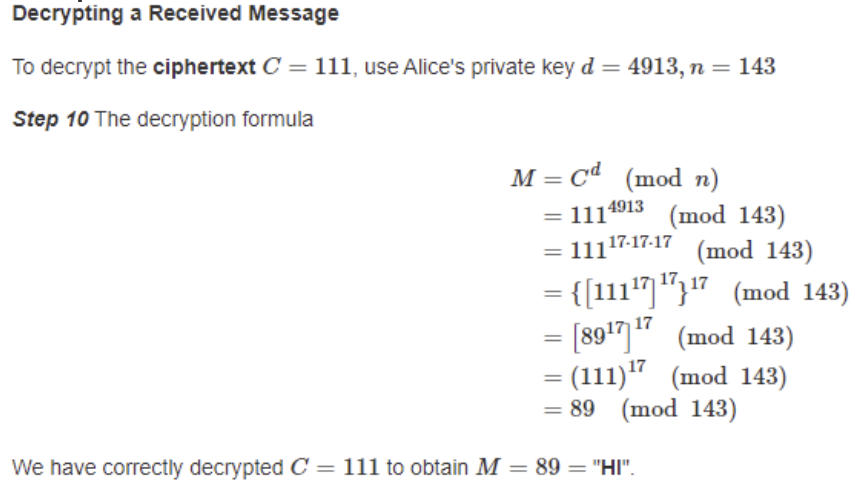

<!-- 

📋 This is the tech-news archives to help me keep track of what I am interested in!

- Reference tech news link: <https://thenextweb.com/news/blockchain-development-tech-career>
  

{{ notice-2 | markdownify }}
 -->

📋 This is my note-taking from what I learned in the class "Math185-002 Discrete Mathematics"
{: .notice--danger}

 

# Overview of Course

## Topics

- Modern Cryptography (DHM, RSA)

## Weekly Learning Outcomes

- Find the residue.
- Find the key using the DHM scheme.
- Apply the RSA scheme in encryption and decryption.

 

# 5-ext. Modern Cryptography

Modern Cryptography

## Cryptography

Cryptography involves secret codes, ways of disguising information in order that a `sender` can transmit it to an intended `receiver` so that an `adversary` who somehow intercepts the transmission will be unable to detect its meaning.

- Converting a message to its disguised form is called `encrypting` (or the practice of `encryption`).
- Converting the message back to original form is called `decrypting` (or the practice of `decryption`).
- Basis of cryptography is some mathematical function, called the `encryption algorithm`. More advanced level of sophistication is to introduce a `key`, which is required to perform the algorithm properly.

 

## Cryptography Elements

At this point, we have two elements to do a reasonably sophisticated code:

1. A mathematical function.
2. Additional key that makes it possible to compute properly.

 

## Cryptography Problems

This raises problems when it comes to our adversary:

1. If the adversary gained knowledge of the encrypting function, its inverse could be derived and now any message intercepted could be easily decoded. Since the function would have to be known to both the sender and receiver, that exchange could be intercepted.
2. The key would have to be known to both sender and receiver. In exchanging that knowledge, its value could be intercepted. This became known as the `key exchange problem` or `key distribution problem`.

 

## Magic Function

Both of these problems were solved with a `magic function` that works based on modular arithmetic, the properties of exponents and, in one protocol, prime numbers and Greatest Common Factors:

> C = Mk(mod n)

- C will be the `cipher text` (or `coded text`) of a `numerical` message M.
- k is an exponent that has different interpretations.
- n is simply a known number used in the computation.

These values have certain properties depending on the way the function is used.

 

## Diffie-Hellman-Merkle (DHM) Key Exchange Scheme

It’s the first protocol to use the `magic formula`. Here is its process to utilize the function C = Mk(mod n) to create a key that solves the distribution problem.

Two people for simplicity let's call them Alice and Bob can establish a key (a number) that they both will know, but a third person Eve cannot find out, even if Eve observes the communications between Bob and Alice as they set up their key. Alice and Bob can agree to use the function C = Mk(mod n) with specific values for M and n. It does not matter if Eve finds out the values for M and n.

| Alice's Actions                                      | Bob's Actions                                        |
| :--------------------------------------------------- | :--------------------------------------------------- |
| Step 1 Choose a value of a. (Keep this value secret) | Step 1 Choose a value of b. (Keep this value secret) |
| Step 2 Compute 𝛂 = Ma(mod n)              | Step 2 Compute 𝛃 = Mb(mod n)              |
| Step 3 Send the value of 𝛂 to Bob                    | Step 3 Send the value of 𝛃 to Alice                  |
| Step 4 Receive the value of 𝛃 from Bob               | Step 4 Receive the value of 𝛂 from Alice             |
| Step 5 Compute the key: K = 𝛃a(mod n)     | Step 5 Compute the key: K = 𝛂b(mod n)     |



Why it works: How do they both get the same number?

Receiver’s Result = (Sender’s Message)b = (Ma)b = Mab = (Mb)a = (Receiver’s Message)a = Sender's Result


{{ notice-2 | markdownify }}

> Example 1
>
> Establish some numbers known to the sender and receiver. The adversary can also know these, it doesn’t matter. They are the `M` and the `n` of the function. Say, M = 7 and n = 13.
>
> Solution:
>
> 1. Sender: chooses a number and keeps it secret, say 5; call it a = 5 (it can be anything). Compute 𝛂 = Ma(mod n) = 75(mod 13) = 16,807(mod 13) = 11 &rarr; Send coded message 11 to the receiver
> 2. Receiver: chooses a number and keeps it secret, say 8, call it b = 8 (it can be anything). Compute 𝛃 = Mb(mod n) = 78(mod 13) = 5,764,801(mod 13) = 3
> 3. Sender and receiver now compute the key using the magic function.
>    : - Sender: compute using received 3: K = 𝛃a(mod n) = 35(mod 13) = 243(mod 13) = 9
>    : - Receiver: compute using received 11: K = 𝛂b(mod n) = 118(mod 13) = 214,358,881(mod 13) = 9
>
> They each arrive at the same value, 9, which can be used as a key for encrypting/decrypting messages to one another.



Why it’s secure for key exchange:

For example, if the message of 3 is intercepted, the value of the exponent that produced it cannot be replicated. Yes, it can be found that 8 works, but so does 20, 32 and anything congruent to 8 mod 13 (this is a property of exponents modulo a certain number). In addition, it’s not known what value will be used on the other end to create the actual key (i.e. a=5 is not known).


{{ notice-2 | markdownify }}

> Example 2
>
> Establish a common key for Alice and Bob by using specific values for M, n, a, and b, and completing the steps outlined above. Let's choose the values M=7, n=11, a=5 and b=8.
>
> 
>
> They each arrive at the same value, 1, which can be used as a key for encrypting/decrypting messages to one another.

> Example 3: Substituting for large value mods
>
> If M=89, n=93, k=7, find the cipher (encrypted) text C = Mk(mod n).
>
> Solution:
>
> C ≡ 897(mod 93) ≡ [89(mod 93)][893(mod 93)]2 ≡ [89(mod 93)][29(mod 93)]2 ≡ [89(mod 93)][292(mod 93)] ≡ [89(mod 93)][4(mod 93)] ≡ [89x4(mod 93)] ≡ [356(mod 93)] ≡ [77(mod 93)] &rarr; C = 77

 

## RSA Protocol (Rivest, Shamir, Adelman)

Another protocol that used the same function as Diffie-Hellman-Merkle ("Mkmod n") is named `RSA`, also after the researchers that devised it. It took the Diffie-Hellman-Merkle solution to the key exchange problem and eliminated the need to exchange anything at all and is known as
`public key cryptography`. The value of the mod, n, and an exponent to create a `send` message, is known to everyone, but only the receiver has the exponent to decrypt messages.

- What allows nothing to be exchanged is the use of very large prime numbers that, when multiplied, create a number that is exceptionally difficult to factor because of its size.

### The Process of RSA (receiver)

Here is the `process` for choosing the numbers required for the RSA system (it is the `receiver` that does this):

1. The receiver chooses two prime numbers, p and q, which are kept secret (and are very large).
2. The receiver computes the modulus, n, using n = p x q
3. The receiver computes : L = (p - 1)(q - 1)
4. The receiver chooses the encryption exponent e so that e is between 1 and L and it must be a co-prime with n and L (that doesn’t have a common factor with n or L).
5. Create the decryption exponent d that satisfies the modular equation: e∙d = 1 (mod L). "d" is kept secret; if it can be found out by others, then anyone can decrypt a message. Where d =
   $$ {Lx + 1} \over {e} $$
   and x= 1, 2, 3, ... and when you get the whole number that is the smallest value of d.
6. The modulus n and exponent e are announced so that anyone, even an adversary, can know what they are (the assumption in cryptography is that any exchange of information can be known by your adversaries).

### The Process of RSA (sender)

Now, similar to Diffie-Hellman-Merkle, the `magic function` is used to encrypt and decrypt messages. The steps for the `sender` become:

7. Take the text message and create it as a number, M
8. Encrypt the number created by using the public modulus and exponent provided by the receiver. Create your encrypted number, C, using C = Me(mod n).
9. Transmit C to receiver
10. The receiver, who will decrypt it to the original number M using the secret exponent d. That is, calculate: M = Cd(mod n)



Why it’s secure: Without the decryption exponent d, the decoded message cannot be determined. The question then becomes, knowing n and e and even the process to produce them, how hard is it to determine d? The trick is to factor n = p×q and go through the process to determine d. However, our ability to produce exceptionally large prime numbers and multiply them together far outstrips our ability to factor exceptionally large numbers. Thus, at the moment, given a large enough n, the values of p and q are actually quite safe.


{{ notice-2 | markdownify }}

> Example 1
>
> Apply the RSA scheme to find each missing value.
>
> | p   | q   | n   | L   |
> | :-- | :-- | :-- | :-- |
> | 7   | 13  | -   | -   |
>
> Solution:
>
> - n = p x q = 7 x 13 = 91
> - L = (p-1)(q-1) = 6 x 12 = 72

> Example 2
>
> Given the modulus n, the encryption exponent e, and the plaintext M, use the RSA encryption to find the cipher text C in the following case.
>
> | n   | e   | M   |
> | :-- | :-- | :-- |
> | 77  | 21  | 16  |
>
> Solution:
>
> C ≡ 1621(mod 77) ≡ [167(mod 77)]3 ≡ [58(mod 77)]3 ≡ [583(mod 77)] ≡ 71(mod 77) &rarr; C ≡ 71

> Example 3
>
> Given the prime factors p and q, the encryption exponent e, and the cipher text C, apply the RSA algorithm to find (a) the decryption exponent d and (b) the plaintext message M.
>
> | p   | q   | e   | C   |
> | :-- | :-- | :-- | :-- |
> | 7   | 17  | 55  | 75  |
>
> Solution:
> 

> Example 4
>
> Using randomly chosen (reasonably small) primes p = 7 and q = 13, create the public components of n and e.
>
> Solution:
> 

> Example 5
>
> You are the receiver and have worked out the decryption exponent d = 59. You receive the message 45. What message does it decrypt to for the mod of n = 91?
>
> Solution:
> 

> Example 6
>
> 

> Example 7
>
> 

> Example 7
>
> 

> Example 9
>
> 

 

---

 

    🖋️ This is my self-taught blog! Feel free to let me know
    if there are some errors or wrong parts 😆

[Back to Top](#){: .btn .btn--primary }{: .align-right}
