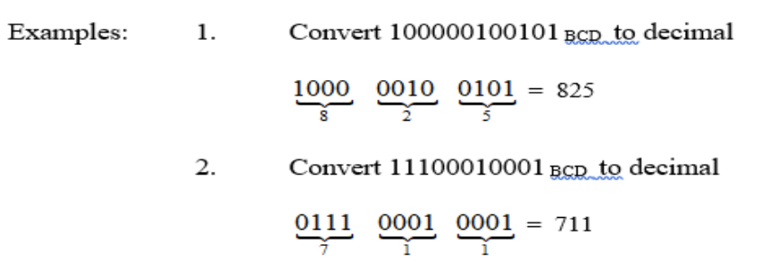

<!-- 

📋 This is the tech-news archives to help me keep track of what I am interested in!

- Reference tech news link: <https://thenextweb.com/news/blockchain-development-tech-career>
  

{{ notice-2 | markdownify }}
 -->

📋 This is my note-taking from what I learned in the class "Math175-002 Functions & Number Systems"
{: .notice--danger}

## Binary Coded Decimals

Binary coded decimals or BCD code is a code used to store decimal numbers as bits, using 0's and 1's. Each digit of the decimal representation of a number is converted to a 4-bit binary number (similar to the short-cut method for converting hex to binary).

Similarly, numbers in BCD code can easily be converted to their decimal representation. The method is similar to the method used to convert from binary to hex. We begin by grouping the BCD code into 4-bit binary segments , starting from the right.

### <u>Remarks</u>

1. Conversion between BCD and decimal is much easier than conversion between decimal and binary. However, it is not possible to perform the normal arithmetic operations (addition, subtraction, multiplication and division) using numbers represented in BCD code.
2. The highest 4 - bit representation in BCD is 1001, which corresponds to 9 in decimal. For example, you would never come across a BCD representation that looks like 1111101 because this number would be grouped into 0111 followed by 1101. However, 1101 represents a number that is larger than nine and cannot be represented by a single digit in a decimal representation.

 

## Exercise

### e-Centennial Supplement "page 12" (Answers page: 13)

<u>Write the BCD representations of the numbers in exercises 11 - 20 on page 5.</u>

<u>In problems 11~20, Convert each decimal number to a binary number</u>

- 11: 4 &rarr; 100
- 12: 6 &rarr; 110
- 13: 11 &rarr; 1011
- 14: 27 &rarr; 11011
- 15: 57 &rarr; 111001
- 16: 63 &rarr; 111111
- 17: 99 &rarr; 1100011
- 18: 111 &rarr; 1101111
- 19: 128 &rarr; 10000000
- 20: 200 &rarr; 11001000

<u>Each of the following numbers is written in its BCD representation. What decimal number does each represent?</u>

- a) 1001BCD &rarr; 9
- b) 10010110BCD &rarr; 96
- c) 1110111BCD &rarr; 77
- d) 101000BCD &rarr; 28
- e) 1011001BCD &rarr; 59
- f) 1110010101BCD &rarr; 395
- g) 1010010111BCD &rarr; 297
- h) 11001000BCD &rarr; No answer possible (11001000 BCD is not a valid BCD representation)

 

---

 

    🖋️ This is my self-taught blog! Feel free to let me know
    if there are some errors or wrong parts 😆

[Back to Top](#){: .btn .btn--primary }{: .align-right}
