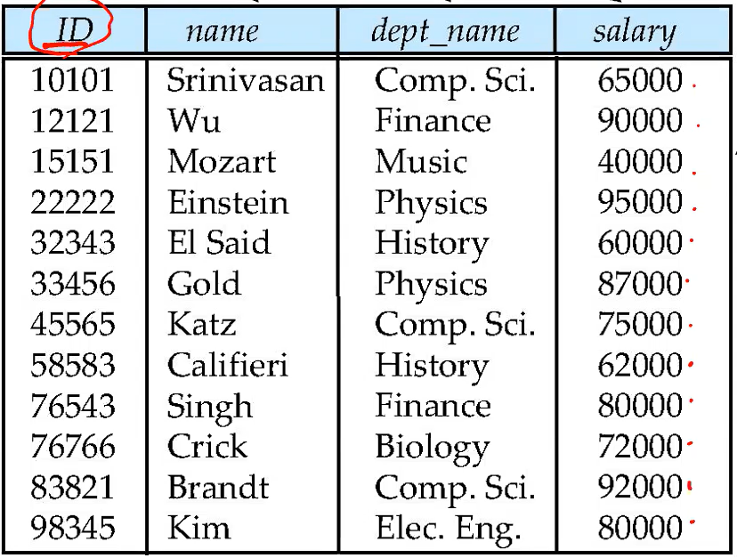

# 키(Keys)

 

- 키(K)는 속성들의 집합 
  - Key 속성이 ID 이고 그 릴레이션의 속성이 R = (ID,name,depa_name,salary) 이라고 할때, key는 릴레이션의 부분집합이다.
## 수퍼키(superkey)
    - 만약 Key의 값들이 R의 모든 튜플들을 유일하게 구별하는데 충분하다면 K를 수퍼키라고 한다.
    - 예제 : {ID}와 {ID,name}은 릴레이션 instructor 의 주키이다. ID만 가지고도 각 행들을 다 구분할 수 있는데 ID,name 두쌍으로 구분할 수 있는 것은 당연하다.
    - dept_name 가지고는 여러개의 튜플들을 Unique 하게 구분할 수 없다. 중복되기 떄문에. 즉 dept_name 은 수퍼키가 아니다.
## 후보키(candidate key)
    - 수퍼키의 부분집합이 수퍼키가 아닌 최소한의 수퍼키를 후보키라고 한다.
    - {ID}는 후보키인가요? {ID}의 부분집합은 {ID} 뿐이고, 더 이상 쪼갤 수 없다. 가장 작은 최소단위이다. 최소한의 수퍼키이므로 후보키이다.
    - {ID,name}의 부분집합은 {ID},{name},{ID,name} 이고 {ID}는 더 작은 수퍼키이기때문에 {ID,name}은 후보키가 아니다.
    - 같은 학과에는 동명이인이 없다라고하자. {name,dept_name} 으로 모든 학생들을 유니크하게 구분할 수 있다. 그러므로 {name,dept_name}은 super key이다. 하지만 name 가지고는 unique 하게 구분 불가 즉 쪼개지면 수퍼키의 기능을 상실한다.  즉 {name,dept_name}은 더이상 쪼갤 수 없는 최소한의 수퍼키이고 후보키이다. 
## 주키(primary key)
    - 후보키 중에 하나를 주키(primary key)로 선택할 수 있음.
## 외래키(foreign key)제약조건
    - 어떤 릴레이션에 존재하는 값은 또 다른 릴레이션에 반드시 나와야한다.
    - 자식 릴레이션의 외래키는 부모 릴레이션의 주키이다(변하지 않는 진리)
***
 

    🌜 주관적인 견해가 담긴 글입니다. 다양한 의견이 있으실 경우
    언제든지 댓글 혹은 메일로 지적해주시면 감사하겠습니다! 😄

[맨 위로 이동하기](#){: .btn .btn--primary }{: .align-right}

