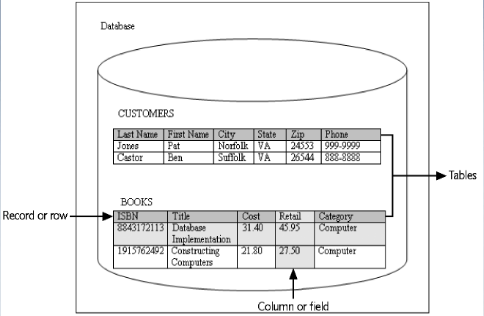

<!-- 

📋 This is the tech-news archives to help me keep track of what I am interested in!

- Reference tech news link: <https://thenextweb.com/news/blockchain-development-tech-career>
  

{{ notice-2 | markdownify }}
 -->

📋 This is my note-taking from what I learned in the class "Introduction To Database Concept"
{: .notice--danger}

 

# Objectives

- Define database terms
- Identify the purpose of a database management system (DBMS)
- Explain database design using entity- relationship models and normalization
- Explain the purpose of a Structured Query Language (SQL)
- Understand how this textbook’s topics are sequenced and how the two sample databases are used

 

# Database Terminology

- Database &rarr; logical structure to store data
- Database management system (DBMS) &rarr; software used to create and interact with the database

 

# Database Components

## Character

- Basic unit of data
- Can be a letter, number, or special symbol

## Field

- A group of related characters
- Represents an attribute or characteristic of an entity
- Corresponds to a column in the physical database

## Record

- A collection of fields for one specific entity
- Corresponds to a row in the physical database

## File

- A group of records about the same type of entity

 

# Database Management System

- Data storage: manage the physical structure of the database
- Security: control user access and privileges
- Multi-user access: manage concurrent data access
- Backup: enable recovery options for database failures
- Data access language: provide a language that allows database access
- Data integrity: enable constraints or checks on data
- Data dictionary: maintain information about database structure

 

---

 

    🖋️ This is my self-taught blog! Feel free to let me know
    if there are some errors or wrong parts 😆

[Back to Top](#){: .btn .btn--primary }{: .align-right}
