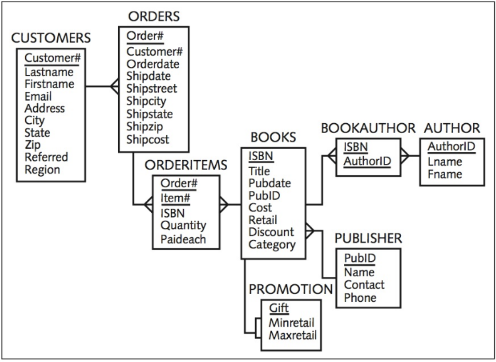
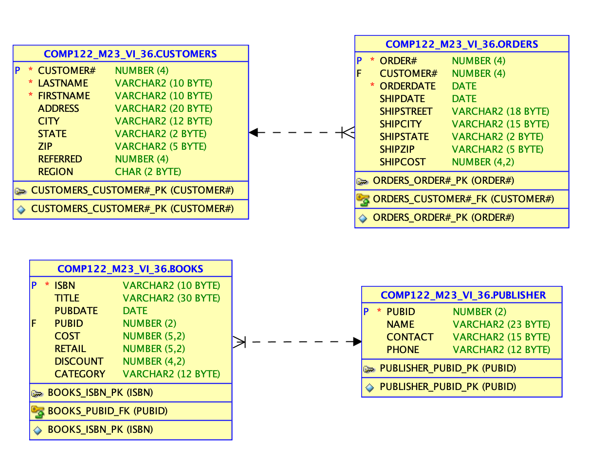

<!-- 

📋 This is the tech-news archives to help me keep track of what I am interested in!

- Reference tech news link: <https://thenextweb.com/news/blockchain-development-tech-career>
  

<div class="notice--danger">{{ notice-2 | markdownify }}</div> -->

📋 This is my note-taking from what I learned in the class "Introduction To Database Concept"
{: .notice--danger}

<br>

# Create the JustLee Database

Use the provided script to create the database so you can follow the chapter examples

Please download the JLDB file in order to execute the following commands

Verify table contents using the DESCRIBE command



<br>

# SELECT Statement Syntax

- SELECT statements are used to retrieve data from the database
- A SELECT statement is referred to as a query
- Syntax gives the basic structure, or rules, for a command
- Optional clauses and keywords are shown in brackets

```
SELECT [DISTINCT | UNIQUE] (*, columnname [AS alias], ...)
       FROM       tablename
       [WHERE     condition]
       [GROUP BY  group_by_expression]
       [HAVING    group_condition]
       [ORDER BY  columnname];
```

- SELECT and FROM clauses are required
- SELECT clause identifies column(s)
- FROM clause identifies table(s)
- Each clause begins with a keyword

## Selecting All Data in a Table

Substitute an asterisk for the column names in a SELECT clause.

```
SELECT * FROM books;
```

## Selecting One Column in a Table

Enter column name in SELECT clause

```
SELECT title FROM books;
```

## Selecting Multiple Columns from a Table

Separate column names with a comma

```
SELECT title, pubdate FROM books;
```

<br>

# Operations within the SELECT Statement

- Column alias can be used for column headings
- Perform arithmetic operations
- Suppress duplicates
- Concatenate data

<br>

# Using Column Aliases

- List the alias after the column heading
- AS keyword is optional
- Enclose in double quotation marks:
  : - If it contains blank space(s)
  : - If it contains special symbol(s)
  : - To retain case

```
SELECT title AS "Title of book", category FROM books;
```

<br>

# Using Arithmetic Operations

Arithmetic Operations:

- Executed left to right
- Multiplication and division are solved first
- Addition and subtraction are solved last
- Override order with parentheses

```
SELECT title, retail-cost profit FROM books;
```

## NULL Values

```
SELECT title, retail, discount, retail-discount FROM books;
```

<br>

# Using DISTINCT and UNIQUE

Enter DISTINCT or UNIQUE after SELECT keyword to suppress duplicates

```
SELECT DISTINCT state FROM customers;
```

<br>

# Using Concatenation

- You can combine data with a string literal
- Use the concatenation operator ||
- It allows the use of column aliases

```
SELECT firstname || ' ' || lastname "Customer Name" FROM customers;
```

<br>

# ER MODEL CREATION - GIF



- Customers - Orders
- Books - Publisher

1. Create New Sheet
2. View - Data Modeler - Browser
3. Relational Model - Right Click - New Relational Model
4. Drag Table to Relational Model Sheet

<br>

# DDL → Data Definition Language

**Data definition language** (DDL) statements let you create and modify BigQuery resources using GoogleSQL query syntax. You can use DDL commands to create, alter, and delete resources, such as tables, table clones, table snapshots, views, user-defined functions (UDFs), and row-level access policies.

## Table Level

1. Create Table
2. Drop Table
3. Alter Table
4. Rename Table

<br>

# DML → Data Manipulation Language

**A data manipulation language** (DML) is a family of computer languages including commands permitting users to manipulate data in a database. This manipulation involves inserting data into database tables, retrieving existing data, deleting data from existing tables and modifying existing data. DML is mostly incorporated in SQL databases.

## Record Level

1. Select Record
2. Insert Record
3. Update Record
4. Delete Record
5. Merge Record

<br>

# EX of Clause

- Where
- From
- Select
- Group by
- Having
- Order by

<br>

# Error in SQL

## Syntax error

This SQL error generally means that somewhere in the query, there is invalid syntax. Some common examples: Using a database-specific SQL for the wrong database (eg BigQuery supports DATE_ADD, but Redshift supports DATEADD) Typo in the SQL (missing comma, misspelled word, etc)

## Logical error

This may occur when the agent itself cannot find the table information from the local database used by Log Inspection, resulting to "Get Events" failed warning (absent log inspection events) from the agent status. This happens when the local database becomes corrupted.

<br>

# Concatenation

[Concatenation_Detail](https://docs.oracle.com/cd/B14117_01/server.101/b10759/operators003.htm)

<br>

# Week 03 Demo

```
select * from customers;
select * from books;
select retail,cost from books;

--Alias
select title,retail,cost,(retail-cost) as profit from books;

--books profit 이름을 ""로 적어도 되고 _로 적어도 되고 as를 안 적어도 됨!
select title,retail,cost,(retail-cost) as "books profit" from books;
select title,retail,cost,(retail-cost) as books_profit from books;
select title,retail,cost,(retail-cost) books_profit from books;

--Cross check profit
select 30.95-18.75 from dual;

--Change Lastname -> Lname, Firstname -> Fname
select firstname as Fname, lastname as Lname from customers;
select firstname Fname, lastname Lname from customers;
--If you have more than one words, we need to use ""
select firstname as "Fname", lastname as "Lname" from customers;

--Show referred is not null
select * from customers where referred is not null;

--Show referred is null
select * from customers where referred is null;
--Logicla error
select * from customers where referred = null;

--Show only unique value (NOT duplicated value)
--unique and distinct do same work but unique is a bit faster!
select unique state from customers;
select distinct state from customers;

--Show only unique value of the list of categories
select unique category from books;

--Concatenation
select 'customer name is : ' || lastname from customers;
--If you wanna seperate the name between fname and lname
select 'customer name is : ' || lastname ||'.'|| firstname from customers;

--Concatenation with clean table name! like "Customer Name"
select lastname ||' '|| firstname as "Customer Name" from customers;

--Use concatenation operator in books table - Title, Category, Profit
select title ||' '|| category ||' '|| (retail-cost) as profit from books;
select title, category, (retail-cost) as profit from books;

select title ||' '|| category as "Title", (retail-cost) as profit from books;
```

<br>



Summary

- A basic query in Oracle 12c SQL includes the SELECT and FROM clauses, the only mandatory clauses in a SELECT statement
- To view all columns in the table, specify an asterisk (\*) or list all of the column names individually in the SELECT clause
- To display a specific column or set of columns, list the column names in the SELECT clause (in the order in which you want them to appear)
- When listing column names in the SELECT clause, a comma must separate column names
- A column alias can be used to clarify the contents of a particular column; if the alias contains spaces or special symbols, or if you want to display the column with any lowercase letters, you must enclose the column alias in double quotation marks (" ")
- Indicate the table name following the FROM keyword
- Basic arithmetic operations can be performed in the SELECT clause
- NULL values indicate an absence of a value
- To remove duplicate listings, include either the DISTINCT or UNIQUE keyword
- To specify which table contains the desired columns, you must list the name of the table after the keyword FROM
- Use vertical bars (||) to combine, or concatenate, fields, literals, and other data
  

<div class="notice--danger">{{ notice-2 | markdownify }}</div>

<br>

---

<br>

    🖋️ This is my self-taught blog! Feel free to let me know
    if there are some errors or wrong parts 😆

[Back to Top](#){: .btn .btn--primary }{: .align-right}
