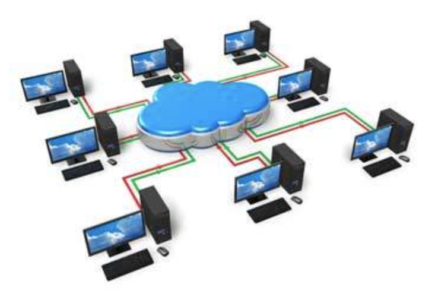

<!-- 

📋 This is the tech-news archives to help me keep track of what I am interested in!

- Reference tech news link: <https://thenextweb.com/news/blockchain-development-tech-career>
  

{{ notice-2 | markdownify }}
 -->

📋 This is my note-taking from what I learned in the class "Software Engineering Fundamentals - COMP 120-002"
{: .notice--danger}

## Operating System

&rarr; [What is an operating system?](https://www.techtarget.com/whatis/definition/operating-system-OS)

- A program that acts as an interface between the software and the computer hardware
- An integrated set of specialized programs used to manage overall resources and operations of the computer
- A specialized software that controls and monitors the execution of all other programs that reside in the computer, including application programs and other system software

### <u>Operating System Data Exchange</u>

### <u>Objectives of the Operating System</u>

- To make the computer system convenient to use in an efficient manner
- To hide the details of the hardware resources from the users
- To provide users a convenient interface to use the computer system
- To act as an intermediary between the hardware and its users, making it easier for the users to access and use other resources
- To manage the resources of a computer system
- To keep track of who is using which resource, granting resource requests, and mediating conflicting requests from different programs and users
- To provide efficient and fair sharing of resources among users and programs

### <u>Characteristics of the Operating System</u>

- Memory management:
  - Keep track of the primary memory, i.e. what part of it is in use by whom, what part is not in use, etc
  - Allocate the memory when a process or program requests it
- Processor management
  - Allocate the processor(CPU) to a process and De-allocate the processor when it is no longer required
- Device management
  - Keep track of all the devices
  - This is also called I/O controller that decides which process gets the device, when, and for how much time
- File management
  - Allocate and De-allocate the resources and decide who gets the resources
- Security
  - Prevent unauthorized access to programs and data by means of passwords and other similar techniques
- Job accounting
  - Keep track of time and resources used by various jobs and/or users
- Control over system performance
  - Record delays between the request for a service and from the system
- Interaction with the operators
  - Interaction may take place via the console of the computer in the form of instructions
  - The Operating System acknowledges the same, does the corresponding action, and informs the operator by a display screen
- Error detection aids
  - Production of dumps, traces, error messages, and other debugging and error-detecting methods
- Coordination between other software and users
  - Coordination and assignment of compilers, interpreters, assemblers, and other software to the various users of the computer systems

 

## Networking

- A Computer Networking is a system in which multiple computers are connected to each other to share information and resources

### <u>Characteristics of a Computer Network</u>

- Share resources from one computer to another
- Create files and store them in one computer, and Access those files from the other computers connected over the network
- Connect a printer, scanner, or a fax machine to one computer within the network and Let other computers of the network use the machines available over the network

### <u>The list of hardware required to set up a computer network</u>

- Network Cables
  

- Distributors
  

- Routers
  

- Internal Network Cards
  

- External Network Cards
  

 

---

 

    🖋️ This is my self-taught blog! Feel free to let me know
    if there are some errors or wrong parts 😆

[Back to Top](#){: .btn .btn--primary }{: .align-right}
