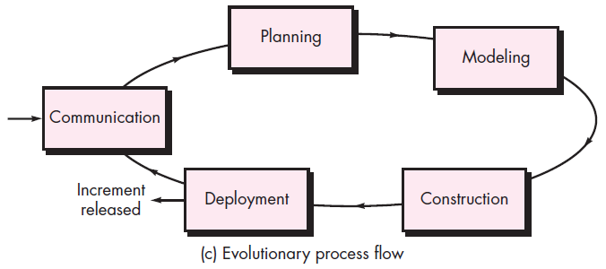
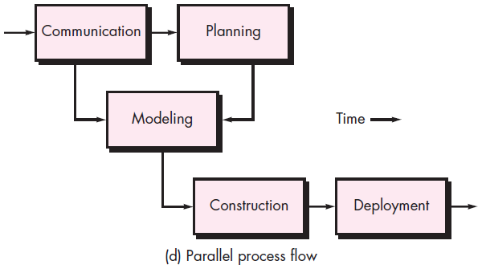

<!-- 

📋 This is the tech-news archives to help me keep track of what I am interested in!

- Reference tech news link: <https://thenextweb.com/news/blockchain-development-tech-career>
  

{{ notice-2 | markdownify }}
 -->

📋 This is my note-taking from what I learned in the class "Software Engineering Fundamentals - COMP 120-002"
{: .notice--danger}

## Software Process Models

 

## A Generic Process Model

A process is defined as a collection of work activities, actions, and tasks that are performed when some work product is to be created. Each of these activities, actions, and tasks reside within a framework or model that defines their relationship with the process and with one another.

Each framework activity is populated by a set of software engineering actions. Each software engineering action is defined by a task set that identifies the work tasks that are to be completed, the work products that will be produced, the quality assurance points that will be required, and the milestones that will be used to indicate progress.

A generic process framework for software engineering defines five framework activities:

1. Communication
2. Planning
3. Modeling
4. Construction
5. Deployment

In addition, a set of umbrella activities — project tracking and control, risk management, quality assurance, configuration management, technical reviews, and others — are applied throughout the process.

You should note that one important aspect of the software process has not yet been discussed. This aspect — called process flow — describes how the framework activities and the actions and tasks that occur within each framework activity are organized with respect to sequence and time.

 

## Process Flows

### <u>Linear Process Flow</u>

A linear process flow executes each of the five framework activities in sequence, beginning with communication and culminating with deployment.

### <u>Iterative Process Flow</u>

An iterative process flow repeats one or more of the activities before proceeding to the next.

### <u>Evolutionary Process Flow</u>

An evolutionary process flow executes the activities in a “circular” manner.

Each circuit through the five activities leads to a more complete version of the software.

### <u>Parallel Process Flow</u>

A parallel process flow executes one or more activities in parallel with other activities (e.g., modeling for one aspect of the software might be executed in parallel with construction of another aspect of the software).

 

## Identifying a Task Set

A task set defines the actual work to be done to accomplish the objectives of a software engineering action.

A task set is defined by creating several lists:

- A list of the tasks to be accomplished.
- A list of the work products to be produced.
- A list of the quality assurance filters to be applied.

### <u>List of Tasks - After SCRUM meeting</u>

[SCRUM meeting](https://www.productplan.com/glossary/scrum-meeting/)

Discussions with:

- Domain Expert
- Other developers in the team
- Business Analyst
- Professional Services
- Customer Services
- Clients
- Other stakeholders

Write a Requirement Analysis Document

 

## 5 Questions Designers Should Ask

1. Is the product satisfactory, or does it require redesign or rework?
2. Was user input solicited, to avoid the product being unsatisfactory and requiring rework?
3. Is there a need for new requirements?
4. Is the product larger than estimated?
5. Did the modules require more testing, design and implementation work to correct than expected?

 

## Process Patterns

Every software team encounters problems as it moves through the software process. It would be useful if proven solutions to these problems were readily available to the team so that the problems could be addressed and resolved quickly.

A process pattern:

1. Describes a process-related problem that is encountered during software engineering work.
2. Identifies the environment in which the problem has been encountered.
3. Suggests one or more proven solutions to the problem.

Stated in more general terms, a process pattern provides you with a template [Amb98] — a consistent method for describing problem solutions within the context of the software process.

### <u>Process Pattern Types</u>

- Stage patterns: Defines a problem associated with a framework activity for the process.
- Task patterns: Defines a problem associated with a software engineering action or work task and relevant to successful software engineering practice.
- Phase patterns: Define the sequence of framework activities that occur with the process, even when the overall flow of activities is iterative in nature.

 

## Process Assessment and Improvement

- The existence of a software process is no guarantee that software will be delivered on time, or meet the customer’s needs, or that it will exhibit long-term quality characteristics.
- Any software process can be assessed to ensure that it meets a set of basic process criteria that have been shown to be essential for successful software engineering.
- Software processes and activities should be assessed using numeric measures or software analytics (metrics).

### <u>Lists of Process Assessment and Improvement Standards</u>

- Standard CMMI Assessment Method for Process Improvement (SCAMPI)

  : Provides a five step process assessment model that incorporates five phases: initiating, diagnosing, establishing, acting and learning.

- CMM-Based Appraisal for Internal Process Improvement (CBA IPI)

  : Provides a diagnostic technique for assessing the relative maturity of a software organization; uses the SEI CMM as the basis for the assessment [Dun01]

- The SPICE (ISO/IEC15504) standard

  : The SPICE (ISO/IEC15504) standard defines a set of requirements for software process assessment. The intent of the standard is to assist organizations in developing an objective evaluation of the efficacy of any defined software process. [ISO08]

- ISO 9001:2000 for Software

  : A generic standard that applies to any organization that wants to improve the overall quality of the products, systems, or services that it provides. Therefore, the standard is directly applicable to software organizations and companies. [Ant06]

 

## Prescriptive Process Models

Prescriptive process models advocate an orderly approach to
software engineering.

That leads to a two questions:

- If prescriptive process models strive for structure and order, are they appropriate for a software world that thrives on change?
- If we reject traditional process models and replace them with something less structured, do we make it impossible to achieve coordination and coherence in software work?

### <u>Waterfall Process Model</u>

Pros

- It is easy to understand and plan.
- It works for well-understood small projects.
- Analysis and testing are straightforward.

Cons

- It does not accommodate change well.
- Testing occurs late in the process.
- Customer approval is at the end.

### <u>Prototyping Process Model</u>

Pros

- Reduced impact of requirement changes.
- Customer is involved early and often.
- Works well for small projects.
- Reduced likelihood of product rejection.

Cons

- Customer involvement may cause delays.
- Temptation to “ship” a prototype.
- Work lost in a throwaway prototype.
- Hard to plan and manage.

### <u>Spiral Process Model</u>

Pros

- Continuous customer involvement.
- Development risks are managed.
- Suitable for large, complex projects.
- It works well for extensible products.

Cons

- Risk analysis failures can doom the project.
- Project may be hard to manage.
- Requires an expert development team.

### <u>Unified Process Model</u>

Pros

- Quality documentation emphasized.
- Continuous customer involvement.
- Accommodates requirements changes.
- Works well for maintenance projects.

Cons

- Use cases are not always precise.
- Tricky software increment integration.
- Overlapping phases can cause problems.
- Requires expert development team.

 



## Questions!!

1. Which model gets approval from the customer at the end?

- Waterfall model &rarr; The customer gives approval at the end of the waterfall model, which is a disadvantage.

2. What actions are appropriate for a framework activity, given the nature of the problem to be solved, the characteristics of the people doing the work, and the stakeholders who are sponsoring the project?

- Connecting consistently with the stakeholders through phone and email. &rarr; Connecting consistently with the stakeholders through phone and email is the appropriate action.

3. UML stands for?

- Unified Modeling Language &rarr; UML stands for Unified Modeling Language



{{ notice-2 | markdownify }}

 

---

 

    🖋️ This is my self-taught blog! Feel free to let me know
    if there are some errors or wrong parts 😆

[Back to Top](#){: .btn .btn--primary }{: .align-right}
