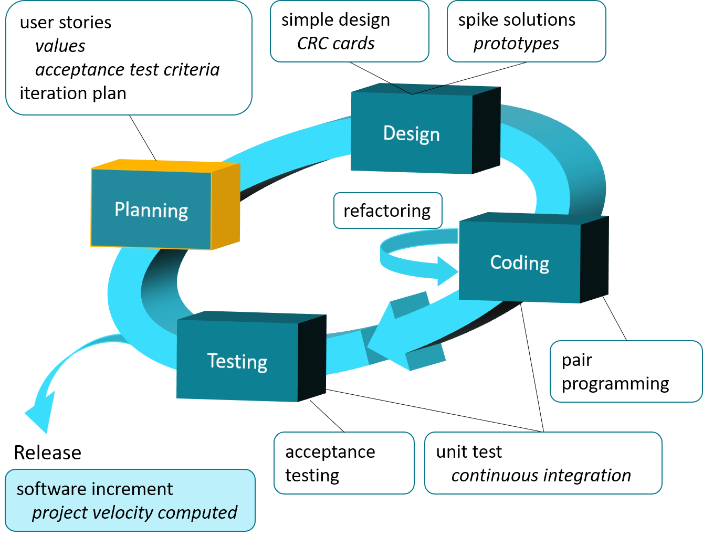

<!-- 

📋 This is the tech-news archives to help me keep track of what I am interested in!

- Reference tech news link: <https://thenextweb.com/news/blockchain-development-tech-career>
  

{{ notice-2 | markdownify }}
 -->

📋 This is my note-taking from what I learned in the class "Software Engineering Fundamentals - COMP 120-002"
{: .notice--danger}

# Written Test

1. Software is a product and can be manufactured using the same technologies used for other engineering artifacts.
2. WebApps are a mixture of print publishing and software development, making their development outside the real of software engineering practice. This is not correct statement.
3. A task set defines the actual work to be done to accomplish the objectives of a software engineering action.
4. WebApps can be integrated with corporate databases.
5. Creating WebApps and MobileApps are not same.
6. In its simplest form an external computing device may access cloud data services using a web browser.
7. Product line software development depends the reuse of existing software components to provide software engineering leverage.
8. Most software is custom built, not assembled out of components.
9. Planning ahead for software reuse reduces the cost and increases the value of the systems into which they are incorporated.
10. In agile process models the only deliverable work product is the working program. This is not correct.
11. Mobile apps contain user interfaces that take both device characteristics and location attrtibutes.
12. PSP stands for: Personal software process
13. UML stands for: Unified Modeling Language
14. ISO 9001 are standards for assessing software processes?
15. Frontend services include the client devices and application software to allow access.
16. Data structures enable the programs to adequately manipulate information.
17. Backlogs in SCRUM are: To do list
18. Cloud computing provides distributed data storage and processing resources to networked computing devices.

## 1. Scrum

Scrum is a very popular agile software development method. It used to guide development activities within a process that incorporates the following framework activities: requirements, analysis, design, evolution, and delivery. Within each framework activity, work tasks take place in a relatively short time-boxed period called a "sprint". The work conducted within a sprint is adapted to the problem at hand and is defined and often modified in real time by the Scrum team. And the scrum process involves "Sprint Planning Meetings," "Daily Scrum Meetings," "Sprint Review Meetings," and "Sprint Retrospective"

Scrum team consists of a product owner, a scrum master, and a small development team. And the development will be carried out in the following activities:

- Product backlog with developers and stakeholder
- Sprint planning meeting backlog
- Daily Scrum meeting with team members (15mins max)
- Sprint review meeting
- Sprint retrospective

 

## 2. Extreme Programming (XP)

Extreme Programming encompasses a set of rules and practices that occur within the context of four framework activities: planning, design, coding, and testing.

- XP Planning begins with user stories, team estimates cost, stories grouped into increments, commitment made on delivery date, computer project velocity.
- XP Design follows KIS principle, encourages use of CRC cards, design prototypes, and refactoring.
- XP Coding construct unit tests before coding, uses pair programming.
- XP Testing executes unit tests daily and acceptance tests defined by customer.

 

## 3. Kanban

Kanban describes methods for improving any process or workflow. Kanban is focused on change management and service delivery. It originated at Toyota and is comprised of six core practices:

- Visualizing workflow using a Kanban board.
- Limiting the amount of work in progress at any given time.
- Managing workflow to reduce waste by understanding the current value flow.
- Making process policies explicit and the criteria used to define “done”.
- Focusing on continuous improvement by creating feedback loops where changes are introduced.
- Make process changes collaboratively and involve all stakeholders as needed.

 

## 4. DevOps

DevOps was created to combine Development and Operations. It attempts to apply agile development principles across the entire software supply chain. The DevOps approach involves several stages that loop continuously until the desired product exists:

- Continuous development. Software delivered in multiple sprints.
- Continuous testing. Automated testing tools used prior to integration.
- Continuous integration. Code pieces with new functionality added to existing code running code.
- Continuous deployment. Integrated code is deployed to the production environment.
- Continuous monitoring. Team operations staff members proactively monitor software performance in the production environment.

 

# Practical Test

 

---

 

    🖋️ This is my self-taught blog! Feel free to let me know
    if there are some errors or wrong parts 😆

[Back to Top](#){: .btn .btn--primary }{: .align-right}
