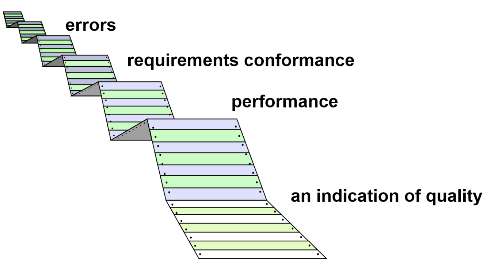
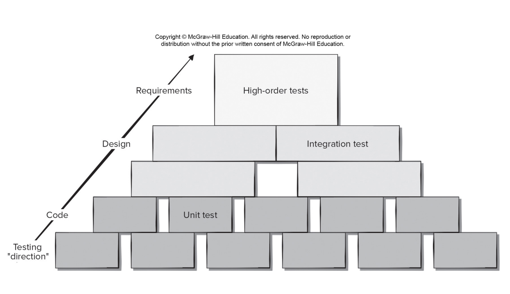
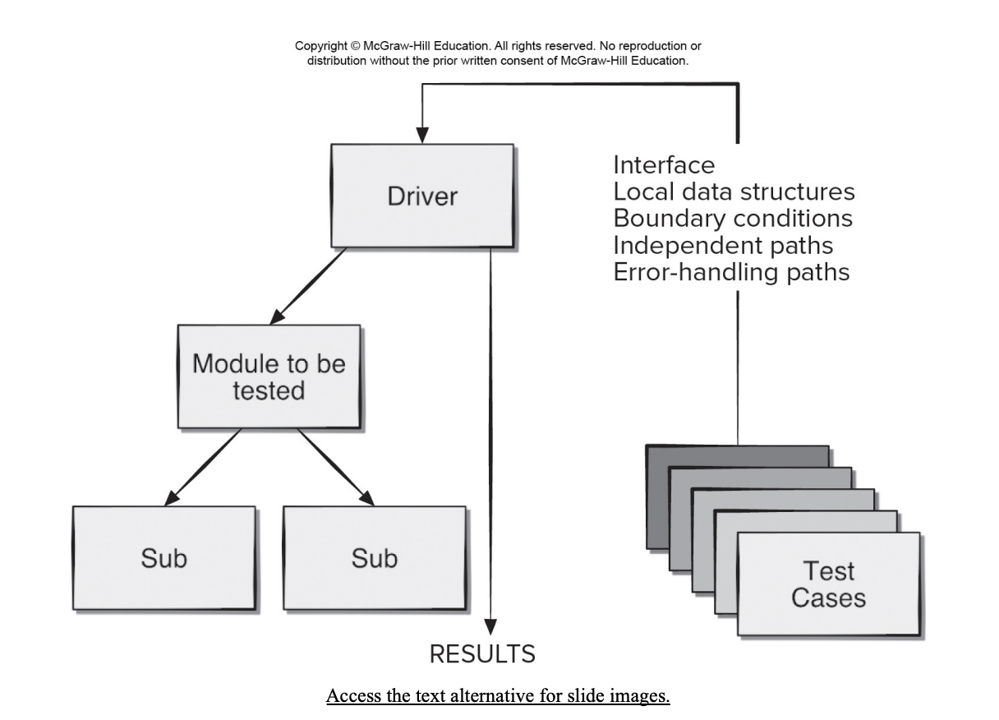
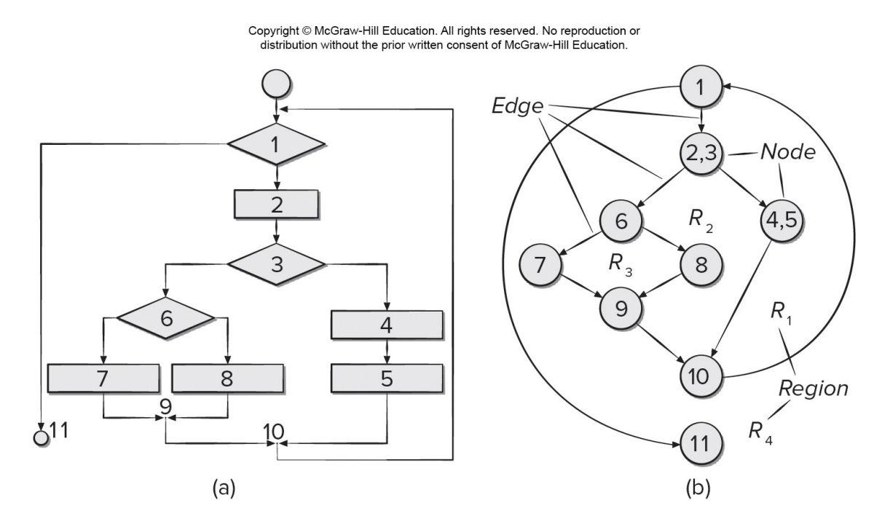
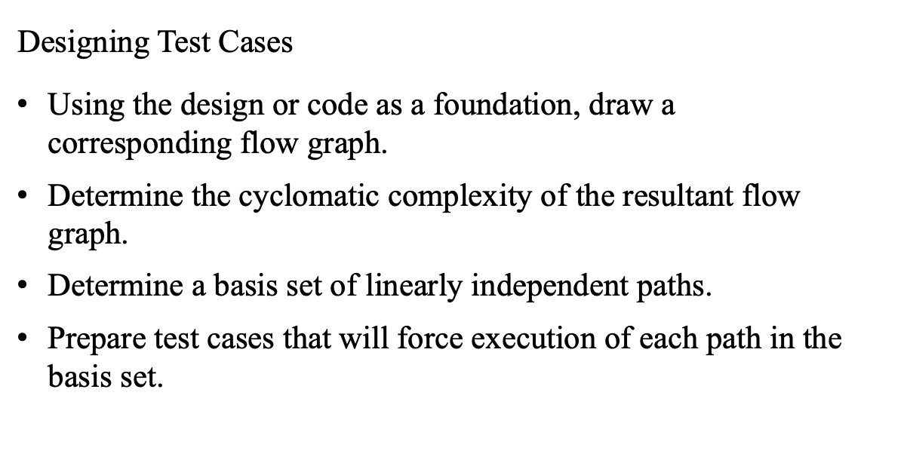

<!-- 

📋 This is the tech-news archives to help me keep track of what I am interested in!

- Reference tech news link: <https://thenextweb.com/news/blockchain-development-tech-career>
  

{{ notice-2 | markdownify }}
 -->

📋 This is my note-taking from what I learned in the class "Software Engineering Fundamentals - COMP 120-002"
{: .notice--danger}

# Software Testing Strategies

Testing is like checking a product before it's released to the customer. It involves doing things to make sure the product works properly and doesn't have any problems. Testing is something that can be organized and done in a structured way to make sure nothing is missed.

 

## Testing Strategic Approach

1. Before testing, review the technical details carefully to catch mistakes early.
2. Start testing individual parts and move towards testing the whole system.
3. Different types of software require different testing techniques at different stages.
4. Developers and sometimes a separate test group perform the testing.
5. Testing and debugging are separate activities but both are important for effective software development.

### <u>Verification and Validation</u>

- Verification: This refers to the process of making sure that software performs a particular function correctly.
  : "Are we building the product right?"
- Validation: This refers to a process that ensures that the software developed meets the requirements of the customer.
  : "Are we building the right product?"

 

## Organizing for Testing

- Software developers test their own work to make sure everything works as it should.
- An independent test group(ITG) gets involved after the software architecture is complete to avoid bias in testing.
- The independent test group's job is to find errors.
- Developers and the independent test group work together to conduct thorough testing throughout the project.

 

## Who Tests the Software?

- Developer: Developer knows how the system works and will test it carefully, but they are also focused on getting the job done efficiently. They want to show that the program is working correctly, meets customer needs, and will be finished on time and within the planned budget.
- Independent Tester: Independent Tester wants to learn about the system, but they also want to try and break it. They are motivated by making sure the system works well.

 

## Testing Strategy

When testing software, we start by testing small pieces (like individual parts of code) and gradually work our way up to testing the entire system as a whole. This process is like spiraling outwards, with each level of testing becoming broader in scope.

At the beginning, we focus on testing individual components of the software. Then we move on to testing how those components work together (integration testing), making sure they fit together properly like puzzle pieces. After that, we test whether the software meets the requirements that were set out in the planning stages (validation testing).

Finally, we test the entire system to make sure everything works together smoothly. For object-oriented software (which is organized around classes of objects that interact with each other), our initial focus is on testing those classes and their interactions rather than individual code modules.

 

## Testing the Big Picture

The process of software testing can be divided into four stages:

1. Unit Testing: Test individual parts of the software to make sure they work correctly.
2. Integration Testing: Test how these individual parts work together.
3. Validation Testing: Test that the software meets the requirements set at the beginning of the project.
4. System Testing: Test the entire system to make sure everything works together correctly.

It's like building a puzzle - first, you check each piece, then you put them together, make sure they match the picture on the box, and finally check that everything works together as it should.

 

## Software Testing Steps

 

## When is Testing Done?

### <u>Criteria for Done</u>

1. Testing doesn't stop after the software engineer is done; it continues to make sure the software works well for the end user.
2. Time and money don't determine when testing is complete; it's important to meet the users' needs and expectations.
3. The statistical quality assurance approach suggests Testing a sample of possible program executions can give a good idea of how well the software works overall.
4. Collecting data during testing helps figure out when testing is complete based on how well the software is performing.

 

## Test Planning

1. Clearly define what the product should be able to do before starting testing.
2. State exactly what you want to achieve with each test.
3. Know who will be using the software and create a profile for each type of user.
4. Use a testing plan that emphasizes testing in small, frequent cycles.
5. Make sure the software is built in a way that allows it to test itself.
6. Use technical reviews to catch problems before testing begins.
7. Conduct technical reviews to evaluate the testing strategy and test cases themselves.
8. Have a process for continuously improving the testing process.

Overall, these tips are meant to help teams test software more effectively by focusing on clear goals, user needs, and ongoing improvement.

 

## Test Recordkeeping

Test cases can be recorded in Google Docs spreadsheet:

- Briefly describes the test case.
- Contains a pointer to the requirement being tested.
- Contains expected output from the test case data or the criteria for success.
- Indicate whether the test was passed or failed.
- Dates the test case was run.
- Should have room for comments about why a test may have failed (aids in debugging).

 

## Role of Scaffolding

- When testing software components, you can't just test them on their own - you need a framework to help you.
- This framework includes special programs called drivers and stubs.
- A driver is like the main program that takes in test data, sends it to the component being tested, and then shows the results.
- A stub is a dummy program that replaces other parts of the software that the component being tested relies on.
- Stubs follow the same interface as the real programs, do minimal data manipulation, and show that they were called.

 

## Unit Test Environment

 

## Unit Testing

Unit testing is a type of testing where each part of a program is tested on its own to make sure it works correctly. This is done by testing different ways that the part can be used to make sure it's reliable and catches as many errors as possible.

 

## Unit-Test Procedures

When testing a component, it's often necessary to develop driver and stub software to help with the testing. A driver is like a main program that takes in test data, sends it to the component being tested, and then displays the results. Stubs are used to replace other modules that are used by the component being tested. Stubs use the same interface as the module they are replacing, and may do minimal data manipulation, print out verification of their entry, and then return control back to the module being tested.

 

## General Testing Criteria

During each testing phase, the following areas are checked:

1. Interface integrity: Checking that everything connects correctly internally and externally.
2. Functional validity: Making sure everything works as it should.
3. Information content: Test to ensure that the data structures used by the software are accurate and consistent.
4. Performance: Test to ensure that the software meets the performance bounds established during software design.

These tests are done as each part of the software is added, to catch issues early on.

 

## Cost Effective Testing

Testing everything is a lot of work and doesn't always guarantee that something is working perfectly. It's better to focus on testing the most important and risky parts of a project to make the most of your testing resources.

 

## MobileApp Testing

When testing mobile applications, there are some important things to consider:

1. User-experience: Test the app with real users to make sure it's easy to use and works well on all types of devices.
2. Device compatibility: Check that the app works on different devices and software platforms.
3. Performance: Test how fast the app runs and how much space it takes up on the device.
4. Connectivity: Make sure the app can connect to the internet and other services reliably.
5. Security: Test the app to ensure it doesn't compromise the user's privacy or security.
6. Testing in the wild: Test the app on real devices in different environments to make sure it works well in real-life situations.
7. Certification: Make sure the app meets the standards required for distribution.

 

## High Order Testing

1. Validation testing: Focus is on software requirements.
2. System testing: Focus is on system integration.
3. Alpha/Beta testing: Alpha testing is when a small group of users try a product at the developer's place, and beta testing is when the product is tested by end-users at their own sites without the developer around. Both tests focus on how customers use the product.
4. Recovery testing: Forces the software to fail in a variety of ways and verifies that recovery is properly performed.
5. Security testing: Verifies that protection mechanisms built into into a system will, in fact, protect it from illegal penetration
6. Stress testing: Executes a system in a manner that demands resources in abnormal quantity, frequency, or volume.
7. Performance testing: Test the run-time performance of software within the context of an integrated system.

 

## Test Case Design

Before you start writing code for a component, it's a good idea to design test cases to make sure the code you write will work correctly. Here are the areas you should focus on when designing these tests:

- Make sure the component can receive and output information properly.
- Check that any data stored in the component stays accurate throughout the code's execution.
- Test every possible path through the code to make sure everything works correctly.
- Make sure the code works correctly when dealing with any limits or restrictions.
- Test all the ways the code handles errors.

 

## Module Tests

 

## Error Handling

Good design should anticipate and plan for potential errors that may occur during system operation. These errors must be tested to ensure that they can be handled properly. Some of the errors that should be tested include:

1. The error message is not clear or understandable.
2. The error message does not match the actual error that occurred.
3. The error causes the system to crash or malfunction before it can be handled.
4. The system's handling of the error is incorrect.
5. The error message does not provide enough information to identify the cause of the error.

 

## Traceability

- To be able to track and check the testing process, each test needs to be linked back to specific functional or nonfunctional requirements.
- Nonfunctional requirements should also be linked to business or architectural requirements.
- Many testing problems happen because there are missing connections between tests and requirements, inconsistent test data, or not enough testing coverage.
- When changes are made to software components, it's important to retest specific parts that could be affected (regression testing).

 

## White-box Testing

White-box testing is a method of testing software by examining its internal code and structure. It helps identify errors or bugs in the software's internal workings and improve its overall quality and functionality.

To perform white-box testing, testers create test cases that cover all possible paths and decisions within the code. This ensures that every part of the code is thoroughly tested.

The testing process focuses on four key areas. First, testers make sure that all possible paths within the code have been executed at least once. They also test logical decisions on both their true and false sides to ensure that they're working properly. Second, they test loops to make sure they're functioning correctly at their boundaries and within their operational bounds. Lastly, testers ensure that internal data structures are valid and working as intended.

 

## Basis Path Testing

<u>Flowchart (a) and Flow Graph (b)</u>

 

## Control Structure Testing

- Condition testing: This is a way of testing a program by checking if the logical conditions (like "if" statements) in a particular part of the program are working properly.
- Data flow testing: This technique tests a program by following how data is defined and used throughout the program, and selecting test cases based on that information.
- Loop testing: This technique focuses specifically on testing loops in a program to make sure they are working correctly. It tests things like whether the loop runs the correct number of times and whether it handles edge cases properly.

 

## Classes of Loops

### <u>Loop Testing</u>

| Test cases for simple loops:                | Test cases for nested loops:                                                                                                                            |
| :------------------------------------------ | :------------------------------------------------------------------------------------------------------------------------------------------------------ |
| 1. Skip the loop entirely.                  | 1. Start at the innermost loop. Set all other loops to minimum values.                                                                                  |
| 2. Only one pass through the loop.          | Conduct simple loop tests for the innermost loop while holding the outer loops at their minimum iteration parameter (for example, loop counter) values. |
| 3. Two passes through the loop.             | 3. Add other tests for out-of-range or excluded values.                                                                                                 |
| 4. m passes through the loop where m < n.   | 4. Work outward, conducting tests for the next loop, but keeping all other outer loops at minimum values and other nested loops to “typical” values.    |
| 5. n − 1, n, n + 1 passes through the loop. | 5. Continue until all loops have been tested.                                                                                                           |

 

## Black Box Testing

Black-box testing is a way to test software without looking at the code. The goal is to find mistakes in the software's functions, how it interacts with other programs, how it uses data from databases, how it behaves under certain conditions, and any errors during startup or shutdown. This type of testing is usually done after white-box testing, which looks at the software's internal workings.

Black-box testing helps answer questions about how well the system works, including:

- Does it handle valid inputs correctly?
- How does it behave under different conditions?
- What types of inputs should be tested?
- Are there any inputs that the system is particularly sensitive to?
- How are the boundaries of different data types identified?
- How much data can the system handle, and at what rate?
- What happens when certain types of data are combined?

Remember, black-box testing is focused on testing the system's external behavior, without looking at its internal code or structure.

### <u>Black Box – Interface Testing</u>

- Interface testing checks if a program component can correctly receive and return information.
- Components need other programs called stubs and drivers to test their interfaces.
- Stubs and drivers might include test cases for the component or be accessed by the component.
- Debugging code may need to be added to the component to check the data passed to it.

 

## Object-Oriented Testing (OOT)

To test OO systems effectively, remember to:

- Test the analysis and design models using error discovery techniques.
- Change your testing strategy for unit and integration testing.
- Design test cases that account for the unique characteristics of OO software.

 

## Black Box – Boundary Value Analysis (BVA)

Boundary value analysis is a testing technique where you focus on values at the edges, or boundaries, of input and output ranges.

To do this, you can follow these guidelines:

1. If an input range has values a and b, test with values just above and below a and b.
2. If an input has a set number of values, test with the min, max, and values just above and below.
3. Apply guidelines 1 and 2 to output ranges too.
4. Test the boundaries of internal data structures, like arrays with a max index of 100.

Remember to focus on the boundaries and edges of input and output ranges when designing your test cases.

 

## OOT – Class Testing

Class testing in OO software is like unit testing in conventional software, but instead of focusing on algorithmic detail and data flow, it tests the behavior of a class based on its operations and state. Valid sequences of operations and their permutations are used to test class behaviors, and equivalence partitioning can reduce the number of sequences needed.

 

## OOT– Behavior Testing

- State diagrams help derive test sequences for class behavior.
- Tests should achieve full coverage by using operation sequences that cause transitions through all allowable states.
- Multiple state diagrams can be used to track system behavioral flow when collaborating with several classes.
- To traverse a state model breadth-first, test cases should exercise a single transition at a time and only use previously tested transitions when testing new ones.

 

## State Diagram for Account Class

 

## White-box and black-box testing statements

Complete these statements on white-box and black-box testing and their techniques by dragging the word box to the correct space.

- Black-box testing techniques enable you to derive sets of input conditions that will fully exercise all functional requirements for a program.
- White-box testing is a design philosophy that uses the control structure to derive test cases.

- Basis path testing is a white-box testing technique that enables the test-case designer tp define a basis set of execution paths.
- Equivalence partitioning is a black-box testing method that divides the input domain of a program into classes of data.

- Data flow testing selects test paths of a program according to the locations of definitions and uses of variables in a program.
- Condition testing is a test-case design method that exercises the logical conditions in a program module.
- Loop testing is a testing technique that focuses exclusively on the validity of loop constructs.
- These are all techniques for Control structure testing.

- Boundary value analysis is a test-case design technique that leads to the selection of test cases at the 'edges' of a class.
- Interface testing checks that the program component accepts information in the proper order and data types and returns information the proper order and data format.
- These are all techniques used in black-box testing, also called Functional testing.

 

---

 

    🖋️ This is my self-taught blog! Feel free to let me know
    if there are some errors or wrong parts 😆

[Back to Top](#){: .btn .btn--primary }{: .align-right}
